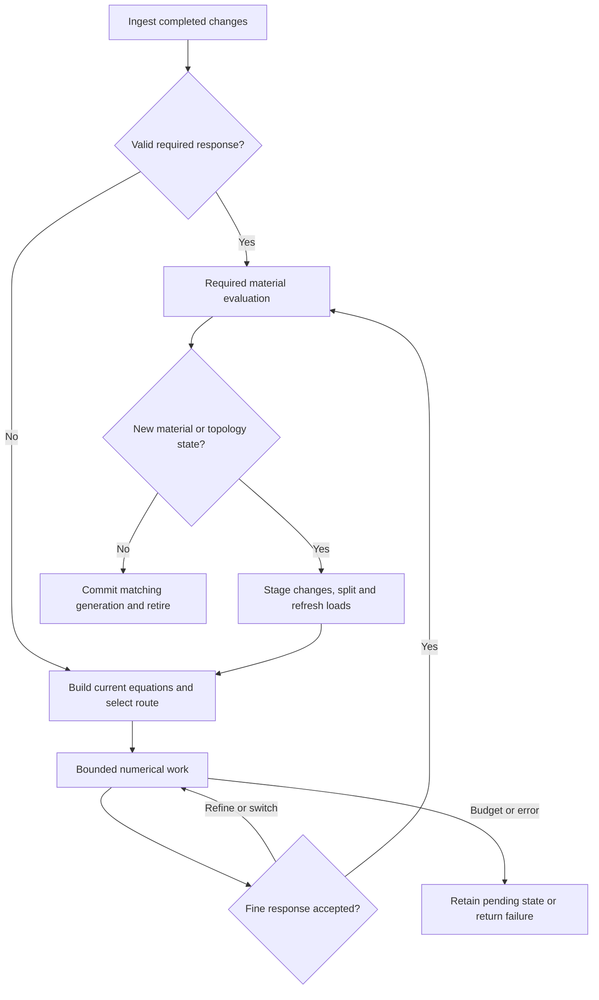

# CUDA destruction stress solver — standalone engineering handoff

10 September 2026 · Specification, decision record, computational evidence, and assigned implementation work

## 1. How to use this document

This document is the complete handoff for an implementer who has no conversation history. It contains the selected architecture, exact mathematical constructions where established, explicit baseline algorithms, performance reasoning, numerical evidence and its limitations, implementation sequence, and intended gaps. External links provide provenance and deeper study; following them is not necessary to understand the required design. Earlier reports are superseded as handoff instructions.

Read the core contracts in Sections 1–7, the numerical algorithms in 8–11, and the material/runtime integration in 12–14. Sections 15–16 preserve the evidence and research rationale. Sections 17–19 define acceptance, intended assignments, and decision coverage; Section 20 contains runnable checks.

“Complete handoff” means the implementer can identify every required behavior and every assigned unresolved task. It does not mean all materials are calibrated, all accelerators are implemented, or real-time performance is proven.

The status labels are binding:

| Label | Meaning |
|---|---|
| DECISION | Retained architectural/behavioral choice from the design work; preserve unless an explicit design change is documented |
| BASELINE | Concrete starting implementation specified here; may be replaced after equivalent correctness and better completed-work measurements |
| EVIDENCE | Supplied structural measurement, archived synthetic result, or mathematical deduction; its provenance is stated |
| GAP Gxx | Intentionally assigned work with a deliverable and acceptance condition in Section 18 |
| DEFERRED | Research or feature extension; not a prerequisite for the initial supported configuration |

Baselines introduced to close specification gaps are not presented as previously benchmarked decisions. In particular, the phase-separated event protocol, explicit nullspace construction, and initial dispatch/aggregation policies below are implementation defaults, not measured winners.

### Executive decisions

Build a GPU-resident, event-driven structural solver for breakable chunk graphs. The rigid-body engine owns motion and collision handling; this subsystem computes internal response, material evolution, and fracture. Its equations preserve all surviving load paths and six-component force/moment coupling.

Use two numerical routes over the same fine equations: sparse exact elimination for suitable components, and structural multilevel PCG for expensive or changing components. Retain block-Jacobi PCG as the first executable baseline. Use exact branch condensation, retained-factor preconditioning, and validated low-rank modifications where their full costs justify them.

Unchanged accepted components require no per-component, per-chunk, or per-bond stress traversal. Changes are reported by input producers. Changed components reuse valid state; independent components converge and retire independently. Local input is not assumed to have only local influence.

Preserve useful structure under bond deletion, but distinguish symbolic validity from numerical validity and numerical validity from usefulness. Fracture can make a new factor cheaper than repairing an old one. A better coarse basis can save more than a faster relaxation kernel.

Keep material time separate from numerical iteration. All decisions use current fine equations and required response checks. A budget limit means unfinished work, never automatic convergence. The overload default preserves accepted state and pauses the dependent physics step until its transaction can finish.

### Scope

DECISION: target desktop-class CUDA GPUs, a 60 FPS application, and a configurable stress budget below the full 16.67 ms frame. Retained geometry may reach city scale; supported active capacity is established by benchmarks. Single-GPU operation is the baseline. Correctness and scalability take priority over bitwise determinism.

The physical baseline is 3D quasi-static internal stress coupled to rigid-body dynamics, with six unknowns per dynamic chunk. Existing bonds only disappear; coefficient and material-history changes remain possible. Newly spawned assets initialize independently. Joints, bond creation/welding, and unknown contact reactions inside the same structural solve are outside this baseline.

Required material capabilities include tension/compression, shear, bending, torsion, irreversible fracture, and an interface for progressive damage and dissipative compression/plastic history. Calibration and the specific nonlinear laws are GAP G02, not implicitly implemented by the elastic solver.

Stress-wave timing, full elastodynamics, geometric buckling, and indefinite nonlinear tangents are separate model extensions. Large rigid-body rotations are handled by consistent reference-frame transformations; large internal deformation is not thereby solved. An eventual 2D specialization can use two translations and one rotation with the same lifecycle; it is not the reference implementation specified here.

## 2. Workload and first-principles performance model

EVIDENCE: the supplied structural census describes sparse frames, walls, and slabs. The table includes fixed chunks in total degree; support distances are unweighted and reported for dynamic chunks.

| Structure | Chunks | Bonds | Fixed chunks | Stress components | Degree min/mean/max | Support hops mean/p95/max |
|---|---:|---:|---:|---:|---|---|
| Authored frame | 64 | 132 | 4 | 1 | 1 / 4.125 / 6 | 5 / 9 / 9 |
| Native shell | 444 | 896 | 64 | 1 | 3 / 4.036 / 5 | 6.295 / 11 / 11 |
| Authored downtown | 24,105 | 74,543 | 445 | 27 | 1 / 6.185 / 20 | 15.956 / 47 / 60 |
| Synthetic shell, 8 rows | 296 | 588 | 64 | 1 | 3 / 3.973 / 5 | 4.241 / 7 / 7 |
| Synthetic shell, 40 rows | 1,480 | 3,052 | 64 | 1 | 3 / 4.124 / 5 | 20.356 / 38 / 39 |

Downtown dynamic component sizes: 148×8, 324×5, 648×5, 1,060×2, 1,296×5, 3,080×1, and 5,936×1. These sum to 23,660 dynamic nodes. The native shell has 380 dynamic nodes, 756 dynamic–dynamic bonds, 28 dynamic–support bonds, 112 support–support bonds, and 1,540 dynamic adjacency visits per complete live-row traversal. Its connected dynamic graph has 756−380+1 = 377 independent cycles. Native total degree histogram: degree 3→32 nodes, 4→364, 5→48.

For 256 independent native copies: 97,280 iterative nodes, 583,680 scalar variables, and 394,240 dynamic adjacency entries. Do not count fixed supports as iterative variables or join buildings through eliminated ground.

These facts lead to the following decisions:

- Sparse local degree controls each operator pass; it does not determine convergence, separator width, or factor fill.
- Tall structures and weak attachments produce collective motions that local updates may resolve slowly. Coarse modes or exact interfaces address these motions directly.
- Loops prevent generic tree-only force accumulation, but a cyclic physical graph may still admit a cheap elimination hierarchy.
- A 60-hop support path is a descriptor, not a 60-iteration prediction. Coupling strength, geometry, supports, and conditioning matter.
- A large city can comprise many small independent numerical problems. Total retained size and simultaneously active size must be reported separately.
- The slowest dependent path matters alongside arithmetic. A cheaper serial downdate can lose to more parallel factorization.
- Writing a fresh response for every affected bond has an output-proportional cost. Sparse input alone cannot remove it.

For a transaction, count
\[
W=W_{\rm input}+W_{\rm topology}+W_{\rm preparation/repair}
+\sum_{\rm solves}W_{\rm solve}+W_{\rm verification/recovery}+W_{\rm material}.
\]
Include failed attempts, all fracture rounds, transfers, reductions, basis conditioning, and cache maintenance. Optimize completed accepted work per physical interval, not sweep speed or iteration count alone.

## 3. Exact elastic operator and conventions

DECISION: retain the six-channel elastic-interface model. BASELINE: the following conventions remove sign/frame ambiguity.

### 3.1 Variables, frames, and bond blocks

All quantities below are in one component reference frame unless explicitly transformed. Let qᵢ = (uᵢ, θᵢ), where u is internal translation and θ a small internal rotation. Chunk position xᵢ is its reference center. A bond e=(i,j) has one common interface point cₑ, an orthonormal basis Rₑ whose columns map local vectors into component coordinates, and offsets rᵢ=cₑ−xᵢ and rⱼ=cₑ−xⱼ. Define S(r)v=r×v.

Use:
\[
G_i=\begin{bmatrix}-R^T&R^TS(r_i)\\0&-R^T\end{bmatrix},\qquad
G_j=\begin{bmatrix} R^T&-R^TS(r_j)\\0& R^T\end{bmatrix}.
\]
Thus
\[
d_e=G_iq_i+G_jq_j-z_e,\qquad s_e=D_ed_e.
\]
The first three entries of d are relative interface translations; the last three are relative rotations. The first three entries of s are forces; the last three are moments. z is reference/inelastic deformation in the same local coordinates.

A common point is essential to this construction's rigid-motion invariance. Arbitrary separate endpoint attachment points cannot be substituted without deriving a different objective operator. The numerical fixture uses the midpoint. Physical assets may use a common face centroid.

D is a symmetric 6×6 constitutive stiffness in compatible units. The initial executable elastic configuration requires positive stiffness in all six channels on live bonds. Strictly positive live six-channel bonds on a connected graph leave only collective rigid modes before supports. Material laws with zero stiffness channels, hinge-like mechanisms, indefinite tangents, or new stencils require explicit extension and failure classification; do not repair them by adding undocumented physical stiffness.

\[
\Psi(q)=\tfrac12\sum_ed_e^TD_ed_e-f_{\rm eff}^Tq,\quad
K=\sum_eG_e^TD_eG_e,\quad
b=f_{\rm eff}+\sum_eG_e^TD_ez_e,\quad Kq=b.
\]
Gₑ contains both endpoint blocks. The internal physical wrench on an endpoint is −Gᵢᵀsₑ; Gᵢᵀsₑ is the energy gradient. This sign convention makes external plus internal wrench vanish at equilibrium.

Rotational bonded-particle mechanics motivates these force/moment channels; the displayed operator is the selected interface model, not a claim to copy another package's material calibration. [LAMMPS rotational bonds](https://docs.lammps.org/bond_bpm_rotational.html)

### 3.2 Gather, recovery, and prescribed values

Implement apply_K(x) without material history or external loads:

```text
parallel for each dynamic output chunk i:
    yi = 0
    for each live incident bond e:
        v = Gi * xi + Gj * xj
        # prescribed entries of x are zero for reduced operator application
        yi += Gi^T * De * v
    write owned yi once
```

Use the correct endpoint-specific block and transpose when the row owns j. Each physical bond is visited once per dynamic endpoint. Cache Kᵢᵢ = ΣGᵢᵀDₑGᵢ and its local solve data. Build b separately. Recovery evaluates d and s once per live bond with the complete prescribed state.

For prescribed values qₛ:
\[
K_{dd}q_d=b_d-K_{ds}q_s.
\]
Prescribed support values contribute loads; their bonds still contribute dynamic diagonals. Arbitrary directional constraints may use per-node admissible-coordinate bases instead of deleting coordinate entries. Their conversion is GAP G01; fully prescribed chunks are the initial baseline.

BASELINE runtime storage is matrix-free fine gather plus assembled diagonal/local/coarse blocks. Keep an assembled BSR/CSR comparison path. The arithmetic model in Section 15 counts dense blocks and is not the operation count of this compact gather.

### 3.3 Scaling and objectivity

Choose a documented invertible block scaling T so q=Tq̂; solve TᵀKT q̂=Tᵀb. Choose length scales per asset/component recipe and record them in the operator identity. Scale nullspace and coarse vectors consistently. This improves meaningful tolerances and finite-precision handling; exact full block-Jacobi is invariant to invertible within-node variable transformations in exact arithmetic, so scaling alone is not a promised iteration reduction.

For a common rigid rotation, let U rotate every translation and rotation block. Then Kw=U Kbody Uᵀ, bbody=Uᵀbworld, and qw=Uqbody. Changing the origin of a moment also requires the lever-arm term. Gravity may change in body coordinates while the factor remains reusable. Boundary restrictions must transform too. [OpenSees corotational transformations](https://opensees.github.io/OpenSeesDocumentation/user/manual/model/geomTransf/Corotational.html)

Internal q values are not automatically applied as new rigid-body motion. Applying recovered internal forces again as external impulses would double-count their role. If plastic deformation is later applied to collision geometry, that operation emits a geometry revision.

## 4. Loads, supports, and free-body modes

### 4.1 Engine contract

A stress query represents one frozen external-input generation and physical interval [t₀,t₁]. Supply stable chunk-targeted load channels, with force/torque at a documented point, or impulse/angular impulse with an explicit loading interval. Do not infer force from “whatever frame time is convenient.” A temporary load must expire or be removed explicitly.

DECISION: the rigid-body adapter is the sole owner of converting contact results and motion into effective structural loads. The solver does not independently invent contact reactions. It must distinguish applied external loads from inertial terms and avoid counting either twice. Engine-specific contact ordering, impact interval and constitutive coupling remain GAP G01.

BASELINE algebra for a freely moving rigid aggregate, when all external nodal wrenches are supplied:
\[
c={\sum m_ix_i\over M},\quad a={\sum F_i\over M},\quad
I_c=\sum(I_i+m_i[(r_i^Tr_i)I-r_ir_i^T]),
\]
\[
\alpha=I_c^{-1}\left[\sum(T_i+r_i\times F_i)-\omega\times(I_c\omega)\right],
\quad r_i=x_i-c.
\]
Use node inertial force mᵢ[a+α×rᵢ+ω×(ω×rᵢ)] and rotational inertial moment Iᵢα+ω×(Iᵢω); subtract these from external nodal wrenches. Inertias are expressed in the same instantaneous frame. This formula assumes a rigid aggregate with fixed relative geometry and no omitted external wrench. If the engine supplies accelerations, use the equivalent engine-consistent inverse-dynamics result and verify balance instead of subtracting both versions.

Supported and kinematic components obtain appropriate engine-consistent inertia and prescribed motion; do not apply unrestricted free-aggregate acceleration formulas to them. Stress components and motion aggregates need not have identical membership. Uniform gravity on a nonspinning freely falling aggregate can cancel from effective loading; arbitrary free rubble, contacts, or spin need not.

### 4.2 Explicit nullspace treatment

For a free connected six-channel component:
\[
N_i=\begin{bmatrix}I&-S(x_i-c)\\0&I\end{bmatrix},\qquad KN=0.
\]
For partial supports represented by Cq=prescribed, surviving rigid motions are Nv with CNv=0. Compute the at-most-six-dimensional kernel of CN, restrict to unknown coordinates, transform through the variable scaling, then orthonormalize its surviving columns Q. Verify A Q≈0 against the actual reduced scaled operator A.

Require Qᵀb̂≈0. A large incompatibility means missing/incorrect loads or an unsupported model; projection must not hide it. Remove only roundoff-level incompatible residual after the check.

BASELINE free-system route is projected PCG:
\[
\Pi=I-QQ^T,\quad \tilde A x=\Pi A(\Pi x),\quad
\tilde M^{-1}r=\Pi M^{-1}(\Pi r),\quad x=\Pi x.
\]
Keep vectors in range(Π), where the admissible system must be positive definite. Fully supported systems use Q with zero columns. Direct factors are initially enabled only for a verified SPD reduced coordinate system. A numerical gauge for free systems is permissible only with compatible loads and verification of all original rows; it is not physical support and is deferred in the runtime baseline.

A connected positive six-channel graph supplies the analytical rigid modes. Extra mechanisms, poor rank separation, or unexpected factor/curvature failures return MECHANISM_OR_MODEL_UNSUPPORTED pending GAP G01/G02 treatment. The displacement-only rigid-mode helper in another package does not automatically construct this six-variable basis. [PETSc nullspace guidance](https://petsc.org/release/manualpages/Mat/MatNullSpaceCreateRigidBody/)

## 5. Data layout, identity, and API

DECISION: stable physical IDs are separate from compact numerical indices. Use unsigned 64-bit asset/chunk/bond/query IDs and component handles (32-bit slot, 32-bit generation). Use 32-bit local adjacency indices while capacities permit; reject overflow explicitly. Serialized fixtures use named typed arrays and a schema version, not native struct padding.

| Owner | Required arrays/records |
|---|---|
| Asset data | Reference x, common bond points/frames, material IDs, initial endpoints/supports, ordering/partition recipe, template signature |
| Chunk state | Mass/inertia, prescribed-state data, chunk→stress handle, chunk→motion owner, local unknown map |
| Bond state | Live bit, D or compact coefficients, z/trial/committed history, strengths/geometry, versions |
| Component header | Handle, node/bond ranges, external generation, topology/operator/response/material/settings revisions, state, nullspace metadata |
| Active numerics | q, r, p, zPCG, Ap, local factors, per-component reductions, route and iteration state |
| Cached preparation | Symbolic pattern, factor values/version, coarse P/AP/Kc, recycled basis, template references, memory charges |
| Runtime | Completed input batches, unique dirty work, unfinished work, candidate outputs, due-material schedule, transaction buffers |
| Outputs | Accepted query/revisions, bond responses or valid stored-response reference, material result, fracture/split events, status and work counters |

Distinguish zₑ material deformation from zPCG, the preconditioned residual.

BASELINE public operations and semantics:

```text
initialize_asset(asset, initial_state, recipe) -> asset_handle/status
submit_batch(batch_id, physical_interval, ordered_events, completion_event)
advance(work_budget) -> progress_handle       # asynchronous GPU work
read_completed(progress_handle) -> accepted/pending/failure metadata
acknowledge(transaction_id)                    # engine accepted motion/contact handoff
rollback(transaction_id, new_world_generation) # restore checkpoint before replay
release_asset(asset_handle)                    # deferred until references retire
```

Inputs address stable chunk/bond/load-channel IDs. UpsertLoad replaces a channel's previous value; RemoveLoad removes it. PatchBondCoefficients, SetPrescribedState, ChangeSupportMask, DeleteBond, and MaterialDeadline have explicit payload/version types. SetPrescribedState changes values with a fixed constrained subspace; ChangeSupportMask changes which degrees of freedom are unknown and triggers structural repartitioning. Unknown references, stale slot generations, and capacity failures produce errors rather than partial application. Event order is defined within a completed batch; multiple upserts of one channel use the final ordered value.

Return statuses: ACCEPTED, PENDING_BUDGET, NEEDS_ENGINE_REFRESH, STALE_INPUT, INCOMPATIBLE_LOAD, MECHANISM_OR_MODEL_UNSUPPORTED, NUMERICAL_FAILURE, and CAPACITY_EXCEEDED. Status names are baseline API choices; semantic distinctions must remain.

Preallocate or pool buffers. Factors and bases have bounded caches. Use copy-on-write for modifications of shared templates. Eviction removes an accelerator, not physical history or a still-valid accepted response. Retire memory only after device work and output consumers release it.

## 6. Reuse certificates and the event protocol

### 6.1 What can be reused

| Artifact | Required validity |
|---|---|
| Equilibrium q | Same reduced equations/mapping and accepted numerical contract |
| Stored bond response | Valid q plus unchanged G, D, z and required output mapping |
| Material verdict | Valid responses plus thresholds/history/time interval for that decision |
| Exact factor | Identical reduced operator/order, or a successfully verified modification |
| Old preconditioner | Compatible dimension/subspace, fixed admissible numerical action during recurrence, useful convergence |
| Symbolic ordering/separators/coloring | Valid graph/access superset under the current variable mapping |
| P or recycled Z | Compatible space and independent useful columns; current AP, PᵀAP or AZ/ZᵀAZ as required |

Versions are dependency identities, not a probabilistic hash proof. A hash can index a template cache, followed by equivalence validation. Same topology does not imply same operator. Same K and b do not imply same bond responses when local history changes cancel in assembly. Strength-only changes can require a verdict without refactorization.

An accepted certificate records the actual revisions and tolerance policy verified. New children cannot blindly inherit it. Exact reuse may wake on tiny numerical input changes; filtering/tolerance-based reuse is an explicit approximate feature, not a hidden shortcut.

### 6.2 BASELINE: phase-separated ingestion

This baseline deliberately avoids concurrent mutation of an operator being solved. Producers may write a separate inbox while numerical kernels execute; completed batches enter solver state only at phase boundaries ordered by CUDA events/stream dependencies.

```text
at a work-batch boundary:
    seal completed producer batches through cutoff E
    validate events and preflight staging capacity
    route stable chunk/bond events using current ownership
    sort/reduce only these events by component and reason
    merge resulting unique handles with unfinished work
    apply validated external changes in the ingestion phase
    restart/revalidate affected numerical recurrences
    run a bounded solve/material work batch
    recheck required input generations before publication
    publish accepted candidates; retain unfinished handles
```

A batch becomes visible only after its payload writes complete. Tail reservation alone is not publication. Inputs completed after cutoff E belong to a subsequent boundary; this defines event ordering. No hidden producer may write active numerical coefficients directly.

Use sort/reduce and compact active lists first; custom persistent lock-free queues are optional after profiling. Clearing, sorting, and merging touches events and active work, not all retained components. If capacity is insufficient, keep the completed input batch unconsumed and return CAPACITY_EXCEEDED; do not clear its dirty information.

Events on a prescribed chunk fan out to the components owning adjacent dynamic endpoints; that chunk need not own a stress component itself. A changed motion owner uses its membership map to identify affected stress components. Coefficient/deletion events route through their incident endpoints. These routes use indexed incidence/membership, not city-wide discovery scans.

After repartitioning, reroute external events through stable chunk/bond IDs. Old component handles become tombstones and cannot refer to a reused slot with a new generation. A candidate response is accepted only for its external cutoff and final internal revisions. A superseding ingested event invalidates that candidate. An event at a later cutoff activates a new query normally.

### 6.3 Inactivity

Accepted components leave active arrays. No periodic hierarchy walk, input-equality scan, cache-aging scan, or speculative recoloring is permitted on sleeping components. A due-material scheduler may examine its minimum deadline; it must not scan every sleeping bond each tick. Its device implementation is GAP G06 with a no-idle-scan acceptance gate.

Version producers include load removal/expiration, persistent contact-force changes, support motion/removal, body-frame gravity changes, effective inertial changes, material history, geometry, settings, and topology. Lack of a new collision is insufficient.

An empty active list and no due material event produce zero stress component/node/bond work plus bounded scheduling overhead. This requirement concerns the stress subsystem; it does not claim that collision detection or the whole game becomes free.

## 7. Solve lifecycle, acceptance, and bounded progress



Each component may run several solve/material/split rounds in one physical interval. No global “hardest component” convergence flag controls all others.

For successive frozen equations:
\[
K_1=K_0+\Delta K,\quad b_1=b_0+\Delta b,\quad
r_0=b_0-K_0q_0,\quad K_1\Delta q=r_0+\Delta b-\Delta Kq_0.
\]
Use q₀ as a compatible initial guess. This correction equation is already implicit in warm-started Krylov solving; it is not an independent source of speed. A sparse new residual contribution may spread globally through factors or coarse corrections.

### 7.1 Executable block-PCG baseline

Let A and b̂ denote the reduced scaled problem and Π its admissible projector. M is fixed during a recurrence. For block Jacobi, apply each cached 6×6 diagonal Cholesky solve; do not build explicit inverses in the production baseline.

```text
x = Pi * compatible_initial_guess
r = Pi * (bhat - A*x)
if candidate_linear_acceptance(r): run full acceptance/recovery
z = Pi * apply_M(r); rho = dot(r,z); p = z
repeat within the current work budget:
    v = Pi * apply_A(p)
    sigma = dot(p,v)
    if rho or sigma is nonfinite/nonpositive for a nonzero residual:
        recompute true residual; return classified breakdown if not accepted
    alpha = rho / sigma
    x = Pi * (x + alpha*p)
    r = Pi * (r - alpha*v)
    if check is due or recurrence suggests convergence:
        rtrue = Pi * (bhat - A*x)
        if linear acceptance passes:
            recover responses; execute full acceptance; exit if accepted
        if recurrence drift exceeds configured bound:
            r = rtrue; restart recurrence from x
    z = Pi * apply_M(r)
    rho_new = dot(r,z)
    beta = rho_new / rho
    p = Pi * (z + beta*p); rho = rho_new
on budget exhaustion: retain x and valid recurrence, return PENDING_BUDGET
```

All dot products, alpha/beta/rho values, flags, and iteration counts are per component. Reusing an old factor as M must not substitute the old matrix for apply_A. Restart after operator/preconditioner changes. Flexible methods remain an optional future recurrence. [PETSc PCG requirements](https://petsc.org/release/manualpages/KSP/KSPCG/)

A zero-dimensional admissible system, or zero compatible residual, can finish without applying a singular/empty local preconditioner. This covers appropriate trivial free fragments; it does not authorize a general “free tree has zero stress” rule.

### 7.2 Acceptance functions and explicit unknown parameters

Required configuration fields include scaled absolute/relative residual tolerances, per-node force/torque balance scales and limits, compatibility/rank tolerances, residual-check interval, drift limit, maximum iterations/route attempts, and material decision policy ID. A production profile must provide these values; a missing value is a configuration error. The reference fixture uses FP64 relative tolerance 10⁻⁸ with zero absolute tolerance for its nonzero load; production values are GAP G05.

For a new numerical result require:
\[
\|\hat b-A\hat q\|_2\leq a_{\rm tol}+r_{\rm tol}\|\hat b\|_2.
\]
Also require maximum node force and torque imbalance, each normalized by its documented physical scale, below its limit. Check free-mode compatibility separately. Evaluate original fine equations, including rows omitted by any numerical gauge. Reject NaNs, invalid material states, and unexpected negative curvature.

A stored certificate may reuse these previously performed checks when their dependencies are unchanged; this does not require an idle rescan.

Recover every required changed-component bond response initially. Compare near-threshold fracture behavior to stronger reference solves during qualification. The production near-threshold policy and any rigorous output-error estimator are GAP G05; no unimplemented “confidence” function may silently approve failure. When the configured acceptance/decision policy cannot classify a case within limits, return an explicit pending/failure state.

For a linear bond output cᵀq:
\[
\delta s=c^TK^{-1}r=w^Tr,\qquad K^Tw=c.
\]
For SPD K, error energy is rᵀK⁻¹r. These identities motivate goal-oriented/error-bound work, but solving an adjoint per bond can cost more than it saves. A small mean residual is not such a bound. Certified selective recovery is DEFERRED.

## 8. Exact sparse route and structural condensation

### 8.1 Concrete baseline factor structure

DECISION: exact sparse elimination is a valid global stress solve, not merely a preconditioner. It must be compared with iterative solving for small/narrow-interface components.

BASELINE asset preparation computes a deterministic greedy minimum-degree ordering for the reference implementation: repeatedly eliminate the live node minimizing (current filled degree, stable ID), connect its remaining neighbors into a clique, and continue. This exactly defines the ordering used in the shell counts. Faster AMD/nested-dissection preparation is permitted after comparing fill and dependency depth; the simple reference ordering is not the desired high-throughput GPU setup algorithm.

Store a lower block-sparse Cholesky pattern: packed 21-value diagonal blocks, 36-value off-diagonal blocks, column offsets, sorted row indices, and row access maps for solves. Numerical block recurrence:
\[
L_{kk}=\operatorname{chol}\left(K_{kk}-\sum_{p<k}L_{kp}L_{kp}^T\right),
\]
\[
L_{jk}=\left(K_{jk}-\sum_{p<k}L_{jp}L_{kp}^T\right)L_{kk}^{-T}.
\]
Only structural nonzeros and fill are stored. Use triangular solves for the right multiplication. Forward/backward substitution follows actual nonzero dependencies of L, with independent rows/fronts batched where ready.

The recurrence specifies correctness; efficient multifrontal/supernodal kernels, storage crossover, runtime reordering, and backend selection are GAP G04. A slow correct reference is acceptable at the corresponding development gate, not proof of real-time capability.

Choose between retained ordering and a new ordering by actual symbolic estimates. A heuristic can find a worse ordering after deletion even though fill cannot increase under the same fixed ordering. Numerical factors still change.

### 8.2 Exact interior elimination

For interior I and boundary Γ:
\[
S=K_{\Gamma\Gamma}-K_{\Gamma I}K_{II}^{-1}K_{I\Gamma},\quad
g=b_\Gamma-K_{\Gamma I}K_{II}^{-1}b_I,
\]
\[
Sq_\Gamma=g,\qquad q_I=K_{II}^{-1}(b_I-K_{I\Gamma}q_\Gamma).
\]
Use factorizations to apply inverses. Every crossing bond must terminate on a retained interface; do not omit couplings between nominal architectural regions. Check invertibility after damage. A region can have many internal loops and still have a small interface. Its interior can be solved independently conditional on boundary state; its reaction remains coupled to the building. [MFEM static condensation](https://docs.mfem.org/4.8/classmfem_1_1StaticCondensation.html)

For dense local dimensions p interior and s boundary, setup scales as O(p³+p²s+ps²), with O(p²+ps+s²) factor/coupling/update storage. Separator width, not merely region count, controls cost. An unchanged region may still need recovery after its boundary solution changes.

### 8.3 Single-attachment specialization

For an otherwise unsupported connected branch with prescribed effective loads and exactly one full-wrench bond to the core:
\[
F_{\rm attach}=-\sum_iF_i,\quad
T_{\rm attach}=-\sum_i[T_i+(x_i-x_{\rm attach})\times F_i].
\]
These are the attachment's actions on the branch; the core receives the opposite wrench. In the selected linear model, arbitrary attachment motion can be followed by a branch rigid motion, so its condensed stiffness on the core is zero; its equivalent load remains.

Accumulate its resultant, solve the core, then solve/recover branch internal stresses. Internal loops remain. Additional supports, unknown contact reactions, partial attachments or dynamic/geometric response invalidate this specialization.

An optional bridge analysis can collapse bridge-connected regions and peel unsupported leaf branches. A bridge may appear before a split. Automatic GPU bridge detection is part of GAP G03; the existing numerical test supplied the patch explicitly.

### 8.4 Layered structures

If physical couplings stay within a layer or adjacent layers, the reordered matrix is block tridiagonal. Alternating-layer elimination gives recursive Schur reduction and logarithmic outer dependency levels under sufficient resources. For H layers of bounded scalar width b, characteristic work remains O(Hb³) to factor and O(Hb²) per solve. Logarithmic depth does not mean logarithmic total cost.

Retain as a specialized route, not a default dense whole-floor representation. The measured symbolic example in Section 15 shows that dense recursive whole-row elimination used about 19.4 times sparse factor arithmetic. Preserve sparsity and small separators. GPU block-tridiagonal research is an algorithm/kernel reference, not a building benchmark. [Recursive GPU Cholesky](https://arxiv.org/html/2601.03754v1), [batched recursive Schur solves](https://arxiv.org/html/2509.03015v1)

## 9. Changed factors, reuse, and dispatch

For eligible fixed-geometry bond removal or stiffness loss:
\[
K_1=K_0-UU^T,\qquad U_e=G_e^T\operatorname{chol}(D_e-D'_e).
\]
Dₑ−D′ₑ must be PSD. For a removed six-channel bond rank(Uₑ)≤6. Also update b and response/history dependencies; changing D with nonzero z is not a matrix-only change. Geometry, supports, altered coordinates, or indefinite changes require separate handling.

### 9.1 Three different techniques

**Retained-factor preconditioning:** keep L₀ and apply K₀⁻¹ as a correction while solving K₁. With exact inverse preconditioning, at most rank(U) eigenvalues differ from one, giving an exact-arithmetic CG termination bound of rank(U)+1. Finite precision can exceed it; the weak archived case did. Useful convergence must repay the expensive triangular applications. [PETSc preconditioner reuse](https://petsc.org/release/manualpages/KSP/KSPSetReusePreconditioner/)

**Sparse downdating:** modify a private factor with each column x of U. A reference scalar-column recurrence is:

```text
for affected column k in dependency order:
    d = Lkk*Lkk - xk*xk
    if d fails the configured positive-pivot test: abort modification
    newdiag = sqrt(d); c = newdiag/Lkk; s = xk/Lkk
    Lkk = newdiag
    for stored affected row j > k:
        Ljk = (Ljk - s*xj)/c
        xj = c*xj - s*Ljk        # uses updated Ljk
    xk = 0
```

Traverse a proven symbolic reach/superset; never discard a generated update outside it silently. Validate against current K and fine residuals. Failed modification leaves the original factor intact. A batch can use multiple-rank algorithms to reduce repeated traversal; their GPU implementation and FP32 stability are GAP G04. Lower modeled work alone does not remove serial dependencies. [Davis–Hager sparse modifications](https://people.engr.tamu.edu/davis/publications_files/MultipleRank_Modifications_of_a_Sparse_Cholesky_Factorization.pdf)

**Woodbury correction:**
\[
Y=K_0^{-1}U,\ C=I-U^TY,\ q_0=K_0^{-1}b,\quad
q_1=q_0+YC^{-1}U^Tq_0.
\]
This is useful only if response-column setup, storage, and conditioning repay their cost. The seven-bond example spent more on constructing Y than on fresh factorization plus one solve. Keep it DEFERRED for special high-reuse cases. [Woodbury formula](https://nhigham.com/2020/09/29/what-is-the-sherman-morrison-woodbury-formula/)

Actual splits require new admissible systems. Do not force Cholesky downdates through a free-component zero pivot.

### 9.2 BASELINE dispatch, with bounded adaptation

```text
if required stored responses remain accepted: skip the numerical solve
else if exact factor matches current SPD equations: direct solve
else:
    choose an admissible already-built preconditioner:
        qualified retained factor, else qualified structural hierarchy,
        else block Jacobi
    run bounded PCG work
    at configured checkpoints, compare remaining-work and rebuild estimates
    if a qualified alternative repays setup and budget permits:
        preserve x, rebuild/update privately, restart with new accelerator
    stop switching after configured attempt limit
```

Asset recipes may request fresh direct setup using symbolic fill and an explicitly qualified workload profile. No exact factor is required just because a component is small. When history is absent, block-PCG is the universal executable baseline on the supported mathematical configuration; it can return nonconvergence.

For unchanged-operator queries compare F+R S against ΣkᵢIᵢ, including warm starts. Only actual new load queries count toward R; idle frames do not amortize factors. For changed states compare update cost, current factor application cost, and fresh preparation. Time estimates are calibrated per execution route; raw FLOPs are only an initial model. Default attempt limits, cache budgets and calibrated thresholds are GAP G05.

## 10. Structural multilevel route and reusable modes

DECISION: fine operator and final response remain authoritative. Coarse variables accelerate collective corrections; they do not permanently replace detailed wall/slab mechanics.

On the admissible space use a symmetric additive construction:
\[
M^{-1}=\sum_a R_a^TA_a^{-1}R_a+P(P^TKP)^{-1}P^T.
\]
Local restrictions cover all unknowns, local solves are SPD with appropriate local boundary treatment, and P has independent admissible columns. Apply overlap weights on both restriction and prolongation sides. For projected free systems, apply Π around corrections and remove coarse dependencies caused by global rigid modes.

### 10.1 Reproducible first hierarchy

BASELINE correctness/reference grouping follows the archived experiment: pick the smallest unassigned dynamic node; breadth-first grow through ascending-ID surviving neighbors, accepting up to 16 nodes; repeat. This is a specified baseline, not a claim that 16 or unweighted BFS is optimal. It can run during reference/asset preparation. Scalable fracture-aware GPU aggregation, coupling-strength metrics, and incremental repair are GAP G03; do not run a city-wide serial BFS every frame.

For each aggregate with center cₐ, start six columns:
\[
u_i=t_a+\omega_a\times(x_i-c_a),\quad \theta_i=\omega_a.
\]
For the baseline, cₐ is the arithmetic mean of member positions. Apply support and variable-scaling transformations. Start local correction with node block Jacobi; add stronger patches only when saved iterations repay local setup and application.

Build Kc=PᵀKP from current fine bonds:
\[
K_c=\sum_e(G_eP)^TD_e(G_eP).
\]
With unchanged P and geometry, a deleted bond contributes the exact coarse downdate −(GₑP)ᵀDₑ(GₑP). P may remain structurally legal while becoming ineffective.

Rank filtering and conditioning are mandatory. Dense pivoted QR is the reference method for small experiments. It is not free, and it can destroy sparse-transfer economics. Production sparse basis conditioning and higher-level setup are GAP G03. Disable an invalid coarse accelerator and use an admissible fallback; do not make it invertible by altering the fine physical matrix.

Use further sparse/coarse levels when coarse work is excessive. A fixed symmetric cycle with a small terminal factor preserves the PCG requirement; exact level sizes and GPU kernels are measured configuration. The same constraint applies to a colored smoother: a forward Gauss–Seidel sweep alone is not a symmetric preconditioner.

### 10.2 Structural enrichment and response recycling

Candidate enrichments already motivated by the research are:

| Structure | Useful correction families |
|---|---|
| Strong compact region | Collective translation and rotation |
| Beam/column | Bending, axial stretch, torsion, joint-region response |
| Wall/slab | In-plane response, out-of-plane bending/twisting, junction interaction |
| Weakly attached region | Relative collective motion on each side of the weak connection |
| Persistently difficult coefficients/modes | Selected local spectral modes |

Add modes to regions identified by graph/mechanical diagnostics and slow convergence. A universal rigid mode set for an entire building is insufficient. Automatic selection remains GAP G03; the most successful archived patch was supplied explicitly. GenEO/BDDC offer principled enrichment directions, with setup cost. [GenEO](https://arxiv.org/abs/2104.00280), [BDDC](https://petsc.org/release/manualpages/PC/PCBDDC/)

Small recycled correction spaces are a separate optional accelerator:
\[
E=Z^TKZ,\qquad \delta q=ZE^{-1}Z^Tr.
\]
Store independent useful recent corrections and, when worthwhile, KZ. Recompute projected data after operator changes, reject invalid child restrictions, and retain the fine solve. Eight dense directions on 2,280 variables cost about 72,960 operations for restriction/prolongation; 48 cost 437,760, before maintenance. A small coarse dimension is not proof of cheap application. [Recycled Krylov methods](https://arxiv.org/abs/1208.0264), [Fischer guesses](https://petsc.org/release/manualpages/KSP/KSPSetUseFischerGuess/)

Template-equivalent operators may share immutable factors, hierarchy recipes, and numerical preparation. Loads, responses, material histories, and convergence states remain per instance. Batching KX=B improves operator reuse without physically coupling the structures.

## 11. Topology, structural reuse, and regional work

DECISION: surviving physical bonds determine connectivity. Fixed/prescribed nodes do not bridge dynamic unknown components. Contact-induced loads can activate several bond components; unknown coupled contacts would change the partition.

**Important exception:** deletion-only physical connectivity does not make the reduced unknown graph deletion-only under every support operation. Releasing a prescribed chunk can introduce unknown couplings through it and join old stress components; prescribing an unknown can split them. BASELINE ChangeSupportMask therefore collects the changed chunks and all adjacent old unknown components, expands that affected group through newly admitted unknown connections, and rebuilds its current reduced connectivity/mapping. Invalidate incompatible factors and certificates. Do not assume old symbolic fill bounds survive newly introduced unknowns. This bounded repartition handles a constraint change without adding a physical bond.

BASELINE component rebuilding after deletion is local to affected old parents:

```text
initialize parent[v] = v for each unknown node in the affected old parent
repeat parallel rounds:
    for every surviving unknown–unknown bond (i,j) in that parent:
        find current roots ri,rj
        if different: monotonically hook the larger root toward the smaller
    shortcut parent pointers
until all edge endpoints have common roots and labels are flattened
sort/reduce nodes by final root; construct child handles and contiguous ranges
```

Use monotone atomic updates and round boundaries; no stale union-find state is treated as a deletion-capable structure. Count edge visits times actual rounds. This algorithm does not scan other unchanged components. Alternative decremental connectivity or maintained spanning forests may be benchmarked later; deletion of a non-tree edge can be harmless, but a tree-edge deletion still requires a valid replacement/split check.

Four invariants survive pure deletion under fixed definitions:

1. A valid separator remains a separator.
2. Layer bandwidth cannot increase.
3. A fixed unpivoted SPD symbolic factor pattern remains a superset.
4. A valid fine-graph coloring remains valid.

They do not preserve numerical factor values, coarse effectiveness, material responses, or changed variable mappings. Numerical/derived graphs can introduce different dependencies even with deletion-only physical bonds.

Retain original patterns and tombstoned entries initially. Compact live adjacency and rebuild/reorder when predicted saved traversal/setup repays the cost. Do this on active changed components, not via an idle maintenance scan. Do not store every Schur contribution by default; Section 15 shows its memory cost.

A local load/bond change is a starting work region, not a final physical cutoff. Use exact interface propagation, coarse correction, and fine acceptance. Sparse residual work may expand. Required response recovery elsewhere can change even if that region had no local event. A fixed “three bond hops” rule is not part of the solver.

Children receive current supports, compatible effective loads, fresh nullspace handling and compatible initial guesses. Recompute mass/inertia at the motion-owner boundary, not by assuming stress components are rigid owners. Shared/parent numerical data may be restricted only when mathematically valid. New child certificates require new acceptance.

## 12. Material and physics transactions

DECISION: numerical iterations, nonlinear trials, rate-independent fracture rounds, and physical-time history advancement are different operations.

The required material contract is:
```text
evaluate_trial(committed_history, trial_deformation, frozen_geometry, interval)
    -> response, proposed_history, frozen_operator_contribution,
       failure_measure, dissipated_energy, next_due_time, validity/status
```
The committed history at t₀ is immutable across repeated trials over [t₀,t₁]. A rejected trial does not advance it. More linear iterations do not produce more fatigue. Explicit material subintervals must partition physical time rather than repeatedly cover the same interval.

Elastic prediction is the first pass; expensive constitutive work may run only where its criteria require it. Global load redistribution can activate distant material, so “no direct impact” is not a skip proof. Stiffness loss must remove/correct its physical contribution; an old elastic reference may be used only with the changing-interface correction included.

For mostly elastic systems, retain global preparation and update nonlinear interfaces. For a genuine outer nonlinear solve, use inexact inner tolerances, tightening toward final acceptance, and refresh tangents/preconditioners on stalled progress. These are conditional optimizations: they do not improve a frozen linear problem by themselves. The precise return mapping, crushing/yield laws, softening/dissipation, and admissible tangent strategy remain GAP G02. [Inexact Newton control](https://petsc.org/release/manualpages/SNES/SNESKSPSetUseEW/), [Krylov-Newton](https://opensees.berkeley.edu/wiki/index.php/Krylov-Newton_Algorithm)

BASELINE fracture semantics: identify all eligible failures from one accepted stress/material state, stage that bond-removal batch, then resolve the changed structure. Do not break from arbitrary intermediate iterates. Batch versus sequential removal can differ; the batch convention is fixed for the initial implementation and must be included in fixtures.

BASELINE transaction sequence:
1. Snapshot/version the external query and retain the necessary committed physical/material checkpoint.
2. Solve and evaluate trial material; stage bond/state changes privately.
3. Apply staged fracture rounds inside the transaction, rebuilding child ownership/effective loads as required.
4. If changed motion/contact ownership requires the rigid-body engine, return NEEDS_ENGINE_REFRESH with transaction identity; no final certificate is published yet.
5. The engine updates mass/inertia and collision ownership, preserves the specified momentum convention, refreshes contacts or replays affected physics, and submits a new matching external generation.
6. Revalidate/restart affected equations. Publish final accepted material/topology and exactly-once events only after the coupled transaction is accepted.
7. On rollback/cancellation, restore the checkpoint, invalidate descendant trial states and generation-bound caches, and replay with new identities. Re-emitted events cannot be mistaken for new accepted fractures.

Engine-specific checkpoint depth, interaction closure, momentum/energy accounting, contact correction and localized versus broader replay are GAP G07. An implementation must not merely update fragments while retaining obsolete contact impulses. The stress subsystem does not mandate full-world rollback.

Crushing must dissipate energy through a specified constitutive law. Numerical attenuation with distance is not a substitute. Reference plastic deformation that changes collision geometry emits geometry/operator revisions. No calibrated concrete/steel behavior is claimed until G02 is complete.

## 13. CUDA execution, precision, and overload

Use flat hot arrays, stable ownership and bounded pools. Independent islands, factor fronts, patches and coarse tasks share GPU batches; parent/child interface dependencies remain explicit. Single warp, single block and multi-block routes are benchmark candidates keyed by working set and algorithm, not fixed universal chunk thresholds.

Fine matrix-vector gather and double-buffered Jacobi need no coloring. In-place chunk relaxation may use vertex coloring; bond updates writing both endpoints may use edge coloring or atomic scatter. Reuse deletion-valid colors and compact their live work on demand. Read-only ground is not a write conflict; shared reaction accumulators are. Factor/patch schedules need their own dependency graphs. [Box2D coloring](https://box2d.org/posts/2024/08/simd-matters/)

Keep all active runtime numerical intermediates, reductions, topology and material work on the GPU. CPU asset preparation and asynchronous summaries are allowed. Avoid per-iteration CPU convergence reads. Use CUDA stream/event dependencies and reusable CUDA Graph templates; graphs reduce submission overhead without removing algorithmic barriers. [CUDA best practices](https://docs.nvidia.com/cuda/cuda-c-best-practices-guide/), [CUDA Graphs](https://docs.nvidia.com/cuda/cuda-programming-guide/04-special-topics/cuda-graphs.html)

Start runtime arithmetic/storage in FP32 with an FP64 reference and targeted higher-accuracy checking where required. Use refinement or a stronger-precision path when qualified; do not assume FP32 downdates remain stable near separation. Mixed precision must include accurate enough original coefficients and residuals. FP16/Tensor Cores are deferred to suitable dense work after dimensional/conditioning tests; a 6×6 block does not inherit transformer GEMM throughput automatically.

Allocator and queue exhaustion preserve input/checkpoint data and return CAPACITY_EXCEEDED. Budget exhaustion preserves valid progress and returns PENDING_BUDGET. Default overload behavior renders the last accepted state and pauses the dependent physics step until acceptance; it does not certify an unfinished cascade. Any asynchronous local-time or approximate overload mode requires its own coupling/accuracy design.

Release requires a declared GPU/workload envelope, stress budget, memory cap, tolerance/material profile, and worst-cascade results. No unrestricted exact cascade has a guaranteed fixed completion time.

## 14. Code organization and implementation gates

Use C++ interfaces plus CUDA kernels; separate math from scheduling and engine integration. Names below are baseline module boundaries, not an existing repository claim.

| Module | Responsibilities and seams |
|---|---|
| mechanics/operator | G blocks, apply_K, RHS construction, response recovery, frame/scaling transforms |
| mechanics/nullspace | Supports, rigid modes, projection, compatibility/model checks |
| materials | Trial/committed history, material ABI, deadlines, failure/dissipation policies |
| graph | Stable IDs, CSR views, split discovery, component maps, separator/color recipes |
| numerics/pcg | Per-component recurrence, local solves, restarts, true-residual checks |
| numerics/direct | Symbolic factor data, factor/triangular kernels, private updates, verification |
| numerics/coarse | Aggregation, basis/rank handling, Galerkin construction, local/coarse application |
| runtime | Ingress phases, active lists, revision/certificate logic, pools, dispatch, status |
| integration | Load adapter, transactions, engine refresh, rollback, accepted outputs |
| validation | Serialized fixtures, FP64 references, algebra/physics regressions, cost instrumentation |

Keep assertions and error codes at module boundaries. Expensive diagnostics run on active data or explicit debug requests. Add event/state fuzz tests at the runtime boundary; add conservation and material tests at the engine boundary.

| Gate | Implement | Exit evidence |
|---|---|---|
| A | G blocks, supported/free reference equations, fixture format | Symmetry, rigid modes, force/moment balance, known small solutions, explicit unsupported inputs |
| B | GPU gather + block-PCG + full recovery | Agreement with FP64 fixtures; independent convergence; truthful failure/pending states |
| C | Ingress/revisions, material transaction skeleton, GPU splits, engine adapter | No lost/expired events, zero idle traversal, child validity, rollback without duplicated damage |
| D | Exact sparse and structural coarse routes | Lower completed-query cost on qualified fixtures with equal acceptance; preparation included |
| E | Templates, retained factors, qualified downdates/recycling | Measured benefits across changing loads and damage; safe rebuild/failure transitions |
| F | Production materials, precision/memory/overload qualification | Calibrated required behavior and published real-time workload envelope |

Reference blocking tasks are G01/G02/G05. G03/G04 block claiming the corresponding accelerators production-ready. G06/G07 block the complete event/physics lifecycle. The gap ledger below states concrete deliverables.

## 15. Computational evidence retained from the research

### 15.1 Provenance and reproduction recipe

These are archived CPU FP64 numerical experiments and symbolic/arithmetic models, not production engine or GPU measurements. The graph reconstruction matches the supplied shell census; it was not authenticated against original endpoint lists or material coefficients. Do not extrapolate its exact fill/convergence to downtown.

The reconstructed shell is an 8×H×8 unit lattice. Enumerate nodes in y-major, then x, then z order; retain x∈{0,7} or z∈{0,7} or y mod 4=0. From each node add existing neighbors in +x, +y, +z order. Prescribe y=0. H=8,12,40 gives the table in Section 2. The four-node patch is x=0, y∈{5,6}, z∈{2,3}; its surviving bridge in weak tests joins (0,4,2) to (0,5,2). Remove the other seven external bonds. Internal patch bonds remain a loop.

Use midpoint c, R=identity, D=diag(1,1,1,0.1,0.1,0.1), z=0, and six variables per dynamic chunk. Apply total x-force 1 over the 28 top-row nodes and z-force 0.05 at each patch node. Use zero initial guesses unless specified. Weaken the surviving bridge by multiplying its entire D by 10⁻⁴. These dimensionless coefficients are not calibrated material parameters.

Numerical experiments used Python 3.12.14, NumPy 2.3.5, SciPy 1.17.0, FP64, and relative tolerance 10⁻⁸. The generic coarse case used the intact-graph BFS aggregates specified in Section 10: 28 groups, 168 variables. Patch enrichment added six columns, giving 174 independent columns after dense pivoted QR with rank cutoff 10⁻¹⁰. Subsequent damage kept that generic grouping. Iterations can vary with numerical libraries.

Random deletion experiments sample the generation-ordered eligible bonds (at least one dynamic endpoint) using Python random.Random(20260910). Percentage samples use round(fraction×784). Affected-front median batches used seeds 0…99 separately. Factor comparisons explicitly distinguish a fresh greedy ordering from retaining the original ordering.

For n dynamic chunks, e dynamic–dynamic bonds, dense 6×6-block bookkeeping:
\[
I_{\rm PCG}=192n+144e.
\]
The constituent convention is 66n+144e for operator application, 66n for cached inverse-block application, and about 60n for vector updates/dots. Production uses local solves and compact algebra, so recount its actual kernels.

Eliminating a six-variable chunk with d later filled neighbors costs
\[
F_i=\sum_{t=1}^{6}(6d+t)^2=216d^2+252d+91.
\]
Packed lower entries are L=Σ(21+36d), and one forward/back solve costs S=4L−12n. Count multiply, addition, division and square root as one operation each; this is bookkeeping, not equal GPU instruction cost. Ordering, indexing, memory traffic, extra checks/recovery and other excluded work must be added.

### 15.2 Exact factorization and dependency costs

| Shell rows / dynamic chunks | Factor F | Reused solve S | FP32 factor values | Fresh break-even vs comparator |
|---|---:|---:|---:|---:|
| 8 / 232 | 7.253 M | 0.316 M | 0.304 MiB | ~70 iterations |
| 12 / 380 | 21.135 M | 0.655 M | 0.629 MiB | ~120 iterations |
| 40 / 1,416 | 207.923 M | 3.683 M | 3.528 MiB | ~307 iterations |

M means million modeled operations. Native exact values: I=181,824, S=655,344, and F+S=21,789,848. Packed native factor contains 164,976 scalars and 4,361 off-diagonal chunk blocks versus 756 original dynamic edges. At 20/50/100/200 assumed PCG iterations per changed-load query, fresh preparation amortizes after approximately 8/3/2/1 such queries. Warm starts can change these comparisons.

| Native ordering/elimination method | Factor work | Outer dependency depth |
|---|---:|---:|
| Natural chunk order | 68.729 M | 380 |
| Greedy minimum degree | 21.135 M | 74 |
| Simple geometric separators | 31.521 M | 74 |
| Sequential dense whole rows | 252.018 M | 11 |
| Recursive dense whole rows | 409.734 M | 4 |

These depths describe the modeled factor dependencies, not equal-cost launches or measured latency. On the tall graph, minimum degree gave 207.9 M/depth 231; a simple geometric ordering gave 284.4 M/depth 139. This illustrates the arithmetic-versus-parallel-depth tradeoff.

### 15.3 Fracture changes factor economics

| Structural cut | Dynamic components | Fresh factor | One solve |
|---|---|---:|---:|
| Intact | 380 | 21.135 M | 0.655 M |
| Patch retains one bond | 380 | 19.398 M | 0.630 M |
| Patch detaches | 376 + 4 | 19.396 M | 0.629 M |
| Remove 28 bonds between rows 5 and 6 | 204 + 176 | 9.344 M | 0.474 M |
| Random 10% eligible removal | 380 | 9.727 M | 0.447 M |
| Random 25% | 379 + 1 | 4.552 M | 0.301 M |
| Random 50% | 38 components, largest 258 | 0.368 M | 0.099 M |

These are graph cuts, not predicted fracture patterns. Free-component symbolic counts removed one chunk's six variables as a numerical gauge, assuming compatible loads and exactly six rigid modes. Supported-only numerical tests do not validate free runtime handling automatically.

Affected-front rebuilding on the old tree: one deletion had median 10.541 M (49.9% of intact F), with locations ranging about 0.054–11.983 M. Seven patch deletions touched 15.096 M; median batches of 4/16/64 random deletions touched 15.162/18.827/20.307 M. Those are refactor-exposure counts, not the cost of an optimized downdate. Retaining every outgoing Schur message would add about 6.41 MiB/building, or 1.60 GiB for 256 copies.

### 15.4 Weak connections: basis quality matters

| Supported case | Block-Jacobi PCG | Generic coarse | With patch modes |
|---|---:|---:|---:|
| Intact | 235 iterations | 127 | Not tested |
| Patch with one attachment | 319 | 155 | 129 |
| Attachment stiffness ×10⁻⁴ | 696 | 429 | 129 |

| Same case | Block-Jacobi work | Generic coarse work | Patch-enriched work |
|---|---:|---:|---:|
| Intact | 42.729 M | 39.792 M | — |
| One attachment | 57.680 M | 47.700 M | 41.033 M |
| Weak attachment | 125.848 M | 126.455 M | 41.033 M |

Generic coarse setup was 3.161 M; each application added about 50,160 transfer operations and 56,448 triangular-solve operations. Coarse counts of 8/16/24/32/64 six-mode aggregates increased modeled per-iteration work to approximately 1.30/1.38/1.50/1.68/2.90 times block Jacobi.

The sparse enriched-work estimate assumes transfers with the original sparse basis, while the numerical prototype used dense QR to condition its span. Sparse FP32 conditioning with that cost remains unproven. Automatic patch discovery and conditioning are excluded. Recovered global bond-response relative errors were below 2.4×10⁻⁹ against a direct FP64 reference; this is not a bound on every individual near-threshold decision.

A separate eight-node/two-loop illustration found block-Jacobi condition numbers 138.99, 5,027.56, 495,479.90, and 49,540,732.19 as bridge stiffness decreased 1→10⁻²→10⁻⁴→10⁻⁶; targeted coarse modes gave approximately 4.71, 2.29, 2.25, 2.25. This intentionally matched small example illustrates the mechanism, not general convergence or GPU speed.

### 15.5 Factor reuse and modification

| Supported change | Simple PCG | Old factor PCG | Downdate + solve | Fresh factor + solve |
|---|---:|---:|---:|---:|
| One random removed bond | 51.05 M | 5.68 M | 2.98 M | 21.79 M |
| Four random removals | 51.84 M | 12.17 M | 9.60 M | 21.74 M |
| Seven patch removals | 57.68 M | 32.44 M | 13.77 M | 20.03 M |
| Same patch with weakened last bond | 125.85 M | 59.21 M | 15.52 M | 20.03 M |
| Sixty-four random removals | 57.06 M | 65.86 M | Not tested | 11.87 M |

Reuse assumes the intact factor already exists. Fresh comparison selects the better of the original and new greedy order. For four removals, newly computed greedy ordering alone cost 23.54 M versus 21.74 M retaining the original order.

Old-factor iterations for 1/4/16/64 random deletions were 7/15/27/82 versus block-Jacobi 281/286/305/330. The weak case needed 73 old-factor iterations despite a rank-48 exact-arithmetic bound of 49. Warm starting reduced one-removal old-factor iterations 7→6, but increased weak-case block-Jacobi iterations 696→759. Warm starts are useful initial guesses, not guaranteed improvements.

One-bond downdate update work was about 2.329 M versus 11.740 M affected-front refactor exposure. The scalar reference uses dense Python arrays but traverses a specified sparse pattern. It does not demonstrate a GPU downdate kernel. Factor-action probe errors were below 3×10⁻¹⁶; the weak downdate residual was about 3.92×10⁻¹⁰ in FP64.

Woodbury setup needed 6/42/48 old-factor solves for one deletion/seven deletions/seven plus weakening: approximately 3.93/27.52/31.46 M before small-system setup and application, with 53.4/374.1/427.5 KiB of response columns. The weak correction matrix had a smallest eigenvalue near 4.72×10⁻⁷. This is a concrete cost and precision warning.

For the single-attachment four-node patch, 24 interior variables and a six-variable interface gave 4,900 dense local factor operations. Core block-Jacobi needed 303 iterations with either ordinary or ×10⁻⁴ attachment stiffness, with full residual about 7.38×10⁻⁹. Main work was about 54.34 M plus local setup/recovery. This removes the attachment-induced conditioning problem; it did not beat all other tested routes.

### 15.6 Activity and storage scenarios

For a active buildings and c full rebuilds, Wdirect=cF+aS, while a hypothetical k-iteration baseline costs a k I.

| Active native copies | Rebuilds | Direct core work | Assumed 100-iteration PCG |
|---:|---:|---:|---:|
| 0 | 0 | 0 | 0 |
| 1 | 0 | 0.655 M | 18.182 M |
| 16 | 0 | 10.486 M | 290.918 M |
| 16 | 16 | 348.638 M | 290.918 M |
| 256 | 0 | 167.768 M | 4,654.694 M |
| 256 | 16 | 505.920 M | 4,654.694 M |
| 256 | 256 | 5,578.201 M | 4,654.694 M |

Zero denotes numerical core work with valid inactivity conditions, not zero engine overhead. One-building activity may underutilize hardware more than a large batch. These core counts exclude several lifecycle costs and use intact factor sizes.

| Packed FP32 payload | One native component | 256 copies |
|---|---:|---:|
| One six-component vector | 8.906 KiB | 2.227 MiB |
| Six vectors | 53.438 KiB | 13.359 MiB |
| Full 6×6 diagonal blocks | 53.438 KiB | 13.359 MiB |
| Symmetric diagonal blocks | 31.172 KiB | 7.793 MiB |
| 1,540 adjacency records, two 32-bit IDs | 12.031 KiB | 3.008 MiB |
| 381 row offsets | 1.488 KiB | 0.372 MiB |
| Full directed operator blocks incl. diagonal | 266.063 KiB | 66.516 MiB |
| Symmetric operator storage | 137.484 KiB | 34.371 MiB |
| Sparse factor values | 0.629 MiB | 161.1 MiB |

Operator-block counts are 380+2×756=1,892. Symmetric storage requires transpose-aware traversal. Indices, transaction checkpoints, scratch, material data, and fragmentation are additional.

Other important budgets: a dense 2,280-variable factor is ~9.920 MiB and ~3.951 billion factor operations; a 192-variable packed coarse factor is ~72.375 KiB; 24 padded 16-chunk dense patch factors per building would total ~109.125 MiB across 256 buildings. Four extra global vectors cost ~8.906 MiB across the copies, doubled if their operator images are also stored. Share equivalent templates instead of duplicating identical factor values, but never share mutable damage state.

## 16. Research inspirations and what transfers

These sources support the reasoning, not unmeasured speed guarantees for this engine.

| Inspiration | Retained lesson and boundary |
|---|---|
| Structural static condensation | Preserve boundary reactions while eliminating interiors; use small interfaces, not visual region labels alone. [MFEM](https://docs.mfem.org/4.8/classmfem_1_1StaticCondensation.html) |
| GPU block-tridiagonal solvers | Recursive elimination exposes independent blocks and fewer stages; wide dense blocks can erase the benefit. [Schwan et al.](https://arxiv.org/html/2601.03754v1), [Jin et al.](https://arxiv.org/html/2509.03015v1), [socu](https://github.com/PREDICT-EPFL/socu) |
| GPU Schwarz and engineering AMG | Connectivity and meaningful near-nullspace modes matter; assess hierarchy complexity and actual GPU-supported options. [StiffGIPC](https://arxiv.org/html/2411.06224v4), [Hypre BoomerAMG](https://hypre.readthedocs.io/en/latest/solvers-boomeramg.html), [PETSc GAMG](https://petsc.org/release/manualpages/PC/PCGAMG/) |
| GenEO/BDDC | Discover/enrich difficult interface modes; setup and coarse growth remain costs. [GenEO](https://arxiv.org/abs/2104.00280), [BDDC](https://petsc.org/release/manualpages/PC/PCBDDC/), [multilevel spectral methods](https://arxiv.org/abs/2106.06404) |
| Sparse factor modification | Few bond changes can have low algebraic rank despite global physical influence; preserve fallback and precision checks. [Davis–Hager](https://people.engr.tamu.edu/davis/publications_files/MultipleRank_Modifications_of_a_Sparse_Cholesky_Factorization.pdf) |
| Repeated-system engineering solves | Reuse factors, preconditioners, and useful responses while checking current equations. [PETSc reuse](https://petsc.org/release/manualpages/KSP/KSPSetReusePreconditioner/), [Fischer guesses](https://petsc.org/release/manualpages/KSP/KSPSetUseFischerGuess/) |
| CSI Fast Nonlinear Analysis | Reusable elastic response with localized nonlinear interfaces is useful; its modal formulation and geometric-nonlinearity restrictions are not copied wholesale. [CSI manual](https://docs.csiamerica.com/manuals/sap2000/CSiRefer.pdf) |
| OpenSees/engineering nonlinear methods | Local frames, stronger local structural behavior, tangent reuse and inexact inner work can reduce repeated effort. [Corotational](https://opensees.github.io/OpenSeesDocumentation/user/manual/model/geomTransf/Corotational.html), [force-based beam columns](https://opensees.berkeley.edu/wiki/index.php/Force-Based_Beam-Column_Element), [Krylov-Newton](https://opensees.berkeley.edu/wiki/index.php/Krylov-Newton_Algorithm) |
| AVBD and rigid-body solvers | Parallel block updates, persistent scheduling, and stiffness handling are relevant. Their dynamics convergence is not our equilibrium-stress convergence. [AVBD](https://graphics.cs.utah.edu/research/projects/avbd/), [Box2D coloring](https://box2d.org/posts/2024/08/simd-matters/) |
| Dense GPU/transformer efficiency | Batch equivalent operators and multiple RHS; retain intermediates and reuse coefficients. Sparse graph work is not an all-pairs dense matrix multiply. [CUDA best practices](https://docs.nvidia.com/cuda/cuda-c-best-practices-guide/) |
| Mixed-precision refinement | Cheap corrections plus reliable residual/refinement can help; near singularity and discarded coefficient accuracy limit it. [cuSOLVER](https://docs.nvidia.com/cuda/cusolver/index.html) |
| Rank-structured factor compression | Compress accelerator blocks only when numerical ranks and accuracy justify it; preserve the fine target and compatible outer method. [STRUMPACK](https://portal.nersc.gov/project/sparse/strumpack/) |

Hypre documents both elasticity near-nullspace interpolation and specific GPU-enabled options; verify their combination for the chosen six-variable implementation. cuDSS is a comparison/backend candidate, not an assumed drop-in fit: common sparsity batches do not imply common numerical factors, and selected analysis/hybrid modes may involve host computation or synchronization. Audit the pinned version against the device-resident contract. [cuDSS advanced features](https://docs.nvidia.com/cuda/cudss/advanced_features.html)

### Alternative physical formulations retained as explicit choices

| Formulation | Why it is not the baseline |
|---|---|
| Houdini Bullet glue | Weighted impact propagation is a different fracture-driving model from converged elastic equilibrium. [Glue relationship](https://www.sidefx.com/docs/houdini/nodes/dop/glueconrel.html) |
| Houdini FEM | Global nonlinear versus single-linearization methods trade iterations against substeps; compare complete physical intervals. [FEM solver](https://www.sidefx.com/docs/houdini/nodes/dop/femsolver.html) |
| Vellum / XPBD | Compliance and force estimates are meaningful, but stiff finite-iteration accuracy still needs evaluation. [Vellum](https://www.sidefx.com/docs/houdini/vellum/overview.html), [XPBD](https://mmacklin.com/xpbd.pdf) |
| Projective Dynamics | Reusable global matrices depend on compatible energies, weights, timestep and topology. This is a model change, not a universal shortcut. [Original paper](https://users.cs.utah.edu/~ladislav/bouaziz14projective/bouaziz14projective.html) |
| Explicit elastodynamics | Avoids a global solve per substep but stiff small elements can require many substeps; useful if wave timing is required. Mass scaling changes inertia. [Time integration](https://www.dynasupport.com/tutorial/ls-dyna-users-guide/time-integration), [mass scaling](https://www.dynasupport.com/tutorial/ls-dyna-users-guide/mass-scaling) |
| MPM | Useful for flowing/deforming materials, but particle-grid transfer and material work are not established wins for sparse bonded rigid chunks. [Disney snow MPM](https://disneyanimation.com/publications/a-material-point-method-for-snow-simulation/) |

Visual/render geometry and numerical acceleration structure can differ; the original fine bonds remain physical truth. Offline VFX success does not establish a real-time equilibrium solver budget.

Other deferred options preserve their cost argument: cached response columns Q=K⁻¹B require one setup solve per varying load channel and O(number of unknowns × channels) storage; blanket precomputation approaches a dense inverse. Low-rank interface compression from p×p to rank r stores 2pr instead of p² values, but rank discovery and stable approximation must be included. None may bypass fine acceptance.

## 17. Required validation and performance accounting

The fixture format must serialize all information needed to reconstruct a query: schema version, units/scaling, IDs/order, geometry, bond frames/D/z, support data, effective loads or raw adapter inputs, material law/version/history, physical interval, deletion sequence, and acceptance profile. Include source/provenance and hashes. Do not require the original game scene or chat to replay a numerical fixture.

Minimum regression families:

| Family | Required assertions |
|---|---|
| Operator algebra | G N=0, symmetry, positive energy on admissible space, gather equals assembled action, correct support RHS and transpose signs |
| Mechanics | Known axial/shear/bending/torsion cases; global force/moment balance; frame invariance; free gravity and nonzero spin; partial supports/unsupported mechanisms |
| Numerical routes | Direct, block-PCG, coarse, retained-factor and downdate agreement on current fine equations; safe rank/pivot failures; repeat with required precision profiles |
| Reuse/events | Unchanged nonzero stress sleeps; load expiration/persistent contacts wake; strength/history changes invalidate exactly required artifacts; stale generations cannot publish |
| Fracture/transactions | Weak neck, actual split, support loss, loops, child nullspace/loading, ordered multiple impacts, refresh and rollback without duplicate history/events |
| Material | Calibration fixtures, dissipated energy, size/refinement sensitivity, interval refinement, iteration-count independence of committed time history |
| Scheduling | Mixed easy/hard independent stopping; event arrival at every phase boundary; handle reuse; capacity/queue exhaustion; correct pending/resume behavior |
| Scale | Native/frame/tall/downtown graphs, replicated assets, widespread damage, mostly sleeping rubble, few active buildings, repeated coefficient changes |

Record setup/repair, graph scans, live/dead adjacency, iterations, reductions, local/coarse work, basis transfer/conditioning, memory peaks, checkpoints, recovery/material work, and all retries. Weight component summaries by work rather than component count. Report wall time and worst/percentile physical-step cost on named hardware; FLOPs alone do not identify bandwidth or occupancy bottlenecks.

No performance acceptance is satisfied by a lower iteration count with higher total work. No physical acceptance is satisfied solely by a small global norm when required local verdicts disagree with the reference. Material calibration and production performance remain separate qualification results.

## 18. Intended gaps and implementer assignments

These are deliberate remaining tasks, not permission to replace stated decisions silently. Each change should record the chosen algorithm/profile, evidence, and affected invariants. Every enabled configuration must have an accepted-output path or explicit failure status.

| ID / priority | Assigned deliverable | Fixed constraints | Acceptance / completion |
|---|---|---|---|
| G01 — blocks engine-integrated correctness | Exact engine load adapter, impulse interval convention, substep timeline, motion-owner/stress-component mapping; directional support mapping, mask-change repartition and additional-mechanism policy | Sections 3–4 operator/sign/frame and compatibility contract; no double-counted inertia or invented support | Replayed supported/free/spinning/impact/split fixtures, including joining old unknown components after support release, reproduce force/moment balance and documented timing; unsupported cases reject explicitly |
| G02 — blocks production material claims | Named tensile/compressive/shear/bending/torsion failure laws; crushing/plastic return mapping, softening/fracture energy, history and dissipation equations; coefficient/strength calibration | Frozen solver inputs, explicit tangent admissibility, trial/commit time semantics, no numerical distance attenuation | Material and refinement/time tests; energy accounting; supported parameter range; definition of behavior if tangent leaves baseline |
| G03 — blocks scalable structural coarse/branch acceleration | GPU aggregation/coupling metric, patch/bridge detection, sparse basis conditioning/rank selection, multilevel schedules and fracture repair | Fine operator unchanged, independent admissible coarse modes, fixed symmetric preconditioning, complete setup cost | Beats specified baseline on qualified hard graphs including setup/rebuild; weak/large cases; no false sparse cost claim from dense QR |
| G04 — blocks production direct/downdate route | Pin a backend or implement block/multifrontal kernels; layouts, symbolic GPU refresh strategy, solve scheduling, private modification/fallback | Current K verification; no hidden host active loop; unpivoted/SPD assumptions enforced; stable patterns only under valid mapping | Full lifecycle timings/peak memory; correct factor action and responses; safe near-singularity and failed-update rollback at required precision |
| G05 — blocks release qualification | Numeric tolerance/near-threshold policy, initial hardware profiles, dispatch estimator and bounded attempts, cache/memory limits, precision escalation | Explicit acceptance/status, no invented confidence, count all work, no “idle queries” in amortization | Named hardware/workload budget passes; near-threshold reference agreement or explicit unresolved status; constants and rationale checked into profile |
| G06 — blocks complete zero-idle runtime | CUDA implementations of phase protocol, buffers, event reduction, component lifetime, due-material scheduler and pool recovery | No concurrent mutation of an active operator; publish after payload completion; no idle scans or dropped events | Adversarial phase-arrival and capacity tests; constant idle stress traversal as retained scene grows; due material fires exactly as specified |
| G07 — blocks coupled fracture/replay correctness | Engine transaction adapter, checkpoint scope and memory, contact/motion refresh, impulse redistribution/replay and exactly-once output acknowledgment | Trial/committed separation, preserve documented conservation, no obsolete contacts after ownership changes | Accepted replay matches reference policy; rollback restores required material/physical state; budget pause/resume cannot corrupt or duplicate outcomes |

Implement the provided reference choices to start where a production accelerator is unresolved. An unresolved optional accelerator remains disabled; it must not block validating the fine model. An unresolved physical contract for a requested feature does block claiming that feature complete.

Mandatory release configuration fields: material law and parameter set; supported input class; force/torque/scaled residual tolerances; rank/compatibility/pivot policy; near-threshold rule; budgets and max attempts; event/checkpoint capacities; precision modes; GPU model/driver/runtime versions; benchmark envelope. The implementer supplies and qualifies these rather than inheriting arbitrary numbers from an example.

## 19. Decision coverage and non-regression checklist

| Retained decision or research conclusion | Where the implementer finds it |
|---|---|
| Six coupled variables, lever arms, all live load paths | Sections 3–4 |
| Separate stress components from prescribed ground and motion owners; support-mask repartition exception | Sections 2, 4–6, 11–12 |
| Exact inactivity with nonzero stored stress | Section 6 |
| Different validity for equations, outputs, verdicts and accelerators | Sections 5–6 |
| Sparse updates can have global influence | Sections 2, 7, 11 |
| Exact separators/branch condensation and fine recovery | Section 8 |
| Low-rank downdates versus retained factors versus rebuilding | Section 9; evidence 15.3/15.5 |
| Mechanical modes, bending/weak-neck enrichment and multiple levels | Section 10; evidence 15.4 |
| Reuse of coloring/order/separators through deletion | Sections 8, 11, 13 |
| Per-component batching and convergence | Sections 7, 13 |
| Local frames, template reuse, multiple RHS, small recycled spaces | Sections 3, 9–10, 15.6 |
| Material time, nonlinear inner accuracy, fracture transactions | Section 12 |
| Repeated-layer advantage and dense-layer negative result | Sections 8.4, 15.2 |
| Fill, memory, serial dependency and complete-work accounting | Sections 2, 15, 17 |
| Industry/VFX inspiration and limits of alternate formulations | Section 16 |
| Residual/response uncertainty, precision and overload | Sections 7, 13, 17–18 |
| Concrete implementation boundaries and intended assignments | Sections 5–6, 14, 18 |

Do not regress to: per-frame city scans; full-city numerical reductions; treating supports as dynamic bridges; rebuilding valid coloring every fracture; accepting an old factor as the new exact operator; counting every damaged front as a mandatory complete refactor; dense whole-floor defaults; unbounded response-inverse caches; generic coarse modes with no cost accounting; arbitrary free-component pinning; fixed-radius propagation; repeated time integration inside solver iterations; or accepting a budget-limited iterate as converged.

The benchmark data supports this architecture as a well-motivated implementation program. It does not remove the assigned material, GPU engineering, and validation tasks. Completion means closing the enabled-feature gaps against the stated gates, with measurements attached.

## 20. Embedded runnable reference checks

These small programs are included so the implementer can check the starting algebra and symbolic counts without another file from this project. Both were executed successfully for this revision. They validate the stated constructions on their fixtures; they are not GPU benchmarks or material calibration.

### 20.1 Symbolic shell and factor counts

Run this block as a Python 3 script; it requires only the standard library. Its greedy algorithm is for reference/asset analysis, not the runtime GPU ordering implementation. It reproduces all three intact shell factor counts.

```python
def shell(h):
    xyz=[(x,y,z) for y in range(h) for x in range(8) for z in range(8)
         if x in (0,7) or z in (0,7) or y%4==0]
    lookup={p:i for i,p in enumerate(xyz)}
    edges=[]
    for i,(x,y,z) in enumerate(xyz):
        for p in [(x+1,y,z),(x,y+1,z),(x,y,z+1)]:
            if p in lookup: edges.append((i,lookup[p]))
    fixed={i for i,p in enumerate(xyz) if p[1]==0}
    return xyz,edges,fixed

def count(h):
    xyz,edges,fixed=shell(h)
    graph={i:set() for i in range(len(xyz)) if i not in fixed}
    for i,j in edges:
        if i in graph and j in graph:
            graph[i].add(j); graph[j].add(i)
    n=len(graph); e=sum(map(len,graph.values()))//2
    F=entries=0
    while graph:
        i=min(graph,key=lambda j:(len(graph[j]),j))
        neighbors=set(graph[i]); d=len(neighbors)
        F+=216*d*d+252*d+91
        entries+=21+36*d
        for j in neighbors:
            graph[j].update(neighbors)
            graph[j].discard(j); graph[j].discard(i)
        del graph[i]
    return (len(xyz),len(edges),n,e,F,4*entries-12*n,4*entries)

expected_sizes={8:(296,588,232),12:(444,896,380),40:(1480,3052,1416)}
for h in (8,12,40):
    result=count(h)
    assert result[:3]==expected_sizes[h]
    if h==12:
        assert result[3]==756
        assert result[5]==655344
        assert result[4]+result[5]==21789848
    print(h,result)
print("Fields: chunks,bonds,dynamic nodes,dynamic edges,factor ops,solve ops,FP32 factor bytes")
```

Expected native-height fields are (444, 896, 380, 756, 21134504, 655344, 659904): chunks, bonds, dynamic nodes, dynamic edges, factor operations, solve operations, and FP32 factor-value bytes.

### 20.2 Operator, inertia, condensation, and downdate algebra

Run this block as a Python 3 script with NumPy. It checks a six-node cyclic graph with an explicitly rotated bond frame. The dense matrices are intentionally small. The projected free solve uses a numerical term in the known rigid-mode space to select a gauge; original Kq=b is then checked. That term is not physical support. This is an algebra check, not the production PCG implementation.

```python
import numpy as np

def skew(v):
    x,y,z=v
    return np.array([[0,-z,y],[z,0,-x],[-y,x,0]],dtype=float)

xyz=np.array([[0,0,0],[1,0,0],[2,0,0],
              [0,1,0],[1,1,0],[2,1,0]],dtype=float)
edges=[(0,1),(1,2),(3,4),(4,5),(0,3),(1,4),(2,5),(0,4)]
D=np.diag([1.,2.,3.,.2,.3,.4])
R=np.array([[0.,-1.,0.],[1.,0.,0.],[0.,0.,1.]])
K=np.zeros((36,36)); bonds=[]
for i,j in edges:
    c=(xyz[i]+xyz[j])/2
    Gi=np.block([[-R.T,R.T@skew(c-xyz[i])],
                 [np.zeros((3,3)),-R.T]])
    Gj=np.block([[R.T,-R.T@skew(c-xyz[j])],
                 [np.zeros((3,3)),R.T]])
    G=np.zeros((6,36))
    G[:,6*i:6*i+6]=Gi; G[:,6*j:6*j+6]=Gj
    K+=G.T@D@G; bonds.append((i,j,Gi,Gj,G))
N=np.vstack([np.block([[np.eye(3),-skew(x)],
                       [np.zeros((3,3)),np.eye(3)]]) for x in xyz])
assert np.linalg.norm(K-K.T)<1e-12
assert np.linalg.norm(K@N)<1e-12
assert np.count_nonzero(np.linalg.eigvalsh(K)>1e-9)==30
x=np.sin(np.arange(36))
gather=np.zeros(36)
for row in range(6):
    for i,j,Gi,Gj,G in bonds:
        if row==i: gather[6*i:6*i+6]+=Gi.T@D@(G@x)
        if row==j: gather[6*j:6*j+6]+=Gj.T@D@(G@x)
assert np.linalg.norm(gather-K@x)<1e-12

# Rigid inertial relief, including spin and distributed rotational inertia.
mass=np.arange(1,7,dtype=float)
center=mass@xyz/mass.sum(); rr=xyz-center
inertia=np.array([np.diag([.2,.3,.4])*m for m in mass])
Ic=sum((Ii+m*((r@r)*np.eye(3)-np.outer(r,r))
        for Ii,m,r in zip(inertia,mass,rr)),start=np.zeros((3,3)))
F=np.cos(np.arange(18)).reshape(6,3)
T=np.sin(np.arange(18)).reshape(6,3)
omega=np.array([.3,.2,.4])
acc=F.sum(axis=0)/mass.sum()
alpha=np.linalg.solve(Ic,(T+np.cross(rr,F)).sum(axis=0)
                      -np.cross(omega,Ic@omega))
Fe=F-mass[:,None]*(acc+np.cross(alpha,rr)
                   +np.cross(omega,np.cross(omega,rr)))
Te=np.array([t-Ii@alpha-np.cross(omega,Ii@omega)
             for t,Ii in zip(T,inertia)])
be=np.hstack([Fe,Te]).reshape(-1)
assert np.linalg.norm(N.T@be)<1e-12
Q=np.linalg.qr(N)[0]; Pi=np.eye(36)-Q@Q.T
qe=np.linalg.solve(Pi@K@Pi+Q@Q.T,Pi@be)
assert np.linalg.norm(K@qe-be)<1e-11

# Prescribe node zero and test exact condensation.
A=K[6:,6:]; b=np.sin(np.arange(30)+1)
q=np.linalg.solve(A,b)
Aii=A[:12,:12]; Aig=A[:12,12:]; Agg=A[12:,12:]
Schur=Agg-Aig.T@np.linalg.solve(Aii,Aig)
g=b[12:]-Aig.T@np.linalg.solve(Aii,b[:12])
qg=np.linalg.solve(Schur,g)
qi=np.linalg.solve(Aii,b[:12]-Aig@qg)
assert np.linalg.norm(np.r_[qi,qg]-q)<1e-11

# Remove one non-bridge bond; verify the documented downdate recurrence.
Gnext=next(G for i,j,Gi,Gj,G in bonds if (i,j)==(4,5))[:,6:]
U=Gnext.T@np.linalg.cholesky(D)
Anew=A-U@U.T; L=np.linalg.cholesky(A)
for v in U.T:
    update=v.copy()
    for k in range(30):
        d=L[k,k]**2-update[k]**2
        assert d>0
        root=np.sqrt(d); c=root/L[k,k]; s=update[k]/L[k,k]
        L[k,k]=root
        L[k+1:,k]=(L[k+1:,k]-s*update[k+1:])/c
        update[k+1:]=c*update[k+1:]-s*L[k+1:,k]
        update[k]=0
assert np.linalg.norm(L@L.T-Anew)/np.linalg.norm(Anew)<1e-12
print("PASS: operator, rigid modes, gather, inertial relief, projection, "
      "condensation and downdate algebra")
```

Expected output starts with PASS and lists operator, rigid modes, gather, inertial relief, projection, condensation and downdate algebra. Extend these checks with production material, queue, integration and hardware tests from Section 17 before closing the corresponding gaps.
