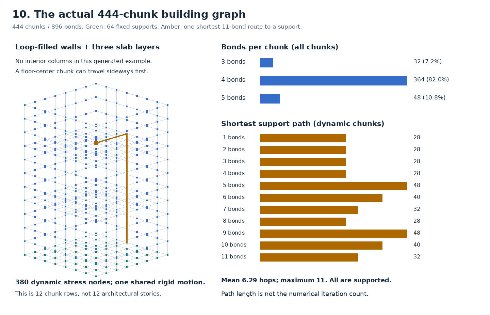
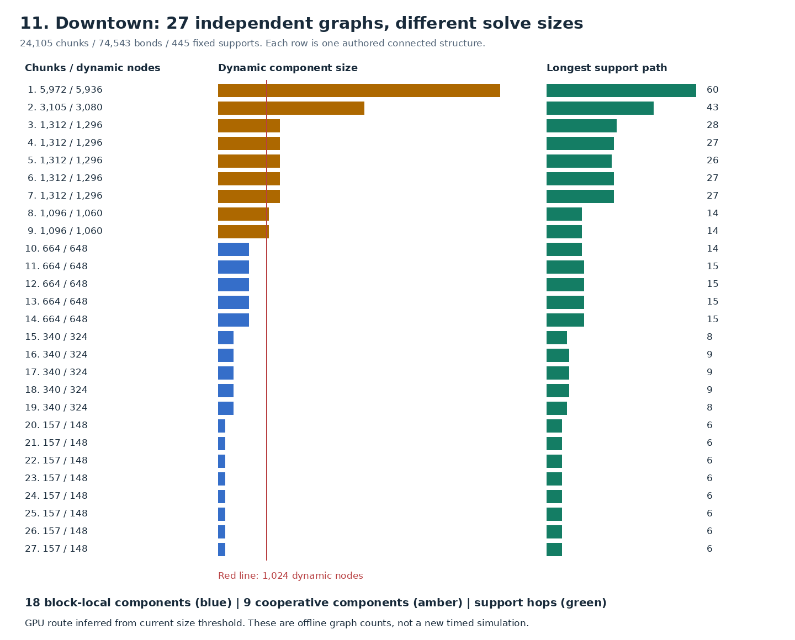

# Stress graph shape: what we actually solve

**The stress graph is a sparse network with loops, rather than a tree rooted at the foundation.** Independent buildings provide independent stress problems. Inside one intact building, loads couple through its surviving bonds; the solver repeatedly works on that component until the equations satisfy the convergence test. A building can become harder to solve while bonds break, before it separates into smaller components.

This supplement adds **new offline graph measurements** to the [visual computation audit](report.md). It does not add a new physics run or performance claim. The measured assets are the actual 444-chunk penetration building, an authored 3-floor frame, and the authored downtown scene. The numerical-work and timing examples below are explicitly identified archived captures.

## 1. What the building graph looks like



A dot is a chunk; a line is an authored structural bond. A contact between two unbonded chunks does not create a structural bond. Two buildings can collide and share contact/correction dependencies while their stress equations remain separate.

For the **444-chunk / 896-bond building**:

- **32 chunks have 3 bonds, 364 have 4, and 48 have 5.** Mean degree is **4.036**. There are no degree-6 chunks in this particular asset: it has perimeter walls and slab layers, but no interior columns continuing through the slabs.
- **64 chunks are fixed supports; 380 are dynamic stress nodes.** The graph has one connected component, and its dynamic nodes also form one component. Initially they share one rigid-cluster motion; the 380 stress nodes are not 380 separately simulated rigid bodies.
- The shortest support route for dynamic chunks averages **6.295 bonds**, reaches **11 bonds**, and has a 95th percentile of **11**. A floor-center chunk at grid coordinate `(3,8,3)` needs three horizontal bonds to reach the perimeter plus eight vertical bonds to the foundation.
- There are **453 independent graph cycles** when including the fixed chunks, and **377** in the dynamic-only subgraph. This is a topological count, not a count of independent physical mechanisms. A tree would have zero cycles. Loads have many possible routes, so a single bottom-up subtree sum does not solve the general problem.

The geometry has **12 chunk rows with slabs at rows 0, 4 and 8**. Calling it a twelve-story building would be incorrect. Chunk resolution and architectural floor count are different quantities.

## 2. Realistic variation: frames, shells and irregular downtown structures

The [exact census below](#exact-graph-census) contains every degree bin, component size and support-path summary.

| Actual asset | Chunks / bonds | Bonds per chunk: min / mean / max | Dynamic support path: mean / max |
|---|---:|---:|---:|
| Authored 3-floor, 2×2-bay frame | 64 / 132 | 1 / 4.125 / 6 | 5.00 / 9 |
| Native penetration building | 444 / 896 | 3 / 4.036 / 5 | 6.29 / 11 |
| Mixed-height downtown, 27 structures | 24,105 / 74,543 | 1 / 6.185 / 20 | 15.96 / 60 |

Degree includes foundations. In the 3-floor frame, all four degree-1 nodes are foundations; its dynamic chunks have degree 4–6. Downtown's dynamic chunks have degree 2–20. The upper tail is real authored connectivity: the degree-20 node is a wall chunk. These graphs have no duplicate endpoint pairs, so bonds-per-chunk and distinct-neighbors-per-chunk coincide.



Downtown's **27 independent stress components** contain **148 to 5,936 dynamic nodes** each. Its largest authored structure has **5,972 chunks / 5,936 dynamic nodes**, chunk-center elevations spanning **0.301 to 84.476**, and a longest support route of **60 bonds**. This is several large connected problems, rather than one 24,105-node problem.

At the current **1,024-dynamic-node threshold**, **18 downtown components use the block-local route and 9 use the cooperative large-component route**. That classification comes from the actual graph and current dispatch threshold, not a new performance experiment. All 256 intact penetration-style buildings fit the block-local route individually.

For a controlled height comparison, extending the same 8×8 shell/slab generator gives:

- **8 chunk rows:** 296 chunks, 588 bonds, maximum support distance 7; mean degree 3.973.
- **40 chunk rows:** 1,480 chunks, 3,052 bonds, maximum support distance 39; mean degree 4.124.

The local neighbor count barely changes, but paths get longer and the taller component exceeds the block-local size threshold. These are graph-only synthetic variants, roughly two versus ten slab-spacing intervals, **not qualified two-story and ten-story physics fixtures**.

## 3. What is computed before anything separates?

The rigid-body solver supplies the actual contact impulses. We convert them, with gravity/inertial contributions and application points, into chunk force/torque loads. Even though the intact building moves as one rigid cluster, its internal bonds must distribute those loads consistently through the structure.

Conceptually, each dynamic node has **six coupled numerical entries: three linear and three angular**. The angular terms represent torque, bending and torsion coupling; geometry offsets and inertia affect the coefficients. These are internal stress-solver variables, not six extra independently integrated rigid-body coordinates per chunk.

For one intact native building:

| Quantity | Exact count | Meaning |
|---|---:|---|
| Authored chunks | 444 | Persistent geometry and authored identity |
| Fixed support chunks | 64 | Boundary conditions, not iterative unknowns |
| Dynamic nodes | 380 | Six numerical entries per node: 2,280 entries |
| Dynamic–dynamic bonds | 756 | Couplings between numerical unknowns |
| Dynamic–support bonds | 28 | Boundary contributions |
| Support–support bonds | 112 | No dynamic-row contribution |
| Dynamic adjacency entries | 1,540 | `2 × 756 + 28`; potential entries in one complete dynamic-row gather |

For **256 independent copies**, that becomes **97,280 dynamic nodes**, **583,680 scalar entries per six-component vector**, and **394,240 dynamic adjacency entries per whole-city sweep**. These are structural counts before fracture, not bytes transferred or measured kernel work. The city still has 113,664 authored chunks and 229,376 authored bonds.

The numerical system is conceptually block diagonal across buildings. We do not build a dense city-wide matrix. Within each component, a thread visits a node's small neighbor list, reads the current neighbor values, evaluates force/torque coupling and contributes to a component reduction. Several different sweeps occur per iteration.

The current resident iteration performs:

1. **Prepare the residual:** how inconsistent are the current bond responses with the required load? For free components, account for rigid-motion null modes that do not represent deformation.
2. **Apply the sparse operator and test convergence.** Near acceptance, rebuild/check the actual residual rather than trusting only the iterative recurrence.
3. **Precondition:** improve the numerical correction direction. Small components use cached local 6×6 inverse products and a two-step polynomial involving an extra neighbor traversal. The first update has a cheaper projected direction; the fixed preconditioned recurrence begins afterward.
4. **Update the direction; apply the operator again; reduce the step-size terms.**
5. **Update the solution.** Repeat for this component if still unconverged; otherwise retire it independently. Recover bond responses for material evaluation.

For small components, these iterations run **inside one resident CUDA block**, whose workers claim the next independent component from a GPU queue. They are not separate physics simulations or one host kernel launch per numerical iteration. Large components use a cooperative schedule with broader synchronization.

**A support distance of 11 does not mean 11 iterations.** Breadth-first search measured that distance once for this document. The runtime stress solver does not launch a path-to-foundation search for every chunk on every iteration. Graph extent is one clue to numerical difficulty; coupling strengths, geometry, supports, slenderness, loading, warm starts and the preconditioner all matter. A scalar unweighted graph is not the full six-component physical operator.

## 4. Fracturing before separation can be the difficult case

Consider four wall chunks connected as a square. In the native asset they have four internal bonds and eight bonds to the rest of the building. The offline illustration below removes only boundary edges:

```text
Intact                         Almost separated                 Separated
large building == square      large building -- square         large building    square
8 boundary bonds              1 boundary bond                  0 boundary bonds
one coupled problem           still one coupled problem        independent problems
896 bonds total               889 bonds total                  888 bonds total
```

The first seven removals leave **all 444 chunks connected**. Removing the eighth produces a **440-chunk supported component and a 4-chunk free component**. These are illustrative graph edits, not a predicted stress verdict or altered demo.

While that last connection remains, we cannot solve the square as an independent island: its reaction on the main structure still matters. A narrow or weak connection can create difficult long-range numerical modes. Losing edges can therefore reduce work per sweep while increasing the number of sweeps. After separation, a small fragment can become cheap, though contact, rotational or other loads can still require stress work.

Free fragments lacking support paths are not automatically an error. Their inertial loads and free-body modes need the correct equations. Shared static ground also does not connect all buildings into one stress island: supports are fixed boundaries, and dynamic component discovery does not traverse through them.

Exact local elimination is a possible way to reduce a connected problem to smaller interface equations, then recover its internal bond responses. That would preserve coupling if derived and validated correctly. Simply declaring still-connected regions independent would change the physics. Factor setup, changes after fracture and interface-system size determine whether elimination wins; it is an optimization candidate, not a demonstrated shortcut.

## 5. What repeats enough to cost real time?

The most informative existing census is **256 buildings / 113,664 chunks / 229,376 bonds**, a 768-shot tape over 600 steps / 10 simulated seconds, RTX 4090, Direct GPU mode off, sleeping on, at most one correction and two stress evaluations. At **tick 48**, the intrusive work capture has 256 projectiles present, 10,449 reported fragment bodies, 10,193 awake fragment bodies and 216,220 reported normal contacts.

| Stress work at that tick | Trial | After correction | Both evaluations |
|---|---:|---:|---:|
| Component evaluations | 1,030 | 1,793 | 2,823 |
| Sum of numerical updates | 42,342 | 64,748 | 107,090 |
| Outer live adjacency visits | 108,468,281 | 134,005,650 | 242,473,931 |
| Polynomial live adjacency visits | 52,977,482 | 66,135,676 | 119,113,158 |
| Cached 6×6 inverse applications | 29,293,140 | 40,091,884 | 69,385,024 |

That is **361,587,089 counted live adjacency visits**, from repeated work over a much smaller persistent graph. An inverse application here means a cached small matrix–vector product, not re-inverting a matrix 69 million times. Counts do not include every preparation/recovery pass or establish actual memory traffic.

**Supported components account for 99.990% of those counted live adjacency visits.** Their 512 component evaluations require 104,134 updates; the 2,311 free-component evaluations require only 2,956. The largest opportunity in this stress capture is repeated supported-structure work, not speeding up thousands of tiny fragments. Fragment collisions and CPU lifecycle remain separate substantial costs.

Instrumented preconditioning plus its reductions accounts for **66.14% of summed component phase cycles**. That includes overlapping work across GPU blocks and probe overhead: it is not 66.14% of frame time and does not prove a bandwidth or compute bottleneck.

In the **separate archived phase-timing capture of the same workload**, tick 48 costs **145.462 ms complete**, with stress at **11.510 ms trial + 19.000 ms corrected = 30.510 ms**. Connectivity/mass/candidate work costs **0.957 ms** across its GPU intervals. Repeated stress is much larger than that connectivity category at this peak. The complete tick also includes collision, fragment/contact lifecycle and observations; 30.510 ms is not the whole destruction cost. See the [fully reconciled timing audit](report.md#3-where-100-of-the-fracture-tick-goes).

The counts and milliseconds come from different captures; dividing them does not produce a measured throughput. Neither capture is a new timing of current source. [Original component census](../../../qualification/vibe-component-work-accepted-20260908/report.md) · [Original timed phases](../../../qualification/rigid-additive-20260909/baseline-phases/report.md).

## 6. Where optimization follows from this graph shape

| Priority / status | Responsibility | What graph shape tells us |
|---|---|---|
| 🟠 Highest measured stress exposure | Preconditioning and repeated supported-component sweeps | Evaluate the entire recurrence, including neighbor gathers, local products, reductions and verification. Reduce repeat work or cost per sweep while retaining the physical convergence test. |
| 🟠 Long connected structures | Multilevel/interface treatment of long-range modes | Taller components and narrow remaining connections need more than a low neighbor count. Measure setup + all iterations; a stronger preconditioner can cost more than it saves. |
| ✅ Existing, 🟠 further locality work | Parallel independent components | Existing GPU work queue and independent retirement already exploit separate buildings. Improve layouts/cohorts and the long completion tail where evidence supports it. One block-local component does not distribute its own solve across all GPU SMs. |
| ✅ Existing, 🟠 eliminate remaining scans | Reuse unchanged converged components | Current exact-input certificates can skip iterative work. Producer-maintained dirtiness could avoid even visiting unchanged component inputs. This especially benefits idle cities and localized impacts. |
| 🟠 Component-local topology | Connectivity and derived-cache updates | No topology change already bypasses rebuilding. After changes, the current connectivity implementation still scans scene-wide node/bond ranges; rebuilding only affected old components remains an opportunity. |
| 🟠 Degree variation | Neighbor work mapping | The shell has degree 3–5; downtown has a 2–20 dynamic range. Warp/tile choices suitable for one distribution may waste work on the other. Degree alone does not establish the limiting GPU resource. |
| 🟠 Storage traversal | Dead bond references and stable adjacency | Endpoints/adjacency persist; deleted edges are checked and skipped. Avoiding dead visits is a candidate only if compaction/invalidation cost is repaid. A previous tested compaction did not establish a complete-step win. |
| 🔴 Separate architectural priority | Fragment/contact lifecycle and correction | These costs can scale with newly split owners and contacts even when free-fragment stress is cheap. Stress graph optimization alone does not remove them. |

### Are unchanged buildings still solved?

**They can skip the iterative solve now, but only with a valid proof.** Current source checks exact effective force/torque input equality, operator/topology validity, solver settings and a previously verified stored-output certificate. A newly converged internal solution is insufficient until the stored bond response is verified. Unrelated unchanged components can retain certificates; changed old components and new split roots cannot blindly inherit them.

Eligibility still scans component inputs, and material/damage evolution still runs where required. No new contacts or rigid-body sleeping alone does not prove every stress input stayed unchanged. There are also narrowly proven zero-input cases, including free trees, handled algebraically; that does not authorize freezing arbitrary free rubble or supported cycles.

### What should we count next to explain difficult solves?

For each expensive component, join **actual solve iterations and phase time** with dynamic nodes, live/dead adjacency visits, degree histogram, support boundary count, support distance, retained warm-start validity and topology change. Add numerical residual reduction, preconditioner applications and interface/coarse sizes. Weight summaries by actual work, not just number of islands.

For physical graph diagnosis, distinguish weak/narrow connections and geometry/coefficient contrasts from simple unweighted distance. A 60-hop path is a descriptor, not a predicted 60-iteration solve. For GPU diagnosis, separate total work from the slowest serial recurrence and insufficient concurrent components. Hardware bandwidth/occupancy claims remain unproven without suitable measurement; the existing software work counts establish repetition, not which GPU resource saturates.

### Which graph operations are actually running?

| Operation | Owner and frequency | Approximate work dependency |
|---|---|---|
| Shortest paths shown here | Offline CPU analysis only | One multi-source traversal of nodes + adjacency |
| Stress component discovery | GPU when topology generation changes | Current node/bond scans, atomic union/root finding, flattening and sorting; fixed supports excluded as bridges |
| Sparse stress iteration | GPU, repeatedly within each active component | Sum over actual iterations of node and adjacency work, plus preconditioning/reductions |
| Convergence and settled reuse | GPU, within solves / at solve entry | Component reductions; exact input/certificate validation before reuse |
| Material verdict and damage | GPU after stress | Required bonds/chunks; damage may evolve while stress is reused |
| Mass/motion regrouping | GPU after structural splits | Changed topology and cluster reductions, with remaining lifecycle ownership described in the main audit |

The adjacency is a flat neighbor list plus row offsets; component ranges provide stable node ordering. A hierarchy can accelerate solving or grouping, but the surviving bonds remain connectivity truth. The solver is not an all-pairs interaction calculation, a dense matrix multiplication, or a repeated breadth-first search to ground.

## Exact graph census

All degree counts include fixed chunks. Support-hop statistics exclude them. Paths are unweighted: one bond = one hop.

| Asset / generated variant | Chunks | Bonds | Supports | Stress components | Degree min / mean / max | Support hops mean / p95 / max |
|---|---:|---:|---:|---:|---|---|
| Authored 3-floor frame | 64 | 132 | 4 | 1 | 1 / 4.125 / 6 | 5.000 / 9 / 9 |
| Native penetration building | 444 | 896 | 64 | 1 | 3 / 4.036 / 5 | 6.295 / 11 / 11 |
| Authored downtown | 24,105 | 74,543 | 445 | 27 | 1 / 6.185 / 20 | 15.956 / 47 / 60 |
| Synthetic height: 8 chunk rows | 296 | 588 | 64 | 1 | 3 / 3.973 / 5 | 4.241 / 7 / 7 |
| Synthetic height: 40 chunk rows | 1,480 | 3,052 | 64 | 1 | 3 / 4.124 / 5 | 20.356 / 38 / 39 |

Every intact asset above has a support path for every dynamic chunk. None has self-bonds or duplicate endpoint pairs. Synthetic height variants change only graph generation; no physics quality or timing is asserted.

### Complete degree histograms

| Bonds per chunk | Native 444-chunk building | Authored 64-chunk frame | Downtown 24,105 chunks |
|---:|---:|---:|---:|
| 1 | 0 | 4 | 125 |
| 2 | 0 | 0 | 298 |
| 3 | 32 | 0 | 334 |
| 4 | 364 | 48 | 2816 |
| 5 | 48 | 4 | 6246 |
| 6 | 0 | 8 | 6828 |
| 7 | 0 | 0 | 1865 |
| 8 | 0 | 0 | 2021 |
| 9 | 0 | 0 | 1970 |
| 10 | 0 | 0 | 1036 |
| 11 | 0 | 0 | 343 |
| 12 | 0 | 0 | 148 |
| 13 | 0 | 0 | 45 |
| 14 | 0 | 0 | 14 |
| 15 | 0 | 0 | 9 |
| 16 | 0 | 0 | 1 |
| 17 | 0 | 0 | 4 |
| 19 | 0 | 0 | 1 |
| 20 | 0 | 0 | 1 |

### Downtown degree by authored role

| Chunk role | Count | Degree min | Mean | Max |
|---|---:|---:|---:|---:|
| column | 7,384 | 2 | 4.709 | 8 |
| foundation | 445 | 1 | 2.121 | 5 |
| slab | 9,116 | 5 | 7.158 | 15 |
| wall | 7,160 | 2 | 6.720 | 20 |

### Intact dynamic-component sizes

| Dynamic nodes per component | Downtown component count | Current CUDA route |
|---:|---:|---|
| 148 | 8 | Block-local |
| 324 | 5 | Block-local |
| 648 | 5 | Block-local |
| 1,060 | 2 | Cooperative large-component |
| 1,296 | 5 | Cooperative large-component |
| 3,080 | 1 | Cooperative large-component |
| 5,936 | 1 | Cooperative large-component |

### Controlled graph cuts: not a simulated fracture verdict

A 2×2 square of four wall chunks at x=0, y=5–6, z=2–3 has eight bonds to the rest of the building. Its four internal bonds form a loop.

| Illustrative state | Removed bonds | Remaining bonds | Connected component sizes | Unsupported dynamic chunks |
|---|---:|---:|---|---:|
| Intact | 0 | 896 | 444 × 1 | 0 |
| Only one external bond left | 7 | 889 | 444 × 1 | 0 |
| Last external bond removed | 8 | 888 | 4 × 1, 440 × 1 | 4 |

### Reproduction and provenance

Run `python3 graph-shape.py` from this directory. It reads authored assets, validates graph identities and produces this census and two figures. No physics or GPU benchmark runs. The 444-chunk graph is checked against the actual playable asset: endpoint pairs, node order, fixed-support flags and positions up to their documented translation. The four-building tile is checked to have four 380-node dynamic components.

Nearest-rank percentiles; BFS starts from all fixed chunks at distance zero. Component discovery excludes fixed chunks for stress partitioning. Graph degree, component and path identities are checked internally. [Machine-readable counts and input SHA-256 hashes](graph-shape-data.json).
