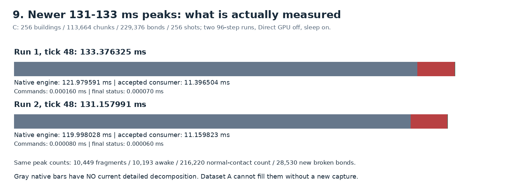
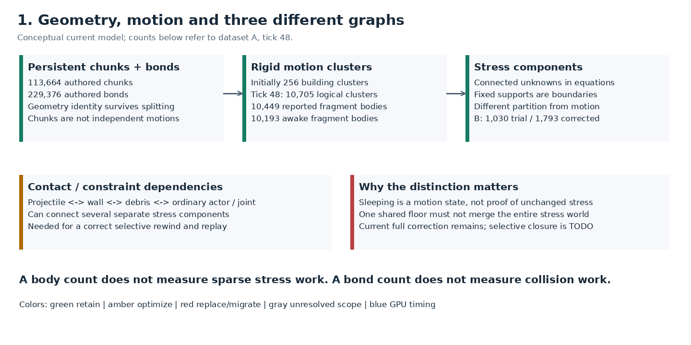
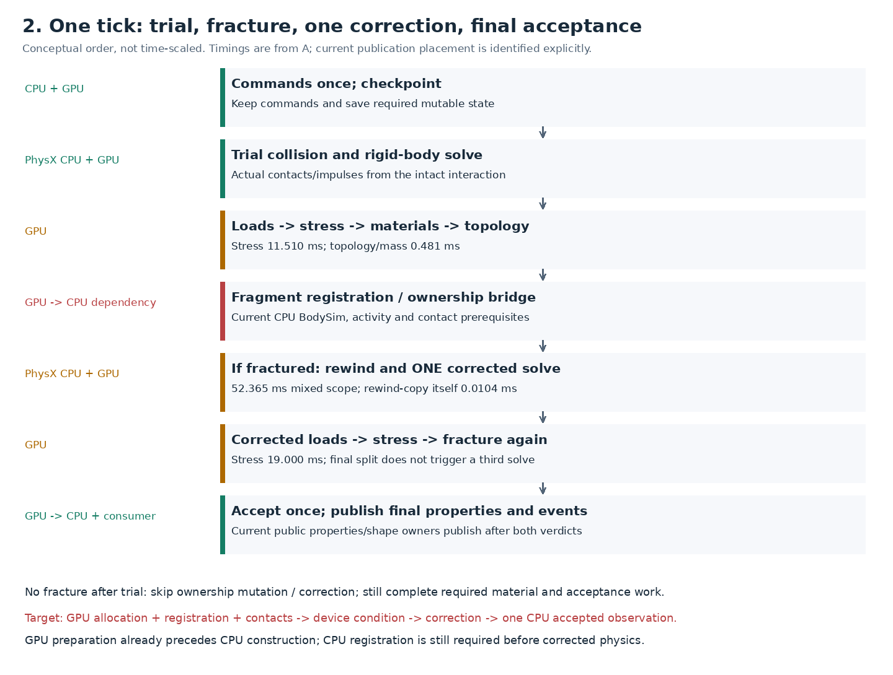
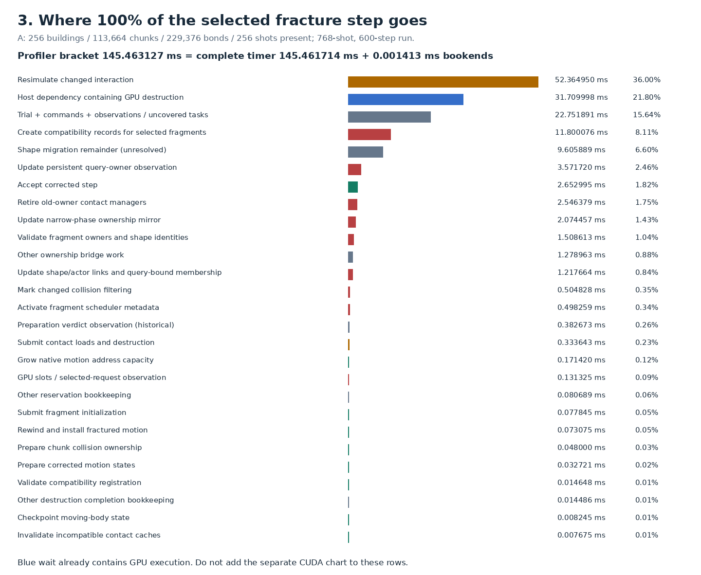
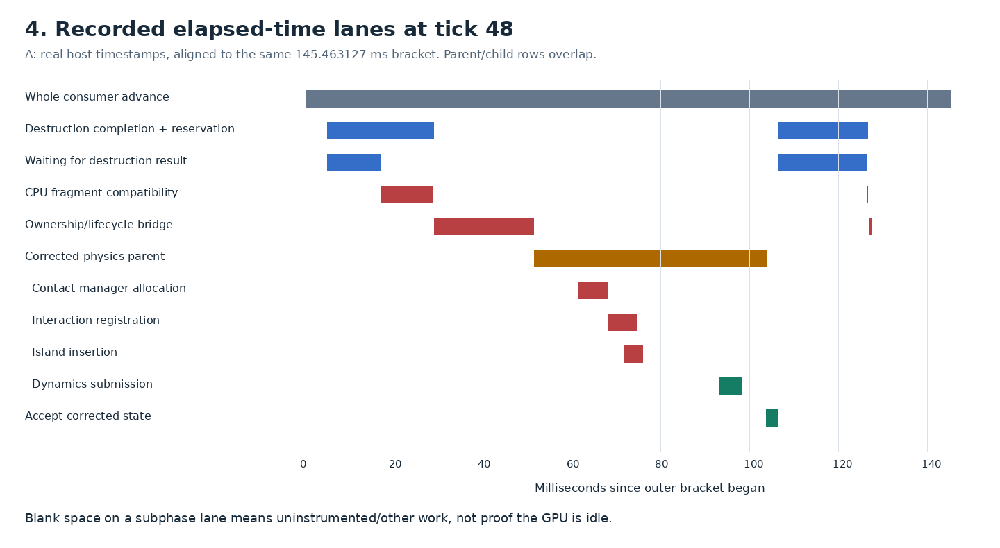
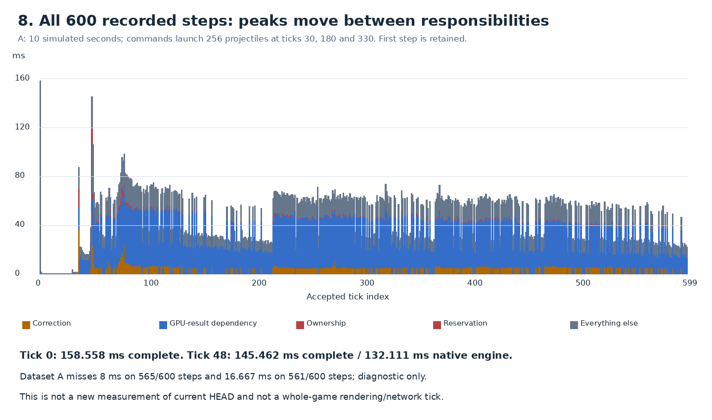
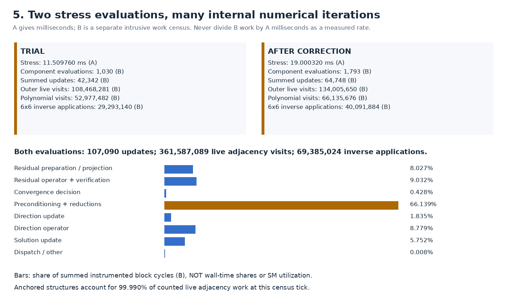
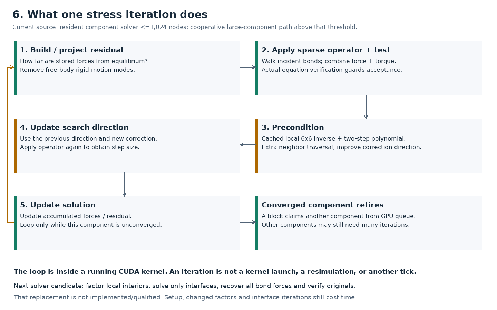
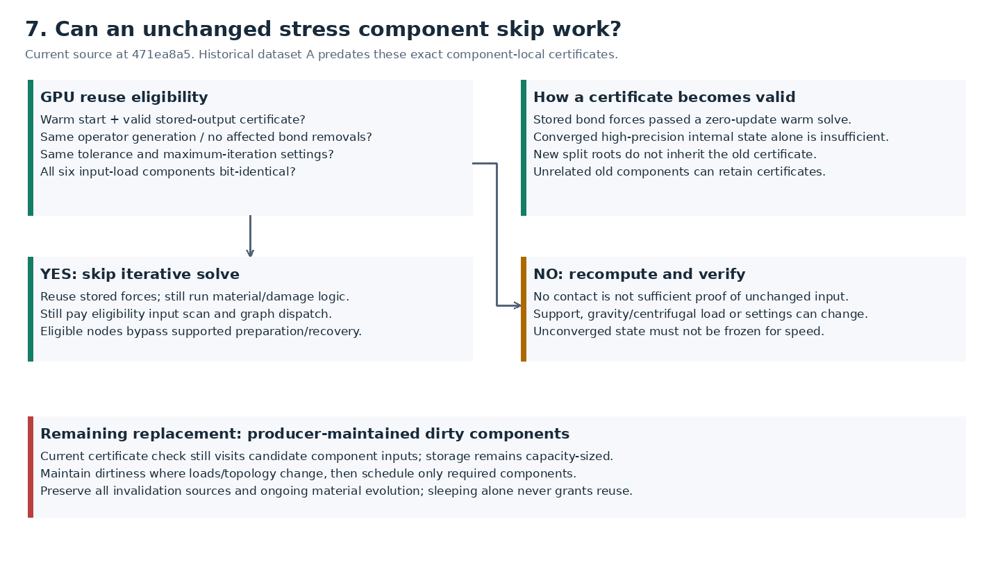

# GPU destruction: visual computation audit

**Start here:** the major cost is repeated structural solving plus fragment/contact lifecycle work around correction. The rewind copy is tiny. We already have resident CUDA iteration, independent component convergence, GPU topology and exact settled-result reuse. We do **not** yet have a fully GPU-owned fragment registration/correction pipeline or fully component-local dirty work.

This document explains responsibilities without requiring code reading. Figures use measurements where available and label conceptual diagrams separately. **A gray remainder is accounted elapsed time whose internal cause is unresolved; it is not missing time, free time, or automatically removable work.**

**Graph-shape supplement:** [actual neighbor counts, support distances, component sizes and what they mean for CUDA work](graph-shape.md).

## Reading map and colors

1. [What the engine represents](#1-what-exists-in-the-engine): chunks, motion and three different graphs.
2. [One tick](#2-one-tick-and-why-there-are-two-stress-evaluations): why stress follows actual collision response.
3. [Where 100% goes](#3-where-100-of-the-fracture-tick-goes): exact wall accounting and recorded timeline.
4. [Repeated work](#4-how-much-work-is-repeated): counts, stress algorithm and computational dependency.
5. [Skipping and redundancy](#5-are-we-re-solving-unchanged-structures): current cache conditions and remaining scans.
6. [Replacement priorities](#6-what-to-delete-replace-or-optimize): costs, constraints and falsifiable experiments.
7. [CUDA usage](#7-which-cuda-features-are-we-actually-using): implemented mechanisms versus proposals.
8. [Questions and measurement gaps](#8-common-questions): what we can and cannot conclude.
9. [Exact generated accounting](#exact-accounting-appendix-generated): every nonzero category, call counts, multiple ticks and newer screens.

| Color / marker | Meaning |
|---|---|
| 🟢 Green — **KEEP** | Required responsibility; existing implementation retained for the stated scope |
| 🟠 Amber — **OPTIMIZE** | Necessary computation; algorithm/layout/scheduling improvements are candidates |
| 🔴 Red — **REPLACE / MIGRATE** | Current implementation or dependency should change; responsibility may remain |
| 🔵 Blue — **GPU interval / dependency** | Measured device work or a host span containing it; not an extra additive cost |
| ⚪ Gray — **UNRESOLVED** | Broad/mixed attribution or unmeasured detail; investigate rather than assume |
| ✅ / 🟡 / ⬜ / ❌ | Implemented / partial or unpromoted / remaining / rejected experiment |

## Evidence: three datasets, never silently combined

**Source audit:** clean source revision `471ea8a55bef3d1320a06d65d238f351f9015859`, inspected 2026-09-09. No engine edits, rebuilds, deployment, service changes or new physics runs were made for this report. Documentation and figures are new. The current private runtime factory is V10; public scene ABI is 15. An archived static-registration prototype/review patch is not a completed integrated lifecycle replacement.

| Key | What it establishes | Workload and limits |
|---|---|---|
| **A — timed diagnostic** | Exact disjoint elapsed-time accounting and host call counts; separate CUDA event intervals | RTX 4090; 256 buildings, 113,664 chunks, 229,376 bonds, 768 shots in 3 waves; 600 steps / 10 simulated seconds. Direct GPU **off**, sleeping **on**, timestep 1/60, correction ≤1, stress passes ≤2. One intrusive phase capture. |
| **B — stress work census** | Component iterations, adjacency visits, inverse applications and block-cycle shares | Same authored city and shot tape; separate intrusive replay, 600 steps / 920 stress evaluations. Counts match its untraced control until the first reported difference at tick 71; matching counts are not proof of identical motion. |
| **C — newer short screens** | Recent complete-step idle/destruction timings on the later implementation | Same city asset; 96 steps / 1.6 simulated seconds per run. First 256-shot wave only; separate zero-shot pristine idle. Two baseline and two candidate runs per regime. No five-run/endurance promotion. |

[A: original phase report](../../../qualification/rigid-additive-20260909/baseline-phases/report.md) · [B: census](../../../qualification/vibe-component-work-accepted-20260908/report.md) · [C: latest iteration-settings receipt](../../../qualification/native-iteration-limits-20260909/README.md).

**A's 145.462 ms is an older instrumented fracture tick, not a fresh measurement of HEAD.** C records fracture peaks of **133.376 and 131.158 ms**, but has no equivalent detailed phase capture. We cannot honestly distribute those newer 130-plus milliseconds using A's percentages.

 C's startup peaks are still higher than its fracture peaks; see the generated appendix.

The timings include recorded commands, native physics/destruction, mandatory accepted-state processing and consumer events. Asset/context preparation is separate. Rendering, video encoding and network serialization are excluded; this is not the whole game's tick cost.

## 1. What exists in the engine

A **chunk** is persistent geometry with authored identity and mass properties. A **bond** describes structural coupling between chunks. A **rigid cluster** is a connected group sharing one motion state: position, orientation, linear velocity and angular velocity. We preserve chunks while changing which cluster supplies their motion.

A **stress component** groups unknowns coupled by structural equations. Fixed supports are boundary conditions, not bridges joining all buildings through the ground. A **contact/constraint dependency set** instead links interacting bodies and joints; a projectile can couple several otherwise independent stress components.

At A's tick 48 there are **10,705 logical clusters**, **10,449 reported fragment bodies**, **10,193 awake fragment bodies** and **256 projectiles present**. These counts come from different producers: do not add the logical-cluster count to the fragment count or treat 113,664 chunks as independently solved rigid bodies. The awake count does not include every kind of actor in the scene.

## 2. One tick and why there are two stress evaluations

The initial rigid interaction must be solved to obtain its actual normal/friction impulses. Those impulses, application points and moments become structural loads. The stress solver determines bond response; material laws decide which bonds break. Connectivity determines new clusters, their full mass/inertia and reconciled motion.

If fracture changes the interaction, the engine restores checkpointed motion and performs **one corrected physics advance over the same timestep**. It then evaluates the corrected contact loads through stress/materials again. A second fracture verdict can split final state, but the correction limit forbids a third physics advance. Events describe accepted state, not trial-pass callbacks.

This is **one simulated tick**, up to **two rigid-body simulations**, and up to **two stress/material evaluations**. It is not a 107,090-pass physics replay. The final-split policy is bounded correction, not an assertion that every possible within-tick fracture/contact feedback has reached an unlimited fixed point.

**Current versus intended ownership:** chunk motion preparation and allocation increasingly use GPU state before CPU compatibility construction. However, CPU simulation records, active scheduling and contact/shape registration still gate corrected physics. Current public shape/query ownership and physical properties publish after both verdicts. The final architecture removes the intermediate CPU registration prerequisite while preserving accepted ordinary PhysX queries and commands.

## 3. Where 100% of the fracture tick goes

The two timer brackets reconcile as follows for **A, tick 48**:

- Native physics + destruction: **132.111269 ms**.
- Accepted consumer observations/events: **13.350094 ms**.
- Recorded-command/pre-step work: **0.000270 ms**.
- Final status/snapshot bracket: **0.000081 ms**.
- **Complete advance: 145.461714 ms** — exactly the sum above.
- Profiler wrapper/FFI bookends: **0.001413 ms** beyond that complete bracket.
- **Disjoint profiler partition: 145.463127 ms = 100%.**

The large `trial.other` category in the archived profiler is **22.751891 ms**. It includes the separately measured consumer observations above; it is **not 22.75 ms of GPU physics**. Subtracting observations, commands, final status and outer bookends leaves **9.400033 ms** of trial/uncovered native work. That is an algebraic remainder, not a newly measured narrow-phase or solver interval.

The ownership path also contains **9.605889 ms** of unresolved work inside the shape-migration parent. We know where that duration lies, but cannot claim how much is lookup, container growth, validation, instrumentation or driver work without more detailed evidence.

This is an **elapsed-time lane chart**, not a sampled CPU flame graph. It displays actual timestamps and nesting. A parent contains its children; CPU tasks can run concurrently. Adding all lanes would double count time. We cannot align device events as a true GPU timeline because this archive stores CUDA durations without synchronized per-kernel start/end timestamps.

**What “waiting” means:** the two host GPU-completion spans total **31.709998 ms**, while GPU stress alone totals **30.510080 ms**. The wait contains useful GPU work; deleting the host wait instruction does not delete the computation. The difference is not a measured “pure synchronization overhead,” because event boundaries, queued work and submission overlap differ. The opportunity is removing host decisions between required GPU stages and enabling valid concurrency.

The **52.364950 ms correction scope** contains CPU task scheduling/contact lifecycle and GPU collision/solve. Its nested scopes include contact-manager allocation (6.703 ms), interaction registration (6.560 ms) and island insertion (4.029 ms), but they are not independently additive. The actual GPU rewind-state copy is **0.010400 ms**. Optimizing the copy cannot eliminate the correction scope.

The first measured step is **158.558196 ms**, larger than tick 48, even without impacts. Explicit initialization is another **675.872602 ms**, outside simulation timing. The first step stays in every-step gates. A no-impact beginning of a bombardment run is not a substitute for the separate fresh-idle campaign in C.

## 4. How much work is repeated?

### Fragment/contact lifecycle: thousands of host operations

At A's tick 48, fragment bodies rise from **4,105 to 10,449**: **6,344 net new bodies**. The profiler records two reservation/application batches and **10,376 calls to each** of these ownership suboperations:

| Operation | Aggregate measured ms | Calls | Disposition |
|---|---:|---:|---|
| Mark filtering changes | 0.504828 | 10,376 | 🔴 Replace migration-driven bookkeeping; preserve newly eligible pairs |
| Retire old-owner contacts | 2.546379 | 10,376 | 🔴 Preserve valid geometry, explicitly invalidate incompatible solver state |
| Update narrow-phase owner mirror | 2.074457 | 10,376 | 🔴 Internal GPU ownership transaction |
| Update actor/shape links | 1.217664 | 10,376 | 🔴 Batch necessary accepted CPU compatibility |
| Update query-owner mirror | 3.571720 | 10,376 | 🔴 Accepted-only changed-owner publication |

That is **51,880 instrumented child-scope invocations**, totaling **9.915048 ms**; the encompassing migration scope is **19.520937 ms** with its remainder included. The repeated count is calls, not proven unique shapes. Instrumentation itself has cost. The five numbers belong to A's earlier bridge; current publication placement has changed.

The accepted consumer also observes **93,488 chunk records**, **28,530 broken-bond records** and **2,357,872 bytes** of topology payload at this step. Those are reported topology observation bytes, not all host/device traffic. Actual new broken bonds are **28,530**; cumulative broken bonds are **57,788**. Observed chunk records are not the same thing as migrating shapes or new bodies: retained-cluster frame changes can expand publication.

### Stress: repeated mathematical work inside resident kernels

B counts **2,823 component evaluations**, **107,090 summed component updates**, **242,473,931 outer live adjacency visits**, **119,113,158 polynomial live adjacency visits**, and **69,385,024 cached local inverse applications** at its tick 48. Counts cover both evaluations. A visit means examining a live incident bond during one sparse traversal; it is not a unique bond or a DRAM transaction.

The maximum component-iteration counter in A is **357**. That maximum is neither the sum over components nor the configured ceiling (**8,192**). B separately records the summed work. These are not millions of CUDA launches: iterations execute inside resident kernels, while thread blocks claim independent components from a device queue.

**512 anchored component evaluations account for 99.990% of counted live adjacency visits.** Free fragments are numerous but contribute only 0.010% to this census metric. Thus “many awake fragments” can dominate collision/lifecycle while the still-connected supported structures dominate structural solving. The dominant workload depends on the phase.

The census attributes **66.14% of summed instrumented block-phase cycles** to preconditioning/reductions. Within its measured preconditioning subphases, polynomial/application is 82.61%. Neither percentage is a share of the 145.46 ms tick. Blocks overlap on the GPU and probes perturb them; **do not multiply these percentages by A's stress milliseconds and call the result measured**.

In plain language:

1. **Residual:** find the remaining imbalance in the structural equations.
2. **Sparse operator:** gather connected neighbors' force/torque contributions instead of storing a giant dense matrix.
3. **Preconditioner:** cheaply approximate a useful correction using cached local 6×6 blocks and a two-step polynomial. This costs additional neighbor visits but aims to reduce total iterations.
4. **Search direction/step:** combine the new correction with prior information and choose the update.
5. **Verify:** check the actual equations, retire converged components independently, and keep working on the others.

Current small-component path: one CUDA block owns a component up to **1,024 nodes**; intermediate scalar reductions use shared memory, while substantial vectors/adjacency remain in device arrays. “Resident solver” means resident execution, not that its entire working set fits in shared memory. Larger components use cooperative execution and a multilevel preconditioner; do not generalize the small-component census to all connected downtown behavior.

**Why not one giant matrix multiply?** These are sparse graph operators with six physical components per node and irregular connectivity, not a large dense product. Dense work is appropriate for bounded local blocks or interface/coarse systems. The proposed replacement factors local interiors once, solves the remaining interfaces, then recovers all original responses. It could eliminate repeated work, but it must pay for factor construction, changed topology, interface iteration and authoritative residual checks. It is currently an unqualified candidate.

## 5. Are we re-solving unchanged structures?

**Sometimes we can skip, and current source does.** There are several distinct mechanisms:

| Question | Current answer | Remaining cost / condition |
|---|---|---|
| Does a component stop once converged inside a solve? | ✅ Yes | Other components continue; large-path global traversal/synchronization may remain |
| Is the last solution reused as a starting point? | ✅ Yes | A warm start alone still requires residual work |
| Can the iterative solve be omitted across calls? | ✅ Exact GPU certificate path is connected | Requires identical effective input and settings, valid operator generation and stored-output verification |
| Do unrelated components keep certificates after another component fractures? | ✅ Changed-old-component invalidation preserves unaffected certificates | New split roots cannot inherit a parent's proof |
| Are reusable components found without scanning their input? | ⬜ No | Current eligibility comparison still scans component inputs; capacity-sized storage remains |
| Does sleeping alone skip stress? | ❌ No | Sleep is not proof that support/load/material state is unchanged |
| Does no new contact mean no work? | ❌ Not by itself | Gravity, acceleration, centrifugal load, supports, settings and topology also matter |
| Does stress reuse skip damage/material laws? | ❌ No | Material/crushing/damage verdict remains independent and executes |
| Does reuse eliminate the physical-force export traversal? | ⬜ No | Native submission still launches a bond-count-sized conversion/export kernel after the solve |
| Does unchanged topology skip connectivity rebuilding? | ✅ Device condition bypasses it | A changed topology can still trigger broad node/bond passes |
| Is connectivity fully recomputed only for affected components? | ⬜ Not yet | Exact local invalidation exists for some caches; full local topology storage is unfinished |

The certificate requires a **zero-update warm solve of stored bond forces**, not just an internally converged higher-precision intermediate. It compares all six load components bitwise and numerical settings. In the current resident API, bond removals are the mutable operator change covered by the local invalidation mechanism; future support/material/operator mutators must preserve or expand that contract.

The native path rejects older external `skipSettledIslands` settings, but its separate internal certificate kernels are connected in submission. Reading the rejected external flag alone would incorrectly suggest that native reuse is absent.

The [settled-local receipt](../../../qualification/native-settled-local-20260909/README.md) reports two baseline/two candidate 600-step runs per regime. For this 256-building asset, idle median improves from **0.567–0.580 to 0.413–0.433 ms**; the paired destruction run has 768 shots, with fracture peaks **133.140–133.482 versus 131.589–138.358 ms**. That establishes a short-screen idle benefit, not a destruction-peak win or complete qualification. These measurements predate C and are not additive savings.

## 6. What to delete, replace or optimize

Priorities below use exposed work, not promised milliseconds. Overlapping opportunities share the same budget. The [full replacement plan](../REPLACEMENT_PLAN.md) and [implementation ledger](../IMPLEMENTATION_LEDGER.md) remain the detailed planning references; dated status prose must be reconciled with later receipts and current source.

| Priority / regime | Status and replacement | Why it could matter | Proof required before claiming a gain |
|---|---|---|---|
| **1 — fracture peaks** | 🟡 🔴 Finish GPU fragment registration, activity and ownership | Thousands of CPU lifecycle operations and contact churn sit between GPU stages | Same ordinary actors/joints, ordering, sleep/wake, new contacts and exact controlled motion; compare all peaks |
| **2 — active stress** | ⬜ 🟠 Reduce repeated structural work with local factor/interface solving | B counts 361.6 million live adjacency visits and 69.4 million inverse applications | Exact captured equations; include setup, invalidation, response recovery and verification; no tolerance changes |
| **3 — fracture peaks** | ⬜ 🔴 Preserve valid contacts and introduce selective correction | A correction exposes 52.365 ms, but necessary rigid work and lifecycle overlap | Dependency closure through ordinary bodies/joints; discover newly eligible pairs; full recompute when validity fails |
| **4 — idle + localized impacts** | 🟡 🔴 Producer dirty lists and component-local topology/storage | Reuse currently scans inputs; local changes can still cause global topology passes | Single-input/support/topology invalidation tests; unchanged-component preservation; continued damage |
| **5 — publication bursts** | 🟡 🔴 Separate cluster-frame changes from true chunk migrations | A reports 93,488 chunk observations and 13.350 ms consumer work | COM/frame changes, membership and current-tick queries must agree; no stale rendering |
| **6 — stress throughput** | 🟠 Complete iterative-state locality and work scheduling | Repeated gathers, reductions, FP64 work and component tails remain | Exact GPU replay plus whole-step idle/destruction screens; include packing and occupancy costs |
| **7 — smaller necessary passes** | 🟠 Loads/material fusion, changed-cluster mass specialization, initialization cleanup | A contact loads 0.281 ms; materials 0.139 ms; topology/mass 0.957 ms | Preserve forces, torques, energy, minima/IDs, overflow errors and event accounting; audit the separate full-bond force-export pass |

These are expected opportunity rankings, not a claim that every item has positive measured savings. A's stress total is **30.510 ms**: even making it free, holding everything else fixed, leaves **114.952 ms** of the complete advance. The analogous calculation cannot be applied to every GPU stage at once without accounting for overlap.

### Already removed or retained: do not start again from old implementations

- ✅ Internal solved-contact consumption eliminates the external contact/load round trip.
- ✅ GPU checkpoints replace CPU rigid-motion snapshots; the copy is not the current dominant cost.
- ✅ Native component iteration avoids host launch/resubmit per numerical update.
- ✅ Converged components retire independently; warm starts and unaffected inverse caches persist.
- ✅ Device topology conditions avoid rebuilds on unchanged generations.
- ✅ Shared normalization computes a component reciprocal once rather than repeatedly per node.
- ✅ Committed deltas replace unconditional whole-world CPU membership rebuilding, although affected-source expansion remains.
- ✅ Unnecessary initial sleep notifications were deleted; real sleep/wake semantics remain.
- 🟡 GPU allocation, birth records and physical-setting inheritance are partial final-ownership progress, not completed registration.
- 🟡 GPU reduction now computes active rigid iteration maxima, but the existing CPU launch loop still needs a **12-byte** completion result. Small bytes can still create a dependency.

### Experiments that did not justify promotion

| Experiment | Recorded disposition | What it teaches |
|---|---|---|
| Inverse-only shared-memory cache | ❌ Reverted; a capacity-only control also slowed execution | Reserving shared memory can reduce useful concurrency; caching more is not automatically faster |
| Four-stage polynomial / tested small-component coarse cycles | ❌ Additional passes outweighed convergence improvements | Compare total setup + solve + verification, not iterations alone |
| Register cap to force more resident blocks | ❌ Reverted after slower complete-step screening | Nominal occupancy is not throughput |
| Standalone shape-to-chunk lookup table | ❌ No established whole-step gain; reverted | Final shared ownership indexing remains useful, but a duplicate lookup representation is not the architecture |
| Retained contact-manager prototype | ❌ Failed controlled ordering/physical oracle | Contact geometry lifetime and solver registration order must be separated |
| Exact GPU settled certificates | ✅ Implemented; 🟡 short-screen qualification | An idle improvement is valuable even without a demonstrated fracture-peak gain |

Evidence and original scopes: [findings](../PERFORMANCE_FINDINGS.md), [contact ordering](../../../qualification/native-contact-owner-20260909/ORDERING_FINDING.md), [settled reuse](../../../qualification/native-settled-local-20260909/README.md). A neutral performance result can retain a simpler final-ownership change, but cannot be called a speedup. A physical regression is not acceptable architectural progress.

## 7. Which CUDA features are we actually using?

| Mechanism | Status / role | What remains to assess |
|---|---|---|
| Persistent device arrays and event dependencies | ✅ Geometry, bonds, solver state, topology and motion remain GPU-side | Intermediate lifecycle owners still force host observations |
| Conditional CUDA graphs | ✅ Gate topology transactions and repeated GPU work | Cannot enclose arbitrary CPU BodySim/contact creation; lifecycle ownership must change first |
| Cooperative groups | ✅ Large-component synchronization and selected lifecycle operations | Global barriers and residency constrain parallelism; use explicit legal occupancy |
| Warp shuffles / block shared-memory reductions | ✅ Norms, component normalization and work ownership | Further fusion must preserve numerical ordering/verification |
| Dynamic device work queue | ✅ Blocks claim the next independent stress component | Component size/degree cohorts may reduce tails; sorting overhead must be included |
| CUB scans, selection and sorting | ✅ Compact/count/order topology products; reusable scratch | Changed-region work instead of whole-world passes is unfinished |
| Atomic union-find and flattening | ✅ GPU stress connectivity; higher root links to lower root | Preserve minimum-ID labels; isolate affected old components rather than rebuild unrelated ones |
| GPU cluster mass/inertia reduction | ✅ Derive shared motion from persistent chunk properties | Changed clusters only, specialized tiny fragments and retained principal frames remain opportunities |
| FP32 + FP64 arithmetic | ✅ Sparse outer math plus higher-precision preconditioning/recovery | Executed FP64 fraction is unmeasured; do not infer arithmetic saturation from source types |
| Explicit asynchronous shared-memory staging | 🟠 Candidate, not a demonstrated broad production optimization | Requires regular enough tiles and reuse; extra registers/shared memory may hurt |
| Tensor Cores / reduced precision | ⬜ No qualified native stress path in this audit | Appropriate for bounded dense blocks; authoritative original residual and bond responses still required |
| TMA / distributed shared memory / block clusters | ⬜ Not available on the current RTX 4090 | Newer-GPU experiment, not required to eliminate today's host lifecycle dependencies |
| Hardware performance counters | ⚪ Unavailable in this environment | No measured cache hit rate, DRAM saturation, instruction-unit utilization or achieved occupancy |

The graphics term “shader execution reordering” is not a general drop-in scheduler for these CUDA stress kernels. Likewise, Tensor Cores do not turn an irregular sparse graph into a dense matrix product for free.

CUDA semantics: [CUDA 12.8 programming guide](https://docs.nvidia.com/cuda/archive/12.8.0/cuda-c-programming-guide/index.html), [Ada resource limits](https://docs.nvidia.com/cuda/archive/12.8.0/ada-tuning-guide/index.html). Implementation status above comes from this repository, not from hardware marketing specifications.

## 8. Common questions

**Does 99.990% anchored work mean we are uselessly solving intact buildings?** No. Anchored components can be newly impacted or carry changed structural loads. The census demonstrates where work is spent, not which evaluations have identical input. Establishing avoidable work requires comparing effective input/operator/certificate state per component.

**Are repeated input/output calculations redundant?** Some are: unchanged exact operators/factors and certified solutions can be reused; full-range scans can be replaced with producer dirty lists. Other repetition is necessary: corrected impulses differ from trial impulses, a residual changes each iteration, and fracture changes the operator. Repetition alone does not prove identical computation.

**How does connectivity work?** The inspected stress topology path initializes roots, joins endpoints of live bonds with atomic union-find, flattens parents and assigns stable labels. Prescribed supports are boundaries. Compaction/sorting creates ordered component rows. This is an appropriate parallel graph algorithm, but its *scope* can still be wasteful when one local break triggers scene-wide work. Structural cluster topology is a separate consumer and must remain consistent with shared motion.

**Can we converge over multiple game ticks?** That is a different physical/numerical policy. The current frozen native contract requires within-step convergence before accepting material verdicts, with an explicit iteration ceiling and failure handling. Spending the iteration budget across frames would not be an equivalent optimization; no such policy change is proposed here.

**Is destruction GPU-bound or CPU-bound?** Neither label describes every stage. A establishes a large GPU stress interval and a large CPU-dependent lifecycle/correction chain. B attributes repeated work within the GPU solver. It does not prove whether an individual kernel is bandwidth-, FP64-, latency- or synchronization-bound. Those explanations require controlled replays or additional instrumentation.

**Why does a faster GPU not solve the full problem?** CPU registration and serial dependencies remain. Accelerating stress alone leaves most of this particular peak. Conversely, eliminating all host decisions does not eliminate required sparse math or rigid collision solving.

**What would a credible theoretical floor look like?** Model mandatory arithmetic, compulsory memory movement and sequential dependency depth separately. Calibrate sustained rates on representative kernels. Logical adjacency bytes are not measured DRAM bytes, summed block cycles are not wall time, and advertised TFLOPS are not achieved throughput. There is no defensible absolute millisecond floor in the current evidence.

**What must we measure next, without guessing?**

1. A current-HEAD phase capture for the same 256-building tape plus fresh idle; preserve the all-step and fracture maxima separately.
2. Separate native trial/correction **host task spans**, synchronized GPU kernel/copy timelines, and idle gaps. Identify dependency edges; do not add overlapping activities.
3. Per-component reuse outcomes and rejection reasons: changed loads, changed operator, invalid certificate, settings, first solve. Count nodes scanned even when the solve is skipped.
4. Actual changed clusters, ownership migrations, created/reused/retired contact managers, allocations, required bytes and acceptance batches. Distinguish unique entities from operation calls.
5. Operator/preconditioner/verification visits, FP64-related work, component iteration distribution and completion tails from matched exact equation replays.
6. Repeat a focused kernel/layout candidate with setup/reset costs, then run untraced complete idle/destruction screens and the existing physical oracles. An intrusive diagnostic is not the performance gate.

## Reproducing and checking this document

The [generator](generate.py) imports the existing timing partition and work-census validators rather than inventing a second benchmark. It reads compressed archived captures, recomputes all **600** disjoint partitions, checks each complete-timer component sum, validates selected component records with the original census oracle, and generates the exact appendix plus nine PNG/SVG figures. It never runs physics.

Run `python3 docs/destruction/visual-audit-20260909/generate.py` from the repository root. Pillow and the existing DejaVu fonts are used only to draw figures. [Machine-readable receipt and input hashes](audit-data.json) records the source revision, evidence hashes and reconciliation tolerance. [Exact accounting alone](accounting.md) is also available. PNG figures render in ordinary Markdown readers; matching SVGs are in `figures/` for zooming.

**Qualification boundary:** this audit explains archived measurements and current source responsibilities. It does not certify current peak performance, physical parity of every historical trace, exhaustive hardware utilization, or completion of the optimization plan.

## Exact accounting appendix (generated)

Dataset A, tick 48; all nonzero disjoint scopes. Denominator: **145.463127 ms** profiler bracket.

| Responsibility | Owner / interpretation | Disposition | ms | % of bracket | Calls |
|---|---|---|---:|---:|---:|
| Resimulate changed interaction | CPU task scheduling + GPU collision, constraints and motion solve | opt | 52.364950 | 35.99878% | 1 |
| Host dependency containing GPU destruction | CPU blocked/spinning until required GPU work completes; not extra GPU work | gpu | 31.709998 | 21.79934% | 2 |
| Trial + commands + observations / uncovered tasks | Trial physics, commands, accepted consumer observations and unclassified task/driver gaps (A) | unknown | 22.751891 | 15.64100% | remainder |
| Create compatibility records for selected fragments | CPU PhysX body/lifecycle records at GPU-selected indices | replace | 11.800076 | 8.11207% | 2 |
| Shape migration remainder (unresolved) | CPU validation, target storage and gaps around instrumented migration operations | unknown | 9.605889 | 6.60366% | remainder |
| Update persistent query-owner observation | CPU owner-lookup and compatibility shape-array updates; query geometry, handles and bounds persist | replace | 3.571720 | 2.45541% | 10376 |
| Accept corrected step | GPU topology/motion commit and required status completion; older captures include CPU property publication | keep | 2.652995 | 1.82383% | 1 |
| Retire old-owner contact managers | CPU releases shape interactions, contact managers and lost-touch bookkeeping | replace | 2.546379 | 1.75053% | 10376 |
| Update narrow-phase ownership mirror | CPU updates persistent narrow-phase owner references; no geometry upload | replace | 2.074457 | 1.42611% | 10376 |
| Validate fragment owners and shape identities | CPU validates the migration batch against compatibility actors and persistent shapes | replace | 1.508613 | 1.03711% | 2 |
| Other ownership bridge work | GPU-to-CPU metadata observation, completion waits and remaining host bookkeeping | unknown | 1.278963 | 0.87924% | remainder |
| Update shape/actor links and query-bound membership | CPU transfers element ownership and registers query-bound tracking | replace | 1.217664 | 0.83709% | 10376 |
| Mark changed collision filtering | CPU broad-phase lifecycle bookkeeping for migrating persistent shapes | replace | 0.504828 | 0.34705% | 10376 |
| Activate fragment scheduler metadata | CPU updates kinematic/dynamic type and wake/island bookkeeping; physical state is GPU-owned | replace | 0.498259 | 0.34253% | 2 |
| Preparation verdict observation (historical) | CPU observes GPU initialization/collision/correction verdicts; includes completion wait (A) | unknown | 0.382673 | 0.26307% | 2 |
| Submit contact loads and destruction | CPU queues GPU loads, stress, material and topology work | opt | 0.333643 | 0.22937% | 2 |
| Grow native motion address capacity | CPU grants unused indices; GPU storage allocation/upload; no spare simulated bodies | keep | 0.171420 | 0.11784% | 2 |
| GPU slots / selected-request observation | GPU compacts and assigns slots; GPU → CPU selected indices/metadata and completion dependency | replace | 0.131325 | 0.09028% | 2 |
| Other reservation bookkeeping | Uninstrumented remainder within CPU reservation scope | unknown | 0.080689 | 0.05547% | remainder |
| Submit fragment initialization | CPU dispatch/lifecycle; GPU initializes and validates without a stage-local readback | keep | 0.077845 | 0.05352% | 2 |
| Rewind and install fractured motion | CPU dispatch + GPU checkpoint restore and owner installation | keep | 0.073075 | 0.05024% | 2 |
| Prepare chunk collision ownership | CPU dispatch + GPU persistent-shape ownership preparation | keep | 0.048000 | 0.03300% | 2 |
| Prepare corrected motion states | CPU dispatch + GPU cluster/body preparation | keep | 0.032721 | 0.02249% | 2 |
| Validate compatibility registration | CPU dispatch → GPU failure merge; preserves device allocation verdict | keep | 0.014648 | 0.01007% | 2 |
| Other destruction completion bookkeeping | Remaining host scope around destruction completion | unknown | 0.014486 | 0.00996% | remainder |
| Checkpoint moving-body state | CPU submission → GPU copy; save state for possible rewind | keep | 0.008245 | 0.00567% | 1 |
| Invalidate incompatible contact caches | CPU dispatch + GPU contact/friction cache reset | keep | 0.007675 | 0.00528% | 1 |
| **TOTAL** | | | **145.463127** | **100%** | |

Percentages may round; all unrounded durations reconcile. Unknown/remainder scopes are retained, not assigned to GPU or assumed removable.

### Complete timer and native engine (same tick)

| Measurement | ms |
|---|---:|
| commands_and_pre_step_ms | 0.000270 |
| native_physics_and_destruction_ms | 132.111269 |
| game_observation_events_ms | 13.350094 |
| accepted_status_and_snapshots_ms | 0.000081 |
| complete_step_ms | 145.461714 |
| Profiler outer bookends beyond complete timer | 0.001413 |

### CUDA intervals (overlap the wall accounting)

| Stage | Trial ms | Corrected/final ms | Sum ms |
|---|---:|---:|---:|
| Convert solved contact impulses into chunk loads | 0.098304 | 0.182272 | 0.280576 |
| Iterative stress solve to convergence | 11.509760 | 19.000320 | 30.510080 |
| Evaluate material damage and fracture | 0.072704 | 0.066560 | 0.139264 |
| Connectivity, cluster mass and fragment candidates | 0.481280 | 0.476160 | 0.957440 |
| Commit changes and rebuild stress topology | 0.049152 | 0.042208 | 0.091360 |

### Selected steps from the same timing capture

| Tick | Complete ms | GPU stress ms | Correction scope ms | Fragments | Awake fragments | Normal-contact count | New broken bonds |
|---|---:|---:|---:|---:|---:|---:|---:|
| 0 | 158.558196 | 3.824640 | 0.000000 | 0 | 0 | 0 | 0 |
| 48 | 145.461714 | 30.510080 | 52.364950 | 10,449 | 10,193 | 216,220 | 28,530 |
| 49 | 106.081589 | 36.383745 | 23.437398 | 11,366 | 11,110 | 298,458 | 4,174 |
| 52 | 57.934441 | 36.333569 | 4.872102 | 11,401 | 11,145 | 291,149 | 2 |
| 76 | 95.560887 | 44.345343 | 17.804788 | 14,342 | 14,056 | 343,325 | 2,519 |
| 78 | 98.492182 | 45.728767 | 23.796347 | 15,151 | 14,850 | 366,181 | 474 |

### Newer short screens (dataset C; no detailed phase decomposition)

256 buildings / 113,664 chunks / 229,376 bonds; 96 steps / 1.6 simulated seconds per run. Destruction executes 256 shots; separate fresh idle has zero shots. Direct GPU off, sleeping on, correction <=1. Two candidate runs shown; original receipt contains two baseline runs as well.

| Regime / run | Complete mean ms | All-step maximum ms | Fracture maximum ms |
|---|---:|---:|---:|
| shots / 1 | 37.526593 | 157.510123 | 133.376325 |
| shots / 2 | 37.465117 | 158.820887 | 131.157991 |
| idle / 1 | 2.075576 | 158.075105 | none |
| idle / 2 | 2.069204 | 156.768651 | none |
