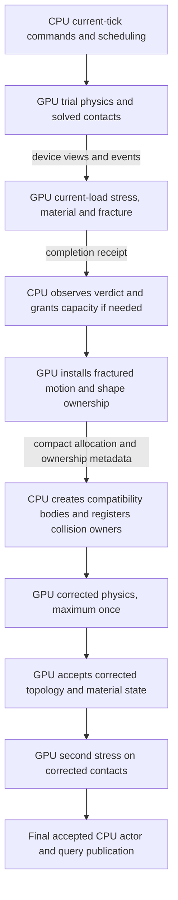

# CPU/GPU communication audit — retained E12

The current dependency sequence is correct in design: use this tick's solved contacts, finish stress/material decisions, install fractured ownership, correct physics once, evaluate stress again, and publish accepted state. The major opportunity at the first fracture is CPU fragment lifecycle work on that dependency chain. Raw metadata transfer bandwidth is smaller. Later loaded steps remain dominated by stress. No new speedup or full fidelity qualification is established by this audit.

## Application baseline and stage evidence

Fresh unprofiled production-dispatch baseline, two 180-step repeats per scenario, unchanged 256-building suite:

| Scenario | Full-step means, ms | All-step peaks, ms (step) | >8 ms | >120 Hz budget | >60 Hz budget |
|---|---|---|---|---|---|
| Idle | 1.672562 / 1.594300 | 15.369736 / 15.710198 (0 / 0) | each 1/180 (0.556%) | each 1/180 (0.556%) | each 0/180 (0%) |
| Heavy, one 256-shot wave | 68.802938 / 68.514985 | 187.345734 (103) / 221.124792 (82) | each 99/180 (55%) | each 99/180 (55%) | each 99/180 (55%) |

Initialization: idle 2245.061 / 2308.894 ms; heavy 2317.243 / 2419.591 ms. Initialization plus all 180 steps: idle 2546.122 / 2595.868 ms; heavy 14701.772 / 14752.289 ms. All steps satisfy recorded convergence and correction/evaluation caps. Shared GPU; historical physical/memory qualification gaps remain. Raw: `out/optimization-next20-20260910/baseline-E12/measurements.json`.

The following separate, existing four-worker host-phase run explains where time goes. It is instrumented, single-run evidence, not a matched performance acceptance test:

| Full-step wall partition, ms | Idle mean | Heavy mean | First fracture step 82 | Later step 103 | Later step 108 |
|---|---:|---:|---:|---:|---:|
| Complete step | 1.998 | 68.917 | 190.905 | 193.873 | 127.035 |
| Stress submission and wait | 0.560 | 42.897 | 59.140 | 86.951 | 87.640 |
| Fragment ownership preparation | 0.018 | 1.750 | 39.017 | 20.503 | 1.214 |
| Correction | 0 | 8.424 | 70.364 | 45.997 | 14.031 |
| Accepted commit/publication | 0 | 1.710 | 11.438 | 5.975 | 3.194 |
| Trial remainder | 1.140 | 13.504 | 10.605 | 34.066 | 20.507 |

Remaining columns omitted here are checkpoint, command and mandatory completion intervals. Rounding/bookend overlap is retained in the underlying report; these intervals are not a clean stock-PhysX/destruction split. GPU kernel durations must not be added to host waits. Raw: `out/optimization-20260910/E12-composition/production-phases/`, including `fixed-stage-checkpoints.json`.

At step 82, ownership preparation contains 16.162 ms CPU compatibility-body allocation, 1.114 ms allocation-request readback/wait, 2.256 ms owner validation, 0.634 ms scheduling, 0.557 ms refilter, 1.658 ms contact retirement, 1.588 ms registration, 0.917 ms actor links, and 11.037 ms unpartitioned shape-migration work. These are nested components of the 39.017 ms group, not additional costs. GPU stress completion wait alone is 58.073 ms; deleting that wait without its dependency would violate causality.

## Actual sequence

Second-verdict splits can update end-of-tick ownership without a third physics advance. All affected interaction participants still require the existing rewind/correction contract. Ordinary API, sleeping and current accepted queries remain required.

Already implemented and worth preserving:

- Contacts, loads, chunk/bond state and numerical work remain on GPU; `advance` borrows solved contact buffers and joins producer/consumer streams with events. There is no CPU stress-input roundtrip to delete.
- GPU selects fragment motion addresses and installs physical ownership before CPU compatibility construction. CPU does not select fracture or reconstruct physical mass/velocity.
- Shapes and geometry registrations persist; rebind changes ownership and incompatible contact rows. A persistent shape index already avoids rebuilding a source-actor shape map.
- Ordinary actor/query ownership and physical-property publication are already deferred/coalesced across correction. Final readback uses a safe capacity bound with combined counts/status to avoid another count-readback handshake.
- Checkpoint/rewind copies are device-to-device. The measured restore/install scope is only 0.263 ms at step 82; skipping affected participants is not justified by that cost.

## Ranked communication/lifecycle targets

1. **Remove repeated CPU fragment registration work.** `NpDestructionBodyAllocator::prepare` constructs real `NpRigidDynamic`/`Sc::BodySim` objects individually; `applyBindings` validates then resolves owners again and runs the general per-shape rebind chain. Establish which part of the 16.162 ms allocation and 11.037 ms migration remainder is allocator/lookup/task bookkeeping. A native batch transaction or reusable lightweight registration may remove this work. Preserve all body/node lifetimes, contact discovery, wake/sleep flags and rollback. Earlier batching/pointer candidates have unresolved native memory failures; they are not accepted or simply retried unchanged. Estimated opportunity 3–10 ms at the first split, low confidence; heavy mean effect depends on fracture frequency. Moving cost into initialization is not a win unless total costs also improve.

2. **Copy only changed host mirrors, and investigate deferring superseded trial mirrors.** `PxgSimulationCore::gpuMemDmaBack` copies full ordinary-mode bounds and cached transforms after each advance. The timeline contains matching fixed 3,145,728- and 3,645,472-byte transfers, 267 pairs across 180 steps: about 0.95 ms per advance. Size/source attribution is inferred, not callstack-proven. A changed-shape export could benefit idle as well as heavy scenes; suppressing trial publication requires proving CPU contact, sleep, bounds/query and correction consumers do not need it before acceptance. This is an integration change, not permission to toggle Direct GPU mode or leave host queries stale. Estimate 0.3–0.9 ms idle and 0.5–1.8 ms heavy step, medium confidence in traffic reduction, low in net savings before packing/scatter costs.

3. **Combine fracture metadata observation.** `prepareBodyCompatibility` reads allocation requests/indices and waits; `applyCorrectionBindings` later gathers owner metadata, copies three more arrays and waits. These inputs were prepared on GPU before CPU construction. Gather/copy them at the same dependency boundary into reusable host storage, then consume the frozen batch after CPU creation. Preserve install-completion ordering and receipt/lifetime validation. This is a narrower first communication experiment than replacing CPU body lifetime. Estimate 0.05–0.5 ms per split, medium confidence; can be refuted by unchanged complete-step timing or staging/allocation cost.

4. **Fold status-only roundtrips into required joins.** `acceptCorrection` explicitly waits for a status readback before second stress. Potentially retain device-side rejection and observe once at the next mandatory host boundary. Audit allocator acceptance/rollback and all intermediate host decisions first; removing error checks is not acceptable. Estimate 0.05–0.3 ms per correction, low confidence.

These are hypotheses, not additive savings. Large first-fracture lifecycle peaks and sustained stress cost deserve separate ranking; optimizing only copies cannot explain away the 87.640 ms stress scope at step 108.

## Transfer census and exclusions

Reused matching E12 Nsight Systems capture: `out/optimization-20260910/E12-composition/profiles/timeline-B/trace.sqlite`. It uses the qualified inline diagnostic dispatcher to avoid the recorded cross-thread profiler defect. Its CPU/full-step timing does not represent production scheduling. Exact copy records contained inside its own complete-step timestamps are exported in [dataflow-transfers.json](dataflow-transfers.json); reproduction: `python3 out/optimization-next20-20260910/audit-dataflow-transfers.py`.

| Diagnostic step | H2D bytes / summed device ms | D2H bytes / summed device ms | D2D bytes / summed device ms |
|---|---|---|---|
| 81, pre-impact | 27,160 / 0.009 | 7,741,164 / 1.091 | 139,264 / 0.002 |
| 82, first fracture | 5,713,576 / 0.869 | 24,515,772 / 3.453 | 46,073,264 / 0.212 |
| 103, later fracture | 12,205,128 / 1.880 | 35,946,100 / 5.079 | 64,095,168 / 0.282 |
| 108, later loaded | 10,949,332 / 1.762 | 35,354,532 / 5.002 | 59,597,792 / 0.252 |

This includes ordinary engine communication, not just destruction. Copy durations may overlap other work. Large recorded-state observation copies outside complete-step bounds are excluded; summing the whole profiler capture would falsely attribute diagnostic traffic to simulation. No matching E12 idle Systems capture exists, so idle copy costs are not presented as measured.

## Source anchors

- `physx/source/gpusimulationcontroller/src/PxgSimulationController.cpp`: `advanceDestruction`, correction continuation and `gpuDmabackData`.
- `physx/source/gpudestruction/src/PxgDestructionRuntime.cu`: `advance`, `finish`, `reserveBodySlots`, `prepareBodyCompatibility`, `applyCorrectionBindings`, `acceptCorrection`, `finishPostCorrection`.
- `physx/source/physx/src/NpDestructionBodyAllocator.h`: `reserve`, `prepare`, `applyBindings`, `publishShapeOwners`.
- `physx/source/physx/src/NpShapeManager.cpp`: `rebindShapeInternal`, `publishNativeShapeOwner`.
- `physx/source/simulationcontroller/src/ScShapeSimBase.cpp`: `rebindRigidOwner`.
- `physx/source/gpusimulationcontroller/src/PxgSimulationCore.cpp`: `gpuMemDmaBack`.

## Follow-up consumer trace

`Sc::Scene::updateSimulationController` schedules the host mirrors after the solver. `afterIntegration` waits for them through `updateScBodyAndShapeSim`, invokes activity/frozen-state processing, and can roll back newly sleeping bodies and update their cached shape state before destruction finalization. Therefore deferring every trial mirror is not currently proven safe. Prefer a producer-certified changed-shape export that preserves those consumers; a late-only export requires a larger sleep/CCD/contact dependency redesign.

N18 combines metadata observation without changing any of these ordinary host mirrors. Its source commit is `de68f2d2f177bd1a695df213c111396e1c8e1d08`; thirteen native tests and 29-case native memcheck pass. The matched screen fails to establish a heavy full-step gain; [N18 is reverted](N18.md).

N19 tests active-shape publication at the original DMA-back boundary rather than deferring trial state. It writes current records into existing pinned host arrays and retains the downstream completion and CPU sleep/query consumers. Mapped host writes still cross PCIe; NVIDIA recommends single-use, coalesced access on discrete GPUs, so heavy-scene performance is explicitly uncertain ([CUDA Best Practices](https://docs.nvidia.com/cuda/cuda-c-best-practices-guide/)). This is an experiment, not a claim that transfer traffic becomes free.

## Follow-up CPU evidence — 2026-09-11

The normal four-worker N12 CPU sample capture identifies a concrete unnecessary
copy path during fragment registration: `IslandSim::addNode` resizes the custom
`mPreSolveLifetimes` array to each newly added node. `PxArray::resize` reserves the
exact requested capacity; unlike the other node arrays, this lifetime array has
no capacity reserve. A growing fracture batch can therefore repeatedly copy its
entire lifetime history. Nine of116 first-peak CPU samples (7.76%) land in its
`recreate` call chain; step103 also samples it. These are sparse CPU samples,
not a measured7.76% full-step saving. N20 now tests capacity amortization while
preserving all values, initialization, generation increments and ordering.

Evidence: `out/optimization-next20-20260910/N12-guarded-monitor/production-phases/cpu-perf-B-impacts-256/`.
The current retained N12 full600-step results are idle1.739599 ms vs1.747255/
1.750707 ms controls, heavy58.222727 ms vs63.005873/62.554437 ms; heavy maxima
200.129742 ms vs224.808493/218.607394 ms. Heavy budget misses remain519/600
(86.5%). The new CPU hypothesis has no timing result yet. Native sequence-dependent
memory findings remain unresolved and must not be silently waived.
