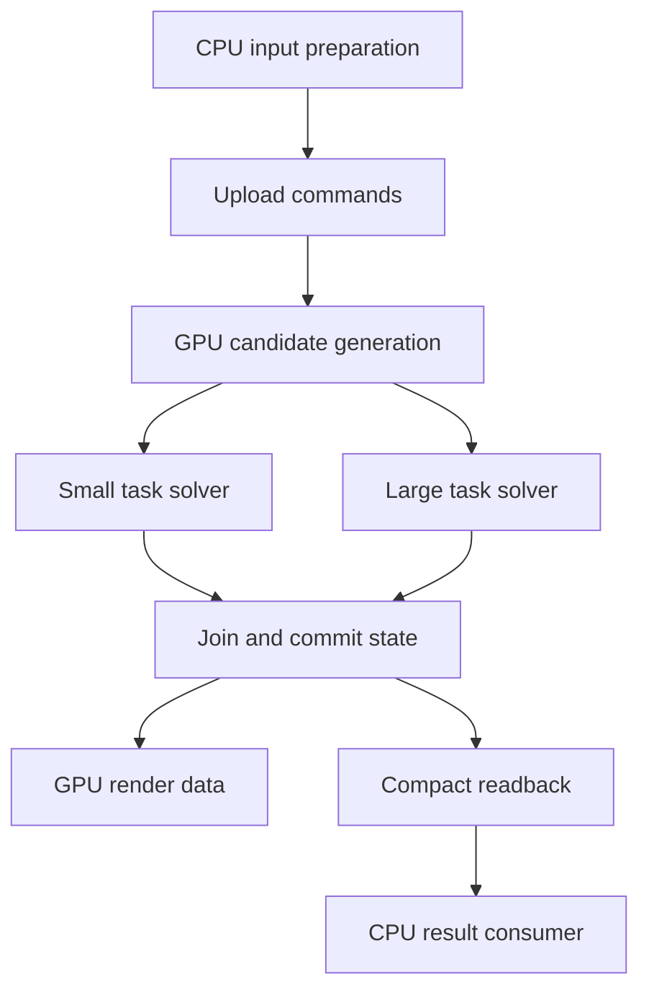

# Optimizing a Complex CPU + GPU CUDA Application

A practical engineering playbook for custom C++/CUDA systems, real-time simulation, irregular graphs, iterative solvers, and substantial CPU orchestration.

Prepared 2026-09-13. Read against the complete NVIDIA CUDA C++ Best Practices Guide, the supplied Reddit discussion, both substantive technical links in that discussion, and all 75 pages of the attached Vasily Volkov presentation. Current API and profiling references supplement those sources. The procedures, experiment designs, and application architectures below are an engineering synthesis; they are not measured results from your application.

**Objective:** minimize the time and resources required to produce a correct, useful application result under representative operating conditions. Optimize completion latency, sustained throughput, tail latency, and quality together. Kernel count, occupancy, GPU utilization, and FLOP/s are diagnostic measurements, not success criteria by themselves.

No finite checklist establishes a universal optimum. A defensible stopping point is a verified performance target, or evidence that the remaining cost requires a specific algorithm, quality, or hardware trade-off.

## Contents

1. [What to retain and correct from the sources](#1-what-to-retain-and-correct-from-the-sources)
2. [Define the performance and correctness contract](#2-define-the-performance-and-correctness-contract)
3. [Build a reproducible measurement harness](#3-build-a-reproducible-measurement-harness)
4. [Profile the complete application first](#4-profile-the-complete-application-first)
5. [Perform a GPU parallelism audit](#5-perform-a-gpu-parallelism-audit)
6. [Choose CPU and GPU responsibilities](#6-choose-cpu-and-gpu-responsibilities)
7. [Represent complex data without a complex transfer path](#7-represent-complex-data-without-a-complex-transfer-path)
8. [Manage allocation, residency, and growth](#8-manage-allocation-residency-and-growth)
9. [Build an explicit asynchronous pipeline](#9-build-an-explicit-asynchronous-pipeline)
10. [Choose kernel boundaries, graphs, and persistent execution](#10-choose-kernel-boundaries-graphs-and-persistent-execution)
11. [Diagnose kernels using hardware counters](#11-diagnose-kernels-using-hardware-counters)
12. [Optimize global memory and data layout](#12-optimize-global-memory-and-data-layout)
13. [Tune occupancy, registers, ILP, and work per thread](#13-tune-occupancy-registers-ilp-and-work-per-thread)
14. [Use shared memory, shuffles, and asynchronous copies](#14-use-shared-memory-shuffles-and-asynchronous-copies)
15. [Handle divergence, irregular work, and the long tail](#15-handle-divergence-irregular-work-and-the-long-tail)
16. [Reduce atomics and synchronization safely](#16-reduce-atomics-and-synchronization-safely)
17. [Exploit sparsity, caching, and incremental updates](#17-exploit-sparsity-caching-and-incremental-updates)
18. [Optimize iterative solvers as algorithms](#18-optimize-iterative-solvers-as-algorithms)
19. [Optimize the CPU path and system configuration](#19-optimize-the-cpu-path-and-system-configuration)
20. [Optimize instructions and numerical precision](#20-optimize-instructions-and-numerical-precision)
21. [Scale across GPUs and integrate other GPU consumers](#21-scale-across-gpus-and-integrate-other-gpu-consumers)
22. [A worked investigation](#22-a-worked-investigation)
23. [Run controlled experiments and preserve evidence](#23-run-controlled-experiments-and-preserve-evidence)
24. [Implementation sequence and completion gates](#24-implementation-sequence-and-completion-gates)
25. [Source coverage and further reading](#25-source-coverage-and-further-reading)

## 1. What to retain and correct from the sources

### 1.1 The Reddit discussion

The supplied thread concerns a finite-element application with complex host data structures and a desire for very few kernel launches. Its useful starting points are GPU-resident arrays, transferable offset-based representations, warp-cooperative work, and selective fusion. Treat the comments as design hypotheses. The original discussion is [Best Practices for Designing Complex GPU Applications with CUDA with Minimal Kernel Calls](https://www.reddit.com/r/CUDA/comments/1chklwq/best_practices_for_designing_complex_gpu/).

| Suggestion | Engineering interpretation | Experiment or constraint |
| --- | --- | --- |
| Replace STL-like containers | Separate owning host objects from inexpensive device views. Keep RAII, templates, and host containers where useful. | Inspect allocation, copying, and generated device code; do not rewrite abstractions merely because they are C++. |
| One large buffer with offsets | Useful for relocation, serialization, ownership, and grouped transfers. | Compare with separately preallocated arrays. One arena does not inherently make accesses coalesced. |
| Use `float4` or `int4` | Wider memory instructions can reduce instruction demand. | Require suitable alignment, full bounds coverage, and useful payload; measure register and traffic changes. |
| A small fixed thread count per SM is enough | There is no universal sufficient count. | Measure the kernel's dependencies, eligible warps, instruction mix, and block residency. |
| Combine passes | Fusion may eliminate intermediate traffic and submission overhead. | Check global dependencies, register lifetimes, resource allocation, and full-stage time. |
| Use explicit constant memory for descriptors | Worth considering for genuinely shared configuration. | Benchmark against ordinary parameters; account for simultaneous simulations and updates. |
| Keep small serial operations on the GPU | Sometimes avoids an expensive round trip. | Compare complete dependency-path costs, including synchronization. |

Two source-specific details matter:

- Boost's actual `offset_ptr` stores a displacement from the pointer object's own address. An arena handle storing a displacement from the arena base is a different representation. Do not substitute one for the other without changing resolution and relocation rules. The Boost page describes interprocess memory, not a ready-made CUDA container. [Boost offset pointer documentation](https://www.boost.org/doc/libs/1_85_0/doc/html/interprocess/offset_ptr.html).
- Fused register usage is not reliably the maximum of the original two kernels' register counts. Overlapping live values can increase it; compiler elimination and reuse can decrease it. Inspect the compiled result. Kernel parameter handling and annotations are documented in [CUDA C++ language extensions](https://docs.nvidia.com/cuda/cuda-programming-guide/05-appendices/cpp-language-extensions.html).

### 1.2 What Volkov demonstrates

The attached *Better Performance at Lower Occupancy* is a 2010 presentation, with examples on G80, GT200, and Fermi hardware. Its contribution is a way to reason about execution, not a list of modern tuning constants.

| PDF pages | Result or argument | How to apply it |
| --- | --- | --- |
| 7–26 | Arithmetic latency can be covered by independent instructions within a thread as well as by more resident threads. | Look for several independent accumulators or outputs. Merely unrolling one dependent recurrence does not create independence. |
| 28–42 | Memory throughput requires enough outstanding traffic; more threads are one way to supply it. | Test more independent loads per thread and wider loads where appropriate. Keep sufficient total work distributed across the GPU. |
| 44–50 | Register reuse can reduce expensive movement through other memory levels. | Count shared-memory and global-memory accesses per useful result, not just per-thread registers. |
| 52–67 | Computing multiple matrix outputs per thread raises throughput while occupancy eventually falls. | Jointly tune output tile, block size, registers, shared traffic, and resident blocks. |
| 69–75 | Grouping more FFT work within each thread reduces inter-thread exchange. | Search for small local subproblems that reduce communication when computed together. |

In the matrix example, the reported configurations progress from 242 GFLOP/s with one output per thread and about 67% occupancy to 485 GFLOP/s with eight outputs per thread and about 33% occupancy. These are historical measurements, not expected performance or speedups on a current GPU. The memory examples similarly demonstrate that high bandwidth can coexist with low occupancy; they do not establish 4%, 8%, or any other universal target. [Volkov presentation, especially pages 38–42 and 54–67](https://www.nvidia.com/content/gtc-2010/pdfs/2238_gtc2010.pdf).

There is also a useful arithmetic correction: page 59 prints 5 B/FLOP for two outputs. From the displayed inner loop, two FMAs perform four FLOPs using three scalar shared loads, or 12/4 = **3 B/FLOP**, assuming the common operand is loaded once. That agrees with the slide's 448 GFLOP/s bandwidth ceiling and its later trend. Always recompute a cost model from the actual operations.

### 1.3 Reconcile the Best Practices Guide with the PDF

The current Best Practices Guide promotes an iterative assess/parallelize/optimize/deploy process. However, §11.1 retains an absolute claim about low occupancy reducing latency hiding, while §11.3 explicitly recognizes that sufficient instruction-level parallelism can cover latency at low occupancy. Use the qualified interpretation: occupancy supplies potential parallelism; useful independent work and resource demand determine performance. Its historical hardware, default-stream, and profiler examples also need interpretation for the actual installed platform. [Best Practices Guide, §§2.2, 11.1, and 11.3](https://docs.nvidia.com/cuda/cuda-c-best-practices-guide/index.html).

Throughout this guide, a recommendation means **test it under the stated conditions**. A semantic requirement, such as a valid synchronization relationship, is mandatory regardless of the timing outcome.

## 2. Define the performance and correctness contract

Write the contract before modifying the implementation. Otherwise an optimization can silently make the problem easier or delay the result.

| Contract field | Specify concretely |
| --- | --- |
| Useful output | Completed simulation tick, solved system at tolerance, processed request, or completed batch. |
| Latency boundary | Input available to result available to the actual consumer, including required transfers. |
| Throughput | Useful outputs per second after pipeline fill, at a bounded queue depth. |
| Tail behavior | p50, p95, p99, maximum observed, and deadline-miss count over a stated workload duration. |
| Quality | Residual tolerance, conservation/error bounds, visual criteria, or exact integer output. |
| Workload envelope | Sizes, topology, active fractions, iteration distributions, input bursts, and sustained duration. |
| Resource limits | VRAM, pinned host memory, CPU cores, allowable buffering, and background GPU consumers. |
| Reproducibility | Required determinism level and expected variation from parallel floating-point evaluation. |

For a 60 Hz application, 16.67 ms is the period for the whole frame. It is not automatically the solver budget. Allocate time for other CPU/GPU work and state explicitly whether simulation and rendering are dependent, overlapped, or decoupled. Increasing throughput by queuing several frames may worsen input latency.

Build at least these workload classes:

1. Tiny input: exposes fixed costs and low available parallelism.
2. Typical production input: determines routine experience.
3. Largest supported input: tests capacity and distribution.
4. Mostly inactive state: reveals full-world scans and unnecessary updates.
5. Burst of change: stresses invalidation, allocation, connectivity, and queues.
6. Skewed work: many small tasks plus one expensive task.
7. Long replay: exposes drift, thermal effects, fragmentation, and rare events.

For each case, retain the input, configuration, seed, initial state, and reference output. A simulation's initial state alone is insufficient when later inputs depend on live timing; record an input/event tape or a reproducible scenario generator.

## 3. Build a reproducible measurement harness

### 3.1 Record the environment and build

Run these commands on the target machine and retain their output with each baseline:

```bash
nvidia-smi -q
nvidia-smi topo -m
nvcc --version
nsys --version
ncu --version
compute-sanitizer --version
git rev-parse HEAD
git diff --stat
```

Also record CPU/NUMA topology, operating system, compiler flags, dependencies, GPU UUID, power/clock state, display use, and other GPU processes. Preserve the actual patch, not just its diff statistics. Query device properties for SM count, per-block/per-SM resources, shared memory, supported features, and memory capabilities. The CUDA version shown by `nvidia-smi` is not a substitute for identifying the installed compiler/runtime.

Use an optimized build with source attribution. Example for a CUDA translation unit:

```bash
# Set CUDA_TARGET to a compute capability supported by your GPU and compiler.
# The value is a suffix such as 89, not a GPU product name.
nvcc -O3 -lineinfo -Xptxas=-v -arch="sm_${CUDA_TARGET}" \
  -c kernels.cu -o kernels.o
```

Do not benchmark a device-debug `-G` build as production performance. Record registers, local memory, spills, and shared memory from compiler output. For shipping binaries, choose explicit native targets and a deliberate PTX fallback strategy; do not copy obsolete architecture lists from old examples. [NVCC manual](https://docs.nvidia.com/cuda/cuda-compiler-driver-nvcc/index.html), [compute capability reference](https://docs.nvidia.com/cuda/cuda-programming-guide/05-appendices/compute-capabilities.html).

### 3.2 Measure three different things

| Measurement | What it answers | Common error |
| --- | --- | --- |
| Host submission time | How expensive is preparing/enqueuing work? | Calling it GPU execution time. |
| GPU interval | How long between ordered device events? | Assuming it includes work on unrelated streams. |
| Application completion time | When does the consumer obtain the result? | Stopping before the last asynchronous dependency completes. |

For one stream, put CUDA events before and after the measured sequence. Synchronize the ending event before reading elapsed time. Create/reuse timing events outside the hot interval. For a multi-stream region, the start must precede every measured branch and the end must follow an explicit join of every branch. Unrelated concurrent work can still affect elapsed time through contention.

For isolated wall-clock measurement, establish a completed starting boundary, start a monotonic CPU timer, submit the operation, wait for the operation's actual terminal dependencies, then stop the timer. For production throughput, retain the normal pipeline and measure completed outputs over elapsed time. Adding a device-wide synchronization after every kernel changes the workload.

CUDA's host-blocking and device-ordering semantics depend on the API and memory arguments. In particular, an `Async` suffix does not prove that a pageable-host transfer behaves as the intended asynchronous pipeline. [CUDA API synchronization behavior](https://docs.nvidia.com/cuda/cuda-runtime-api/api-sync-behavior.html).

### 3.3 Separate warm-up from production behavior

- Measure startup separately: context creation, JIT/module loading, allocations, graph construction, and library setup.
- Warm up the actual path and memory-pool capacity. A dummy kernel does not initialize every later specialization.
- For stationary microbenchmarks, repeat until clocks and timing stabilize. For an evolving simulation, restore the same checkpoint and replay the same interval for each candidate.
- Alternate baseline and candidate runs to reduce time-of-day/thermal bias.
- Retain every per-run and per-tick sample, including outliers. Explain outliers before excluding any.
- Use enough observations for the claimed tail percentile. A p99 estimated from a few dozen ticks is not reliable; dependent adjacent ticks also are not independent samples.
- Confirm performance in the intended environment, including graphics if they share the GPU.

Choose an initial repetition count such as ten paired runs, then increase only if the effect is close to noise or rare-event coverage remains inadequate. Do not label a tiny best-of-many improvement a production gain.

### 3.4 Establish correctness before optimization

Use a small deterministic reference case, an adversarial case, and a representative replay. Validate dimensions, index mapping, intermediate mathematical invariants, and final outputs.

```bash
compute-sanitizer --tool memcheck ./app --case small
compute-sanitizer --tool racecheck ./app --case small
compute-sanitizer --tool initcheck ./app --case small
compute-sanitizer --tool synccheck ./app --case small
```

The application flags throughout this guide are a proposed harness interface, not built-in CUDA options. Implement or replace them. Sanitizer runs are correctness runs, not benchmarks. Racecheck primarily diagnoses shared-memory hazards; passing it does not prove global queues or inter-stream ownership correct. Check every API result, immediate launch errors, and asynchronous completion errors. [Compute Sanitizer manual](https://docs.nvidia.com/compute-sanitizer/ComputeSanitizer/index.html).

## 4. Profile the complete application first

### 4.1 Build a dependency inventory

For each stage, write its input buffers, output buffers, processor, stream, iteration count, synchronization, and consumers. Include CPU preprocessing, command generation, GPU kernels, reductions, readback, rendering, file output, and cleanup.



This is an example dependency graph, not a required decomposition. Label real buffers and ownership in the implementation. A CUDA stream is an ordering mechanism, not a dedicated hardware engine.

### 4.2 Capture a bounded Nsight Systems trace

Give stable NVTX names to semantic phases such as `prepare`, `upload`, `solve`, `commit`, and `readback`. Mark the benchmark window after warm-up using `cudaProfilerStart()` and `cudaProfilerStop()` if using the capture command below. Keep the final completion inside the captured window.

```bash
nsys profile --trace=cuda,nvtx,osrt --sample=none \
  --capture-range=cudaProfilerApi --capture-range-end=stop \
  -o baseline-system ./app --case representative --profile-window

nsys stats --report cuda_api_sum,cuda_gpu_kern_sum,cuda_gpu_mem_time_sum \
  baseline-system.nsys-rep
```

Confirm flags/report names with the installed `nsys` help. Start with a short trace; add CPU sampling when the timeline reveals unexplained CPU activity. NVTX host ranges describe the submission scope unless device completion is explicitly part of that range. [Nsight Systems User Guide](https://docs.nvidia.com/nsight-systems/UserGuide/index.html).

Inspect in this order:

1. Where is the application waiting for useful output?
2. Is the GPU idle because the next work has not been submitted?
3. Is a CPU thread blocked on readback, an event, a lock, allocation, or I/O?
4. Do transfers overlap independent work as intended?
5. Are large numbers of short kernels separated by visible gaps?
6. Does a long tail continue after most independent work finishes?
7. Are memory capacity, migration, or background consumers changing behavior?

Use aggregate kernel time to identify expensive families, then return to the timeline. Summed durations across concurrent kernels are not the same as elapsed application time. A large `cudaDeviceSynchronize` duration commonly includes waiting for earlier work; do not count it again as independent overhead.

### 4.3 Estimate the useful ceiling before changing code

For a serial, non-overlapped decomposition, accelerating fraction `f` by factor `s` gives:

```text
total_speedup = 1 / ((1 - f) + f / s)
```

For example, doubling a stage occupying 30% of elapsed time gives about 1.18× overall. If that stage overlaps another stage that already determines completion, its speedup may have almost no latency benefit. For overlapping systems, reason from the actual dependency path and shared-resource contention.

Maintain two separate costs: **how much work is performed** and **how efficiently that work executes**. A solver doing twice the necessary iterations can have excellent kernel counters and still be architecturally inefficient.

## 5. Perform a GPU parallelism audit

A CPU algorithm translated into CUDA syntax may retain its original sequential structure. Audit every outer loop, leader-thread section, recursion, queue, and global barrier.

For each loop ask:

1. Which iterations are mathematically independent?
2. Which dependence is essential, and which exists only because the implementation uses one mutable object or list?
3. Is parallelism exposed across objects, elements, neighbors, components, and batches?
4. Does the mapping generate enough independently schedulable blocks?
5. How much work runs with only one active lane?
6. How does the distribution change after filtering, splitting, or convergence?

| CPU-style structure | GPU candidate | Qualification |
| --- | --- | --- |
| One block loops over independent objects | Distribute objects across blocks or warp groups | Preserve shared-state dependencies. |
| One thread walks a large neighbor list | Cooperative lanes over neighbors; reduce partials | Short lists may favor one thread per row or a smaller lane group. |
| Serial append/filter | Flag, scan, scatter; or bounded atomic reservation | Include scan/scratch costs and output ordering needs. |
| Serial sum/min/max | Hierarchical or segmented reduction | Floating-point order changes; global completion remains necessary. |
| Recursive pointer traversal | Flattened nodes, frontier queues, wider nodes | More branching factor can increase bytes and redundant tests. |
| Every object waits for the slowest convergence | Per-object retirement and size classes | Retire only at a valid numerical criterion. |
| Full-world bookkeeping every tick | Producer-maintained change queues and versions | Correctly capture every invalidating producer. |
| CPU fetches a scalar after every pass | Device-resident control, graph condition, or grouped checks | Include extra iterations, control cost, and API support. |
| One lock protects all updates | Partitioned ownership or staged aggregation | Atomics alone do not implement a safe publication protocol. |

Do not blindly remove loops. Three short independent accumulations inside a thread can improve latency hiding; one long recurrence can prevent it. Similarly, parallelizing every six-element operation across 32 lanes can waste most of a warp. Optimize the hierarchy of parallelism.

A practical audit artifact is a table with loop location, trip-count distribution, dependence, current mapping, proposed mapping, and measured cost. Prioritize large serial outer loops and global barriers before tiny arithmetic changes. NVIDIA's worked profiling example explicitly finds an outer loop that should be distributed across independent blocks. [Analysis-driven optimization, part 2](https://developer.nvidia.com/blog/analysis-driven-optimization-analyzing-and-improving-performance-with-nvidia-nsight-compute-part-2/).

## 6. Choose CPU and GPU responsibilities

Keep latency-sensitive input handling, I/O, and control-plane responsibilities on the CPU when appropriate. Keep rapidly reused numerical state and operations feeding other GPU operations on the GPU. Choose the boundary by total cost.

For a GPU-resident dependency chain, compare:

```text
CPU detour = wait_for_input + D2H + CPU_work + H2D + resume_overhead
GPU path   = GPU_work + extra_GPU_coordination
```

Include lost overlap and exposed queueing. A CPU operation taking 5 microseconds is not necessarily preferable if the surrounding synchronization and transfer delay the next GPU stage by much more. Conversely, an infrequent CPU task may remain ideal if it executes off the critical path and communicates only a small result.

Use these ownership rules as an initial architecture:

- CPU owns user intent, file/network interaction, and configuration publication.
- GPU owns the evolving numerical state through a complete processing phase.
- CPU submits compact commands rather than full-state replicas.
- GPU produces compact results or render-ready buffers rather than repeatedly exporting its entire state.
- Read-only static assets are uploaded once or on explicit version change.
- Ownership moves at named boundaries, with events or appropriate external synchronization.

For small serial metadata work, test a GPU leader operating on a bounded record. For large metadata work, redesign it as a scan, reduction, segmented operation, or parallel queue. “Run it on the GPU” and “make it parallel” are separate decisions.

## 7. Represent complex data without a complex transfer path

### 7.1 Separate ownership from access

A host class can own `std::vector`, allocator objects, validation, and RAII cleanup. A kernel should receive a lightweight view containing counts and device-valid pointers or offsets. Copying the bytes of a `std::vector` does not copy its storage or make its host pointer usable on the device.

```cpp
// Interface sketch. Ownership and allocation are deliberately separate.
struct BodyView {
    float* x;
    float* y;
    float* z;
    const float* inverse_mass;
    unsigned int* flags;
    unsigned int count;
};
```

Use ordinary structs and inline functions to retain modularity. Share scalar mathematical helpers between host and device when their operations are supported and their meaning is identical. Keep CPU and GPU iteration strategies independent; forcing identical scheduling into one abstraction often hides a poor GPU mapping.

Fixed-size matrix libraries can be useful, but treat support and performance as separate questions. Verify the library's supported device operations and inspect generated register/local-memory usage for the actual expression; a small matrix expression is not automatically a small compiled kernel.

### 7.2 Choose the physical layout from access patterns

| Layout | Favor it when | Check before adopting |
| --- | --- | --- |
| Array of structures | A thread consumes nearly all fields of one compact record | Across-warp strides and unused payload in other phases. |
| Structure of arrays | Lanes process adjacent objects and use the same few fields | Extra pointers and scattered access to whole records. |
| Array of small SoA tiles | Work operates on fixed-size groups and uses several fields | Tile padding, edge handling, and conversion cost. |
| CSR-style adjacency | Rows have variable neighbor counts | Degree skew, indirect gathers, dead edges, and row-offset width. |
| Fixed-width/blocked adjacency | Degrees are tightly bounded or block structure is dense | Padding waste and exceptional high-degree rows. |

Separate frequently touched data from infrequently used metadata. Build a field-by-phase access matrix before combining arrays. A descriptor can present one logical object even when its fields occupy several optimized allocations.

### 7.3 A relocatable arena representation

The following is an interface sketch, not a complete allocator. It uses arena-base byte offsets and an explicit null sentinel. All referenced arrays must belong to the same arena.

```cpp
#include <cstdint>
#include <limits>
#include <type_traits>

constexpr std::uint64_t null_offset =
    std::numeric_limits<std::uint64_t>::max();

template<class T>
struct ArenaSpan {
    std::uint64_t byte_offset;
    std::uint64_t count;
};

template<class T>
__host__ __device__
T* resolve(unsigned char* base, ArenaSpan<T> span) {
    if (span.byte_offset == null_offset) return nullptr;
    return reinterpret_cast<T*>(base + span.byte_offset);
}

template<class T>
__host__ __device__
const T* resolve(const unsigned char* base, ArenaSpan<T> span) {
    if (span.byte_offset == null_offset) return nullptr;
    return reinterpret_cast<const T*>(base + span.byte_offset);
}

static_assert(std::is_trivially_copyable_v<ArenaSpan<float>>);
```

Implement these invariants before using the representation:

1. Align each suballocation to at least `alignof(T)` and any stronger access requirement.
2. Check multiplication and addition overflow before allocating `count * sizeof(T)` bytes.
3. Validate `offset <= arena_size` and `count <= (arena_size - offset) / sizeof(T)` using checked arithmetic.
4. Reserve the null sentinel; offset zero remains valid.
5. Use types with valid object representation and lifetime for the construction/copy mechanism. Raw byte storage is not a license to serialize arbitrary C++ objects.
6. Do not place owning STL objects, host pointers, vtables, or polymorphic object graphs in the transfer representation.
7. Resolve each pointer from the appropriate host or device base. A resolved pointer is not itself relocatable.
8. If arena storage changes, update every captured pointer/view/graph parameter and wait for old users before releasing old storage.
9. Include a schema version if saving the arena to disk. Fixed-width fields alone do not create a portable ABI across compilers, padding rules, or endianness.

For arenas proven to fit the addressable range, narrower offsets can save descriptor bandwidth. Use 64-bit byte arithmetic for larger regions and validate narrowing conversions. Local component indices can remain 32-bit even when total storage is larger.

### 7.4 Static arenas and dynamic worlds are different problems

Use a bump allocator for data sharing one lifetime: initialization, a frame's scratch data, or a complete rebuilt component. Arbitrary deletion/reuse needs more structure: slab pools, size classes, free-slot lists, or generational handles.

A useful split is:

- Static asset arena.
- Long-lived mutable state allocations.
- Per-frame/per-stream scratch arenas.
- Bounded command and output rings.
- Explicit maintenance workspace for rebuilding or compaction.

Do not copy all of these every frame merely because a single bulk transfer is convenient. “One upload” is attractive for initial construction; steady-state transfer volume should follow changed information.

## 8. Manage allocation, residency, and growth

### 8.1 Remove ordinary hot-path allocation first

Preallocate predictable arrays and scratch storage. Cache library workspaces by capacity and stream ownership. Track current use, reserved capacity, high-water mark, and failed reservations separately.

For genuinely dynamic lifetimes, evaluate `cudaMallocAsync`/`cudaFreeAsync` and memory pools. Their correctness depends on stream ordering: allocation precedes use, and freeing follows every use, including other streams. Pool reuse/release settings affect both latency and reserved memory. [Stream-ordered allocator reference](https://docs.nvidia.com/cuda/cuda-programming-guide/04-special-topics/stream-ordered-memory-allocation.html).

Before changing the allocator, measure allocations per tick and the time they expose on the timeline. If all allocation already occurs at startup, replacing it will not improve steady-state kernel execution by itself.

### 8.2 Treat capacity changes as scheduled maintenance

Define what happens when a buffer is full:

1. Detect overflow without writing out of bounds.
2. Preserve unprocessed work or reject the operation explicitly.
3. Allocate larger storage at a controlled boundary.
4. Copy/remap state and refresh views and graphs.
5. Resume only after dependencies are satisfied.
6. Report the event in telemetry.

Never silently truncate a candidate/contact/constraint list to meet a time budget. If bounded approximation is part of the product, specify it as a quality policy and measure its effects.

### 8.3 Use pinned memory selectively

Keep a bounded pool of pinned input/output staging buffers for recurring transfers. Pin/register them once rather than once per tick. Record total pinned bytes and reuse latency. Separate memory primarily written by the CPU from output buffers frequently read by it; specialized write-combined allocations are not a universal substitute for ordinary pinned memory.

Before reusing a host buffer, verify completion of DMA and any CPU consumer. A ring with three slots is only safe if each slot has explicit lifetime tracking; the number three has no special correctness property. Nsight Systems can reveal unexpected host transfer behavior and missing overlap. [Optimizing CUDA memory transfers](https://developer.nvidia.com/blog/optimizing-cuda-memory-transfers-with-nsight-systems/).

### 8.4 Unified memory, UVA, and zero-copy solve different problems

| Mechanism | Provides | Does not promise |
| --- | --- | --- |
| Unified virtual addressing | A unified address-space scheme | All memory is locally accessible at GPU-memory speed. |
| Managed/unified memory | Supported CPU/GPU access with platform-specific migration/coherence | No page faults, no movement, or bounded latency. |
| Mapped host memory | GPU access to supported host allocations | Repeated remote accesses are as cheap as resident device access. |
| Explicit device allocation + copies | Explicit placement and ownership transitions | Correct overlap without dependencies and buffer lifetime management. |

For a discrete GPU with strict tail-latency requirements, explicit residency is a useful baseline. For managed memory, record page faults/migrations, apply appropriate prefetch/advice, separate CPU-hot from GPU-hot regions, and test oversubscription. Coherent systems require a platform-specific model; do not carry PCIe-only conclusions over unchanged. [Unified and system memory](https://docs.nvidia.com/cuda/cuda-programming-guide/02-basics/understanding-memory.html), [unified memory details](https://docs.nvidia.com/cuda/cuda-programming-guide/04-special-topics/unified-memory.html).

## 9. Build an explicit asynchronous pipeline

### 9.1 Start with ownership and events

For an independent input batch, the ordering is upload → compute → download → CPU consumption. Across batches, overlap only genuinely independent work.

```cpp
// Pseudocode: streams/events/storage are created earlier; check all CUDA calls.
// in.host and out.host are pinned. This batch owns its buffer slots.
cudaMemcpyAsync(in.device, in.host, in.bytes,
                cudaMemcpyHostToDevice, upload_stream);
cudaEventRecord(upload_done, upload_stream);

cudaStreamWaitEvent(compute_stream, upload_done, 0);
run_gpu_pipeline(compute_stream, in.device, out.device);
cudaEventRecord(compute_done, compute_stream);

cudaStreamWaitEvent(download_stream, compute_done, 0);
cudaMemcpyAsync(out.host, out.device, out.bytes,
                cudaMemcpyDeviceToHost, download_stream);
cudaEventRecord(download_done, download_stream);

// CPU may do independent work here.
// Before reading output or reusing the output slot:
cudaEventSynchronize(download_done);
consume_output(out.host);
```

Create dependency-only events with `cudaEventDisableTiming`. Use explicitly chosen stream semantics; legacy default-stream ordering differs from nonblocking and per-thread default streams. More streams do not create more bandwidth. Copy engines, dependencies, and device resources determine achievable overlap. [Asynchronous execution](https://docs.nvidia.com/cuda/cuda-programming-guide/02-basics/asynchronous-execution.html).

### 9.2 Do not pipeline through a true recurrence

In a simulation, tick `t+1` may require the committed state of tick `t`. You can prepare future external commands, download a completed snapshot, or render a permitted earlier state, but cannot compute an exact future tick from unavailable state.

If you introduce delayed state consumption, extrapolation, or relaxed coupling, that is an algorithm/latency change. Document the delay and verify its effect.

### 9.3 Tune chunk size and buffering together

Sweep a small set of chunk sizes and two or three buffer counts. Record full latency, steady-state throughput, bytes, copy overlap, and queue age.

- Chunks too small: submission and per-transfer cost dominate.
- Chunks too large: first-result latency and overlap opportunities suffer.
- Too many buffers: excessive latency and memory reservation.
- Too few buffers: producer/consumer bubbles.

For ideal independent work with separate resources, the steady-state batch interval is bounded below by the slowest stage. Shared memory bandwidth and CPU resources can make actual performance worse than this ideal. Measure the pipeline, not the sum of isolated peak rates.

## 10. Choose kernel boundaries, graphs, and persistent execution

### 10.1 Use a readable multipass implementation as a baseline

Separate mathematical operations into small device functions and launch stages at genuine synchronization boundaries. Modularity at the function level does not require a kernel launch per function.

Compare four implementations when submission/traffic is significant:

| Execution design | Main cost it may remove | Main risk |
| --- | --- | --- |
| Ordinary kernels in streams | Provides a simple reference | Repeated submission and intermediates. |
| Same kernels in a reusable graph | Host submission overhead | Instantiation/update costs and invalid captures. |
| Selectively fused kernels | Intermediate traffic and some launches | Registers, spills, incompatible mapping, lost scheduling flexibility. |
| Persistent workers | Repeated dispatch and task imbalance | Queue overhead, fairness, termination, resource monopolization. |

### 10.2 Fuse only where dependencies permit

Good candidate: a thread reads an element, transforms it, evaluates a local condition, and writes a final result. The intermediate value need not leave registers.

More difficult candidate: one kernel writes a whole vector, a second computes a global reduction, and a third uses the scalar. Ordinary thread blocks cannot provide a general grid-wide barrier inside a normal kernel. Fusion requires a valid alternative decomposition or an explicitly supported synchronization mechanism.

Before fusion, estimate:

```text
potential saving = intermediate bytes avoided / achieved bandwidth
                 + exposed submission/dependency cost avoided
```

Then measure the added instruction work, register/local-memory traffic, shared memory, and changed residency. Reused data may already be in cache, so treating every removed load as a DRAM load overstates the saving. Keep numerical transformations and execution fusion separate in the experiment.

### 10.3 Reuse CUDA Graphs

Graphs encode operations and dependencies for repeated submission. They do not inherently fuse kernels, eliminate intermediate arrays, or make an inefficient algorithm parallel. [CUDA Graphs reference](https://docs.nvidia.com/cuda/cuda-programming-guide/04-special-topics/cuda-graphs.html).

Original integration sketch:

```cpp
// All storage, streams, and reusable library state already exist.
cudaGraph_t graph{};
cudaGraphExec_t executable{};
cudaStreamBeginCapture(stream, cudaStreamCaptureModeThreadLocal);
submit_stable_pipeline(stream, device_view);
cudaStreamEndCapture(stream, &graph);
cudaGraphInstantiate(&executable, graph, 0);

// Repeated phase: pointers and captured parameter values stay valid.
cudaGraphLaunch(executable, stream);
```

Check every result and destroy resources after outstanding work completes. Treat changes carefully:

- Mutating an ordinary host scalar after capture does not automatically change a captured kernel argument.
- Updating contents at a stable device address can work when ordered before consumers.
- Changing allocation addresses, shape, dependencies, or specialization requires appropriate parameter updates or graph reconstruction.
- Concurrent simulations need independent mutable state. Constant symbols and shared workspaces can introduce unintended coupling.
- Avoid recapturing and instantiating every tick unless measurements justify the cost.

For dynamic workloads, compare fixed-capacity grids with device-side bounds checks, size-bucket graph variants, supported graph updates, and conditional graph nodes. Conditional/device-launched graph capabilities and restrictions must be checked against the installed toolkit and device. Include graph management in application timing.

### 10.4 Use persistent workers for a measured scheduling problem

A useful bounded design is a fixed set of worker blocks taking independent component descriptors from a device queue, processing each component, publishing results, and exiting when the prebuilt queue is exhausted.

Start with that simpler queue before supporting arbitrary dynamic task generation. Batch reservations can reduce contention. Separate oversized components that cannot fit the worker's resource budget.

For dynamic queues, specify publication ordering, capacity, duplicate suppression, work completion, and termination detection. “Queue empty right now” is not proof that no producer will publish more work.

Do not implement a grid-wide spin barrier that assumes every ordinary block is resident. Waiting blocks can occupy all execution resources while blocks needed to release them remain unscheduled. Cooperative launches have explicit support and residency constraints; an occupancy API can help calculate a legal launch, but runtime checks remain necessary. [Cooperative Groups](https://docs.nvidia.com/cuda/cuda-programming-guide/04-special-topics/cooperative-groups.html).

## 11. Diagnose kernels using hardware counters

### 11.1 Profile a representative invocation

First identify the expensive phase in Systems. Then select a representative kernel invocation or a bounded range with Nsight Compute. Record workload shape, launch configuration, and the state entering the invocation.

```bash
ncu --list-sets
ncu --list-sections
ncu --query-metrics

# Example selection: a push/pop NVTX range named "solve".
ncu --nvtx --nvtx-include 'solve/' \
  --kernel-name 'regex:.*solve.*' --launch-count 1 \
  --set basic -o solve-basic ./app --case representative

# Targeted second pass; confirm identifiers in --list-sections.
ncu --nvtx --nvtx-include 'solve/' \
  --kernel-name 'regex:.*solve.*' --launch-count 1 \
  --section SpeedOfLight --section LaunchStats \
  --section Occupancy --section SchedulerStats \
  --section WarpStateStats --section MemoryWorkloadAnalysis \
  --section SourceCounters \
  -o solve-detail ./app --case representative
```

Use a range emitted only for the target steady-state interval, or the installed tool's invocation filters. Filtering a kernel name alone can accidentally capture initialization or an unrepresentative first iteration. Use `--set full` selectively after identifying a concrete question. Metric availability and suffixes depend on the GPU and tool version. [Nsight Compute CLI](https://docs.nvidia.com/nsight-compute/NsightComputeCli/index.html).

### 11.2 Record profiler perturbation

Nsight Compute can replay work, serialize kernels, alter clock behavior, and flush caches. Consequently, a profiled invocation may differ from the production execution context.

For each report retain replay mode, cache-control setting, clock-control setting, pass count, selection filters, and tool version. A cache-dependent pipeline may require application or range replay with appropriate cache behavior. `--cache-control none` alone does not reconstruct the original upstream state. Use a supported range mode when mandatory concurrency must be preserved. Verify speedups with unprofiled application runs. [Nsight Compute Profiling Guide](https://docs.nvidia.com/nsight-compute/ProfilingGuide/index.html), [range replay explanation](https://developer.nvidia.com/blog/advanced-kernel-profiling-with-the-latest-nsight-compute/).

### 11.3 Build a compact kernel evidence sheet

| Category | Record |
| --- | --- |
| Work | Elements, rows, edges, iterations, valid lanes, active tasks, bytes/results. |
| Time | Representative invocation and aggregate contribution to the stage. |
| Launch | Grid, block, registers/thread, static/dynamic shared memory, waves. |
| Scheduling | Achieved/theoretical occupancy, eligible warps, issue activity, tail. |
| Memory | DRAM bytes and throughput; L2/L1 traffic; sectors/requests; local/shared traffic. |
| Instructions | Dominant pipelines, integer/address overhead, math precision, barriers, atomics. |
| Correctness | Identical work definition, required error bounds, overflow and race checks. |

Raw percentage-of-peak metrics must be interpreted at their level. A top-level memory throughput figure may reflect a busy cache or shared-memory pipeline, not a saturated DRAM bus. A low average can also hide a short saturated phase followed by an underfilled tail.

### 11.4 Use a diagnostic decision table

The following is a set of hypotheses to test, not a lookup table that proves causality. Nsight Compute's current triage guide provides the counter definitions and drill-down structure. [Compute Triage Guide](https://docs.nvidia.com/nsight-compute/ComputeTriage/index.html).

| Observation | Candidate explanation | Next discriminating experiment |
| --- | --- | --- |
| Low SM and DRAM activity; few blocks | Not enough device-wide parallelism | Expose independent outer work; batch tasks without changing quality. |
| Many resident warps; few eligible warps | Dependencies or synchronization prevent issue | Inspect source-attributed stalls; test independent accumulations or data prefetch. |
| High DRAM throughput; good traffic efficiency | DRAM bandwidth limit | Reduce bytes/work or eliminate passes; more occupancy may not help. |
| Low DRAM throughput; long-scoreboard stalls | Dependent misses, gathers, or too few outstanding requests | Improve locality or issue independent requests; inspect L1/L2 and local traffic. |
| High sectors relative to useful addresses | Uncoalesced or over-wide access | Change mapping/layout; compare traffic at the same memory level. |
| Local-memory traffic and register pressure | Spills, dynamic local arrays, or stack use | Reduce live ranges/tile size; compare SASS and timing. |
| Shared traffic with excess wavefronts/conflicts | Bank conflicts or too much communication | Change layout or compute more local work per thread. |
| Load/store queue throttle | Too many memory instructions or downstream pressure | Test wider useful accesses, reuse, or interleaving; inspect the downstream unit. |
| Arithmetic pipeline near practical ceiling | Instruction-throughput limit | Remove redundant operations; test a suitable algorithm/library/precision change. |
| Frequent barrier stalls | Imbalance or excessive cooperation | Shorten scopes, split task classes, or reduce exchanges. |
| Hot global atomic addresses | Contended updates | Aggregate locally, shard ownership, or reduce by key. |
| Good central execution; long sparse finish | Load imbalance | Split large tasks, change scheduling, or retire work independently. |

Stall percentages are not independent pieces of elapsed time and should not simply be added. A high stall percentage can remain after an optimization because other costs disappeared. Judge absolute time and useful work. NVIDIA's worked examples show the bottleneck shifting as successive changes take effect. [Analysis-driven optimization, part 3](https://developer.nvidia.com/blog/analysis-driven-optimization-finishing-the-analysis-with-nvidia-nsight-compute-part-3/).

### 11.5 Build a cost model with matching units

For one kernel:

```text
useful_bandwidth = algorithmic_bytes / seconds
DRAM_bandwidth   = measured_DRAM_bytes / seconds
arithmetic_intensity_at_DRAM = useful_FLOPs / measured_DRAM_bytes
```

A simple roofline lower bound is:

```text
kernel_time >= max(FLOPs / applicable_compute_rate,
                   DRAM_bytes / applicable_DRAM_rate)
```

It excludes many limits: instruction issue, dependent chains, atomics, shared bandwidth, scheduling, and insufficient work. Use the correct instruction type and precision; advertised tensor throughput is irrelevant to scalar FP32 work that does not use tensor instructions.

A more informative model for an irregular kernel is:

```text
time constrained by:
  bytes at each memory level,
  instruction demand on each important pipeline,
  dependency depth,
  synchronization and distribution,
  amount of parallel work available.
```

Use a local streaming benchmark to estimate attainable DRAM throughput under comparable conditions, and a primitive matching the operation to estimate a practical compute ceiling. A cache-resident benchmark is not a measurement of DRAM bandwidth. A roofline is a bound and diagnostic aid, not a runtime prediction. [Hierarchical roofline and occupancy analysis](https://developer.nvidia.com/blog/optimizing-gpu-utilization-with-nsight-compute-2021-3/).

## 12. Optimize global memory and data layout

### 12.1 Analyze addresses for one warp instruction

Write the addresses requested by lanes 0–31 for the actual load. Ask how many memory sectors contain them and how many fetched bytes are useful. Do not assume “each thread reads consecutive values” means “the warp is coalesced.”

Example: each lane reads one 4-byte field from an array of 64-byte records. The addresses are 64 bytes apart. That individual instruction can touch 32 distinct 32-byte sectors. In an aligned SoA, 32 adjacent floats fit in four such sectors. This is an access-level comparison; cache reuse of other fields and later instructions determines the application's actual traffic and speedup.

For matrices, ensure the lane-varying dimension corresponds to the contiguous storage dimension. For CSR, adjacency indices can be read contiguously within a row while the referenced vector values remain irregular gathers. These are separate memory streams with separate opportunities.

Procedure:

1. Identify the hottest actual loads/stores from source/SASS attribution.
2. Derive the address pattern and active-lane mask.
3. Check useful bytes, sectors, alignment, and cache reuse.
4. Change one mapping/layout decision.
5. Confirm lower transaction demand or better useful throughput at the same workload.
6. Recheck other phases affected by the new layout.

### 12.2 Reduce traffic before trying to hide it

Candidate experiments:

- Eliminate temporary arrays consumed only once by an adjacent local operation.
- Keep static coefficients resident and separate from frequently rewritten state.
- Recompute cheap values when loading stored values costs more; compare instruction demand.
- Store only active fields or compress indices when range proofs permit.
- Reorder stable work for locality; include reordering and remapping costs.
- Avoid clearing full-capacity buffers when an active count or epoch scheme suffices.
- Use read-only data appropriately, without assuming that `const` guarantees a particular cache behavior.

For each change record algorithmic bytes, actual cache/DRAM traffic, and total time. A reduction in DRAM bytes can expose an instruction bottleneck; that is useful progress even if the next step must be different.

### 12.3 Vectorized loads are a specific experiment

Use a wider type when all components are needed and the pointer/suballocation is suitably aligned. Handle the final partial vector without out-of-bounds accesses. Inspect SASS to confirm wider operations actually appear. Measure register pressure and remaining parallelism.

A 16-byte load by each lane still has to service the whole warp's address set. It is not a replacement for coalescing. Padding a 12-byte record to 16 bytes can increase traffic; it is justified only if the instruction/alignment benefit outweighs the cost. [Vectorized memory access](https://developer.nvidia.com/blog/cuda-pro-tip-increase-performance-with-vectorized-memory-access/).

### 12.4 Cache controls come after identifying reuse

For a repeated coefficient table mixed with streaming state, test a supported L2 access-policy window. Reserve no more persistence than the workload can use effectively, tune the hit ratio/window size, and measure the other consumers. Reset policies when the phase ends or the data changes role. This is not a guarantee of residency. [L2 cache control](https://docs.nvidia.com/cuda/cuda-programming-guide/04-special-topics/l2-cache-control.html).

## 13. Tune occupancy, registers, ILP, and work per thread

### 13.1 Distinguish the quantities

- **Theoretical occupancy:** resident-warp capacity implied by the launch and resources.
- **Achieved occupancy:** observed active-warp occupancy during execution.
- **Eligible warps:** active warps ready to issue their next instruction.
- **Issue activity:** whether schedulers can actually issue useful instructions.
- **Device coverage:** how much of the GPU has work; high occupancy on one SM does not fill the other SMs.

Register and shared-memory allocation have granularity and thresholds. Reducing registers by one may do nothing, or cross a residency boundary. Do not infer the exact resident-block count from a simple register division; use the occupancy API/tool and the actual launch.

### 13.2 Apply Volkov's reasoning to your kernel

For a pipeline operating at a target service rate, a useful approximation is:

```text
required work in flight ≈ service latency × target throughput
```

Use consistent units: seconds × bytes/second gives bytes; cycles × operations/cycle gives operations. This is a model, not a count of required CUDA threads. Hardware request limits, cache behavior, instruction dependencies, and available task parallelism also constrain the result.

There are three relevant ways to expose more work:

1. More independent warps/blocks.
2. More independent instructions or loads within each thread.
3. More useful data per memory instruction.

They trade against finite registers, shared memory, and instruction capacity. Increasing one can reduce another. This is the durable lesson from the PDF's arithmetic and memory experiments. [Volkov, pages 10–29](https://www.nvidia.com/content/gtc-2010/pdfs/2238_gtc2010.pdf).

### 13.3 Independent work is different from a longer recurrence

```cpp
// One dependent chain: each iteration needs the prior result.
for (int j = 0; j < n; ++j) {
    sum += a[j] * b[j];
}

// Conceptual alternative for a suitable mapping:
// distinct outputs/partial sums create independent chains.
s0 += a0 * b0;
s1 += a1 * b1;
s2 += a2 * b2;
s3 += a3 * b3;
```

The real kernel must preserve coalescing and output ownership. If these are partial sums of one result, combining them changes floating-point order. If they are separate outputs, they can also share input values and reduce data movement. Verify both numerical effects and code generation.

### 13.4 Run a bounded joint sweep

Start with a small matrix such as block sizes `{64, 128, 256}` and useful outputs/items per thread `{1, 2, 4, 8}`. These are experimental starting points, not recommendations for every kernel. Add 32-thread blocks, larger blocks, or different tile shapes only when the mapping suggests them.

For every legal configuration hold the useful workload constant and record:

| Configuration | Time | Registers/thread | Local/spill traffic | Shared bytes/block | Resident blocks/SM | Eligible warps | Bytes/result |
| --- | --- | --- | --- | --- | --- | --- | --- |
| Baseline | Measure | Measure | Measure | Measure | Measure | Measure | Measure |
| Candidate | Measure | Measure | Measure | Measure | Measure | Measure | Measure |

Reject any result that wins by reducing required work, excluding setup inconsistently, or overflowing resources. Keep the fastest correct application configuration, even if its occupancy is lower.

Useful follow-up experiments:

- Reduce variable lifetimes or recompute a cheap expression to lower register pressure.
- Partially unroll a loop to expose independence without excessive code size.
- Reduce a register tile when local traffic appears.
- Compare a natural register allocation with a targeted register limit. A cap that causes spilling can lose badly.
- Vary unused dynamic shared memory to probe occupancy sensitivity, while recognizing that shared/L1 partition effects may confound the experiment on some architectures.
- Specialize a common shape if removing dynamic indexing reduces local arrays or branches.

Stop increasing work per thread when extra registers, code size, or reduced grid parallelism outweigh reuse and latency hiding. The PDF's FFT example illustrates reducing communication through larger local subproblems; it does not imply every sparse row should be assigned to fewer threads. [Volkov, pages 44–75](https://www.nvidia.com/content/gtc-2010/pdfs/2238_gtc2010.pdf).

## 14. Use shared memory, shuffles, and asynchronous copies

### 14.1 Justify shared memory by a concrete saving

Use shared memory when a block reuses data, exchanges results, rearranges accesses, or performs a cooperative operation. Estimate the loads eliminated and compare them with staging, synchronization, shared traffic, and lost residency.

A tile consumed once may not repay the staging cost. A frequently reused small block can. Explicit staging can also lose to the hardware cache if the cache already provides the required reuse.

For classic scalar 32-bit shared accesses, a useful bank model is:

```text
bank = (byte_address / 4) modulo 32
```

Analyze the actual instruction width and hardware behavior before generalizing. Distinct addresses in the same bank can require additional service; same-location reads can broadcast. Padding a transpose tile's leading dimension from 32 to 33 can remove the classic column-access conflict, but arbitrary padding is not automatically beneficial. Shared memory and thread mapping are described in [writing SIMT kernels](https://docs.nvidia.com/cuda/cuda-programming-guide/02-basics/writing-cuda-kernels.html).

### 14.2 Use explicit warp collectives

Prefer well-tested reduction/scan primitives when they match the operation. Warp shuffles can exchange register values without a shared-memory round trip. A shuffle does not provide a general memory-ordering barrier.

All participating lanes must obey the collective's mask and participation rules. Do not use a full-warp mask when some required lanes never reach the instruction, and do not assume independent thread scheduling preserves old implicit warp-synchronous code. A reduction must not consume values from inactive source lanes. Use Cooperative Groups or a tested primitive for partial groups. [CUDA warp-level primitives](https://developer.nvidia.com/blog/using-cuda-warp-level-primitives/).

### 14.3 Pipeline global-to-shared movement when there is useful overlap

For tiled kernels on supported hardware:

1. Load tile `i+1` asynchronously.
2. Compute on ready tile `i`.
3. Wait at the point where the next tile is needed.
4. Do not overwrite a tile until all its consumers finish.
5. Handle initial fill, final drain, and boundary tiles explicitly.

Hardware-assisted copies may also avoid an intermediate register path. Start with two stages and expand only when measured benefits justify extra shared memory and synchronization. Alignment, transfer sizes, supported instructions, and barrier rules vary by mechanism. TMA and other advanced paths are hardware-dependent; a GPU architecture family name alone is insufficient. [Asynchronous data copies](https://docs.nvidia.com/cuda/cuda-programming-guide/04-special-topics/async-copies.html).

## 15. Handle divergence, irregular work, and the long tail

Branching across different warps is not intra-warp divergence. Branches within a warp can serialize paths or become predicated instructions. Removing a branch by computing both paths may increase total work.

Measure per-task size and cost distributions, not only averages. For graph work, collect row degree, component size, iteration count, active fraction, and longest task. Then compare mappings:

| Work shape | Initial candidates |
| --- | --- |
| Many short uniform rows | One thread per row; small lane groups if arithmetic per edge warrants it. |
| Moderate variable rows | One warp per row; segmented processing. |
| Large rows | Multiple warps or blocks with partial reductions. |
| Many small independent systems | Block-local solve, or several systems per block. |
| Few large systems | Multi-block decomposition with a valid global reduction/synchronization design. |

For average degree near four, a warp per row can leave many lanes idle during neighbor work. But the result also depends on per-neighbor arithmetic and data reuse. Compare useful lane activity, memory behavior, reduction cost, and time to solution.

Test these scheduling changes separately:

- Bucket by size or computation type when it reduces divergence enough to repay classification.
- Split exceptional long rows/tasks into independent chunks with a defined reduction.
- Use a bounded device work queue when static scheduling leaves a large tail.
- Batch very small tasks to amortize dispatch.
- Retire converged tasks independently.
- Reorder only stable workloads where the benefit survives enough iterations.

A changing task distribution may require several implementations and dispatch thresholds. Derive thresholds from measurements on the intended GPU; a fixed “1,024 nodes is always best” boundary is not portable.

## 16. Reduce atomics and synchronization safely

### 16.1 Reduce contention by changing ownership

For many updates to the same destination, compare:

- Per-thread accumulation followed by one contribution.
- Warp/block aggregation.
- Sharded partial results and a later reduction.
- Sort/group by destination and segmented reduction.
- Gather formulations where one owner computes each output.
- Conflict coloring when amortized preprocessing and extra passes are acceptable.

These approaches exchange atomics for storage, sorting, duplicated work, or synchronization. Report the entire stage cost. A small, uncontended atomic can be cheaper than a complicated aggregation scheme.

### 16.2 Distinguish atomicity from publication

Reserving a queue slot with an atomic increment does not automatically publish fully written payload to a consumer. Define the producer/consumer protocol with appropriate memory order and thread scope, or separate production and consumption into correctly ordered kernels. `volatile` is not a substitute for synchronization. A memory fence alone is not a barrier that waits for other threads. [CUDA C++ memory model](https://docs.nvidia.com/cuda/cuda-programming-guide/05-appendices/cuda-cpp-memory-model.html).

For every queue specify capacity, slot reservation, payload write, readiness publication, consumer acquisition, reclamation, and termination. Include wraparound and generation rules if slots are reused.

### 16.3 Remove unnecessary synchronization at the right scope

| Current synchronization | Candidate change | Required proof |
| --- | --- | --- |
| Device-wide wait | Stream event/wait | No other stream's result is required. |
| Host wait between GPU phases | Device ordering | CPU does not need the intermediate value. |
| Block barrier | Warp collective or warp barrier | All communication stays within the relevant warp/group. |
| Repeated global reduction | Grouped or reformulated reductions | Same mathematical criterion or an explicit accepted approximation. |
| Grid-wide barrier | Independent task progression | No cross-task dependency remains. |

Do not remove a barrier because one test happens to pass. Identify the data it protects and prove the replacement ordering.

## 17. Exploit sparsity, caching, and incremental updates

This section proposes architecture patterns for stateful applications. Their correctness depends on the mathematical model and on complete invalidation rules; hardware counters alone cannot establish that work is unnecessary.

### 17.1 Measure why work runs

For every expensive stage, record total capacity, live objects, active objects, changed objects, candidate work, accepted work, and work actually visited. A kernel can be efficiently processing a mostly unnecessary list.

A useful cost model is:

```text
sparse_path = change_detection + queue/compaction + useful_active_work + maintenance
full_path   = full_scan + work_for_all_live_items
```

Sparse execution wins only when the complete sparse path is cheaper. For high active fractions, a dense fallback may be preferable. Derive the crossover empirically and avoid rapid oscillation around it.

### 17.2 Make producers maintain dirtiness

If the operation that changes state already knows which object changed, let it mark a version or append to a bounded change queue. Avoid rediscovering the same fact with a full-world scan.

An initial invalidation table for a structural simulation might be:

| Producer/event | Potential invalidations |
| --- | --- |
| New external load or changed contact | Load vector; affected connected component's solution. |
| Changed support condition | Operator, boundary conditions, factorization/preconditioner, solution. |
| Bond removal | Topology, connectivity, operator, component membership, caches. |
| Material or stiffness change | Numerical coefficients and dependent solver state. |
| Geometry/orientation change | Any operator terms or loads depending on the chosen frame/model. |
| Tolerance/quality change | Cached acceptance certificate and stopping state. |

This is a starting table, not a complete physical model. Trace every write that can affect an output. A change in gravity direction, moving support, stiffness, timestep, or reference frame can invalidate a solution even without a new collision event.

### 17.3 Distinguish exact reuse from approximate reuse

An exact reuse key must cover every input defining the result. For a cached solve this could include topology, coefficient, load, boundary, model, and tolerance versions.

- If `A`, `b`, constraints, and the acceptance criterion are unchanged, a previously accepted solution may remain reusable.
- If inputs change slightly, retaining the previous solution as an initial guess is a warm start, not proof that no solve is needed.
- If a quantitative error bound allows a changed input to be ignored, record the bound and its assumptions.
- If the choice is visual or heuristic, classify it as an approximation and validate the intended experience.

Measure cache hit rate, validation cost, false invalidations, and missed-invalidations detected by periodic reference recomputation. Validation can cost more than recomputation for tiny tasks.

### 17.4 Incremental topology requires deletion-aware algorithms

If connectivity only splits and never merges, deletions identify affected prior components. Unaffected components can retain labels and cached setup. Recompute connectivity inside affected components using a valid deletion/split procedure.

Ordinary union-find efficiently combines sets; it does not by itself maintain connected components under arbitrary edge deletion. A removed edge does not necessarily split a component because another path may still connect it. Validate articulation-like cuts, redundant edges, isolated nodes, multiple simultaneous removals, and removal batches crossing earlier split boundaries.

Keep stable external IDs separate from compact execution indices. On rebuilding a component, update every dependent mapping and invalidate stored pointers or adjacency ranges that no longer refer to the same object.

### 17.5 Amortize compaction and rebuilding

Tombstones or inactive entries are cheap to create but expensive to revisit forever. Rebuild when expected future savings exceed the rebuild cost:

```text
expected_reuses × (old_visit_cost - compacted_visit_cost) > rebuild_cost
```

Include remapping, scratch allocation, descriptor updates, and graph updates. Estimate reuse from observed workload behavior and retain a fallback if topology changes again quickly. A fixed dead-edge percentage is a heuristic, not a universal optimum.

For idle worlds, aim to make expensive work scale with changes and active state. Do not promise literally zero cost: input polling, scheduling, validation, or rendering may still be required.

## 18. Optimize iterative solvers as algorithms

### 18.1 Minimize time to an acceptable solution

An iterative solver's cost can be decomposed as:

```text
total = setup + invalidation/rebuild
      + iterations × (operator + preconditioner + vector work + reductions)
      + recovery/output
```

For multiple components, sum work to understand resource demand, but also track the longest dependency path to understand elapsed time. A faster sweep can lose if it increases iterations; a more expensive preconditioner can win by reducing iterations enough.

For each solve retain initial/final residual, stopping reason, iteration count, operator applications, preconditioner applications, and output error/quality. Count trial solves, corrections, restarts, and fallback passes too.

### 18.2 Establish the mathematical requirements

For a linear problem `A x = b`, use a defined norm and stopping condition, for example:

```text
norm(b - A*x) <= absolute_tolerance + relative_tolerance * norm(b)
```

Select tolerances from the application requirements and conditioning; no universal tolerance fits every unit scale. For recurrent residual updates, occasionally recompute a true residual to detect drift when warranted.

Preconditioned conjugate gradient requires an appropriate symmetric definite problem and compatible preconditioner. Free structural components may contain rigid-body nullspaces; handle constraints/projection and consistency explicitly. Changing a preconditioner arbitrarily between iterations can require a different solver formulation. [PETSc's CG requirements](https://petsc.org/release/manualpages/KSP/KSPCG/).

Do not hide a numerical breakdown by merely increasing the iteration cap. Examine singularity, conditioning, invalid coefficients, insufficient constraints, and precision.

### 18.3 Match execution to component scale

| Component class | Candidate strategy | Key measurement |
| --- | --- | --- |
| Many tiny systems | Several systems per block or batched specialized kernels | Dispatch/setup overhead versus useful work. |
| Small systems fitting local resources | One block per component with local reductions | Registers/shared memory, component tail, time to convergence. |
| Medium systems | Several warps/tiles with staged reductions | Communication cost and occupancy. |
| Large/long connected systems | Multi-block operator and stronger global preconditioning | Iteration growth and reduction/communication time. |
| Unchanged accepted systems | Reuse with valid input versions/certificates | Validation cost and hit rate. |

A resident block can avoid repeated launches and keep intermediates local, but it constrains each component to one block's resources. A large component must expose parallelism across blocks or use an algorithm that reduces its serial depth. When only one difficult component remains, batching more tiny ones cannot shorten that component's true dependency chain.

### 18.4 Compare operator representations

For sparse block systems, compare:

- Explicit CSR/BSR storage.
- Matrix-free evaluation from geometry/edge data.
- Cached small blocks or local factors.
- Hybrid representations for common and exceptional cases.

Count actual bytes and arithmetic. Matrix-free evaluation reduces stored coefficients only if recomputation and extra source data are affordable. Dense block storage wastes bandwidth when internal blocks are sparse. A cached 6×6 inverse may reduce repeated setup but add significant per-node traffic; a factorization or structured application can have a different cost/accuracy profile.

Use library primitives as baselines where they match the operation, including reductions, scans, sorting, sparse operators, and batched dense algebra. Include conversion, workspace, synchronization, and preprocessing amortization in comparisons. Hand-written CUDA must earn its complexity against the relevant baseline.

### 18.5 Evaluate preconditioners using total solve cost

Proposed experiment progression:

1. Establish a numerically valid simple diagonal/block baseline.
2. Measure convergence versus graph size, shape, stiffness contrast, and support distance.
3. Test a stronger local preconditioner and record extra traffic/operator applications.
4. If iteration growth follows long-range coupling, evaluate a coarse/interface/multilevel approach.
5. Include hierarchy construction, updates, storage, and post-topology-change rebuilds.
6. Keep the simplest method meeting the target across the workload envelope.

A polynomial preconditioner can reduce outer iterations while adding operator passes. Count all adjacency visits, not only the outer loop count. A local smoother can improve local errors while leaving long-wavelength error slow to disappear; that is a reason to test coarse correction, not a proof that a particular multilevel design will win.

### 18.6 Remove waste from stopping and correction

Independent components should not keep iterating solely because another component is unconverged. Compact or retire them when the bookkeeping cost is justified.

For CPU-visible convergence checks, compare every-iteration readback, device-side control, and checking every `k` iterations. Grouped checking trades fewer control interactions for possible oversolving. Measure the crossover; bound nonconvergence and account for wasted iterations. Device-side looping still requires a valid inter-block dependency design.

For real-time quality trade-offs, expose separate parameters for tolerance, maximum iterations, update frequency, and warm-start policy. Test worst-case residual, drift, delayed response, failure events, and visual behavior over a long replay. Reporting only average appearance can miss a rare catastrophic instability.

## 19. Optimize the CPU path and system configuration

### 19.1 Diagnose the CPU using the application timeline

Determine whether the critical host thread is running, blocked, descheduled, or waiting for GPU work. Only then choose a CPU experiment.

```bash
perf stat -r 5 \
  -e task-clock,cycles,instructions,cache-misses,context-switches,page-faults \
  ./app --case representative

perf record -g --call-graph dwarf -o cpu.data \
  ./app --case representative
perf report -i cpu.data
```

Check event availability and permissions on the target platform. Counting identifies broad behavior; call-stack sampling finds hot code. These commands run the whole application, so use application timestamps/NVTX to relate CPU work to the GPU critical path. Hardware counter multiplexing and sampling overhead can affect interpretation. [Linux perf tutorial](https://perfwiki.github.io/main/tutorial/).

### 19.2 Apply CPU fixes that shorten completion

| Finding | Targeted change | Verify |
| --- | --- | --- |
| Serial preprocessing delays submission | Parallelize independent preparation; pipeline ready batches | GPU idle gap and full completion time. |
| Repeated allocation/serialization | Reuse buffers; avoid rebuilding unchanged descriptors | Allocations, bytes copied, CPU stage time. |
| Lock contention in command generation | Per-worker queues or chunked reservations with clear ownership | Wait time, queue throughput, ordering correctness. |
| Too many small CPU jobs | Batch into coarser tasks | Scheduling cost and responsiveness. |
| Oversubscribed worker pools | Bound threads across application and libraries | Run-queue delay and tail latency. |
| False sharing | Separate frequently written per-worker state | Cache contention and measured throughput. |
| Scalar hot numerical loop | Improve layout and compiler vectorization | Compiler report and assembly, not only source appearance. |
| Blocking logging/output | Move formatting/I/O to bounded asynchronous consumers | Queue growth, loss policy, and shutdown flush. |
| Host polling burns a core | Compare event query/backoff or blocking waits | Latency/CPU use under the actual response requirement. |

Optimize the hottest CPU functions with suitable release flags, vectorization, and possibly LTO/PGO after producing a representative training workload. Keep deployment CPU compatibility explicit; local `-march=native` results are not automatically portable.

### 19.3 Align memory and threads with topology

Inspect `nvidia-smi topo -m`, `lscpu`, and `numactl --hardware` where supported. Compare CPU affinity and memory placement near the GPU's attachment on a NUMA machine. Allocate/first-touch pinned staging memory under the intended placement policy.

Test a scoped process-level policy before changing global system configuration. Record the topology and policy with the benchmark. Do not apply a copied NUMA node number from another machine.

Also check negotiated PCIe link width/speed under load, power/thermal throttling, display sharing, and competing workloads. A bandwidth anomaly may be an environment issue rather than a kernel layout problem. Keep production-relevant clock and power settings; increasing limits or disabling protections is not an optimization methodology.

### 19.4 Watch context and library interactions

Avoid unintentionally creating multiple CUDA contexts for one application through independent modules. Make device/context selection explicit for host threads, and keep library stream/workspace state consistent with concurrent use. CPU multithreading should not serialize on a single globally locked submission object unless measurements show that serialization is negligible.

Keep library plans, descriptors, and handles persistent where appropriate. Check whether convenience calls allocate or synchronize. A library call can be algorithmically efficient and still be used in an inefficient host loop.

## 20. Optimize instructions and numerical precision

Do this after removing larger architectural costs unless counters identify instruction throughput as the current limiter.

### 20.1 Inspect the final generated code

```bash
cuobjdump --dump-resource-usage ./app
cuobjdump --dump-sass ./app > app.sass.txt
```

Correlate instructions with source and hot execution paths. PTX is an intermediate representation; final machine code and measured counters determine what executes. Look for unexpected FP64 conversions, costly division/modulo, repeated address arithmetic, local loads/stores, excessive barriers, code bloat, and uninlined hot helpers. The compiler can already optimize many obvious source expressions; verify before manually rewriting them.

Use `__restrict__` only when the aliasing promise is actually true. It can enable optimization but also change register lifetimes. Source annotations are contracts, not harmless performance hints.

### 20.2 Make small arithmetic changes with explicit domains

| Candidate | Required check |
| --- | --- |
| Float literals/functions in an FP32 path | Avoid unintended double promotion without changing intended precision. |
| Multiply instead of a small fixed integer power | Compare compiler output and exceptional-value semantics. |
| Reciprocal or reciprocal-square-root formulation | Validate error, zero, sign, infinity, and the permitted input range. |
| Combined sine/cosine operation | Both outputs must be needed for the same input. |
| Bit operations for division/modulo by a power of two | Signed negative values and rounding semantics must match. |
| Narrower integer indices | Prove all counts, products, and intermediate address calculations fit. |
| Shorter/unrolled loops | Measure register growth, instruction cache pressure, and tails. |

Signed-overflow undefined behavior is not permission to let an index overflow. Use widths and checked host construction that make the assumptions true.

### 20.3 Treat precision as a controlled experiment

Separate storage precision, arithmetic precision, and accumulation precision. A reduced storage type may save bandwidth while conversion dominates; a higher-precision reduction may improve convergence enough to repay its cost.

Test one change at a time: selected fast intrinsics, FP32 replacing unnecessary FP64, mixed-precision accumulation, or a reduced-precision preconditioner. Broad fast-math flags can affect division, square roots, subnormals, and special cases. Validate the actual compiler configuration and supported math semantics. [Floating-point computation reference](https://docs.nvidia.com/cuda/cuda-programming-guide/05-appendices/mathematical-functions.html).

Record absolute/relative error, residual histories, iteration counts, conservation/drift metrics, and observable result quality. Stress near-threshold decisions, ill-conditioned systems, large dynamic ranges, and long simulations. Comparing only one final scalar is insufficient.

Tensor cores are candidates when the workload can be expressed as sufficiently useful dense matrix operations with acceptable precision. Count packing, padding, conversion, and synchronization. A collection of tiny irregular 6×6 operations is not automatically a tensor-core win; benchmark a complete batched formulation first.

## 21. Scale across GPUs and integrate other GPU consumers

### 21.1 Multi-GPU scaling

Partition work to minimize communicated boundaries and global synchronization, not merely to equalize item count. Independent components are attractive ownership units; a single strongly coupled component may need frequent halo exchanges or reductions.

Measure:

- Compute time per GPU and imbalance.
- Bytes exchanged, message count, and communication latency.
- Peer access and actual interconnect topology.
- Overlap between communication and independent interior work.
- Global reduction frequency.
- Migration/repartition costs as workloads evolve.

Verify peer-access support; do not assume every consumer GPU pair offers the same transfer path or direct access. CUDA exposes multi-GPU memory and synchronization mechanisms, but the application owns partitioning and data correctness. [Programming multi-GPU systems](https://docs.nvidia.com/cuda/cuda-programming-guide/03-advanced/multi-gpu-systems.html).

Report strong scaling for a fixed problem and weak scaling for increased total work separately. More aggregate throughput does not prove that one latency-sensitive task finishes faster.

### 21.2 Rendering and other GPU consumers

When simulation feeds graphics, test producing render-ready buffers and using supported interoperability rather than round-tripping through the CPU. External memory/semaphore APIs have device identity, handle, ownership, and synchronization requirements. Registration/import is typically a setup concern; buffer lifetime and access transitions are recurring concerns. [CUDA graphics interoperability](https://docs.nvidia.com/cuda/cuda-programming-guide/04-special-topics/graphics-interop.html).

Run final benchmarks with the intended renderer and other GPU consumers active. Persistent kernels can compete for SM residency, cache, and bandwidth. Separate streams do not reserve resources or guarantee fairness. Bound long-running work and measure both simulation completion and presentation latency.

## 22. A worked investigation

**Illustrative example only.** The numbers below are invented to demonstrate reasoning. They are not measurements of your software and are not promised speedups.

Suppose a simulation has a 25 ms completion time with this sequential critical-path breakdown:

| Phase | Time |
| --- | ---: |
| CPU preparation | 3.0 ms |
| Uploads and exposed submission gaps | 2.0 ms |
| GPU solve | 16.0 ms |
| Commit and other GPU work | 3.0 ms |
| Readback and result consumption | 1.0 ms |
| **Total** | **25.0 ms** |

### Investigation A: submission overhead

Observation: hundreds of small repeated launches, visible CPU-to-GPU bubbles, stable dependencies.

Hypothesis: reusable graphs reduce exposed submission cost without changing kernels.

Experiment: capture/instantiate once, run the same work and compare completion time. Record graph launch, update, and occasional rebuild cost. If only 0.4 ms disappears, do not credit the entire 2 ms phase; its remaining cost may be transfers or unavoidable dependencies.

### Investigation B: unnecessary solve work

Observation: only 15% of components receive changed inputs, but every component is revisited.

Hypothesis: complete input-version tracking avoids unnecessary solves.

Experiment: build the invalidation table, implement a debug reference recomputation, and measure detection + queue + active solving. Validate support, topology, coefficient, and load changes. Do not predict a 6.7× speedup from a 15% active fraction: active components may be systematically larger or harder.

### Investigation C: accidental sequential work

Observation: one block loops over many independent components.

Hypothesis: distributing components across blocks improves device coverage.

Experiment: change only the outer mapping, preserving each component's numerical method and work count. Check the resulting grid, component distribution, memory access, and solve time. A huge local speedup is credible only if the baseline really left most hardware idle.

### Investigation D: expensive preconditioning

Observation: the preconditioner consumes most solver work, including extra graph traversals.

Hypothesis: a cheaper preconditioner raises iterations slightly but lowers total solve time.

Illustrative arithmetic:

```text
A: 100 iterations × (60 us other work + 100 us preconditioner) = 16.0 ms
B: 130 iterations × (60 us other work +  45 us preconditioner) = 13.65 ms
```

Setup, reductions, and recovery must be added consistently. Verify the same acceptance criterion and representative difficult cases. If the iteration count rises sharply with component diameter, evaluate a stronger global method rather than continuing to simplify local work.

### Investigation E: occupancy versus independent work

Observation: many resident warps, few eligible warps, frequent dependent loads.

Hypothesis: two or four independent local outputs per thread increase useful instructions in flight.

Experiment: joint block/output sweep, keeping useful work constant. If the winning version lowers occupancy but reduces time and local/shared traffic, retain it. If it raises register spills and slows the long tail, reject it.

After every accepted change, reprofile the application. These gains are not independently additive: eliminating components changes launch counts; fusion changes cache behavior; preconditioning changes iteration count. Predicting the final result by multiplying isolated speedup claims is unreliable.

## 23. Run controlled experiments and preserve evidence

### 23.1 Use a hypothesis record

```yaml
experiment_id: E017
question: Does warp-cooperative processing improve long adjacency rows?
evidence:
  observed:
    - Source-attributed gather stalls in the long-row subset
    - Measured row-degree distribution and tail duration
  inferred:
    - One-thread-per-row may expose too little memory parallelism
change:
  - Use a cooperative mapping only for the measured long-row class
held_constant:
  - Input checkpoint and event tape
  - Mathematical operator and convergence tolerance
  - Compiler version and baseline build options
  - Timing boundaries and required outputs
prediction:
  - Better eligible-warp/issue behavior for long rows
  - Reduced long-row stage time, including dispatch and reduction
falsification:
  - More reduction overhead than saved latency
  - Worse application p99 or incorrect output
validation:
  - Required numerical and structural checks
  - Paired unprofiled application runs
  - Targeted counter comparison using the same profiler settings
result: pending
```

Keep observed facts, calculated quantities, causal hypotheses, and proposed changes separate. A screenshot of high long-scoreboard stalls is an observation. “The layout causes those stalls” is a hypothesis until a controlled experiment or more direct evidence supports it.

### 23.2 Record a common result schema

Use a machine-readable CSV/JSONL record per invocation/tick/run with:

```text
build_id, experiment_id, case_id, input_hash, seed, run_id, tick_id,
quality_mode, total_ms, cpu_prepare_ms, gpu_interval_ms,
completed_outputs, active_items, visited_edges, iterations,
h2d_bytes, d2h_bytes, peak_vram_bytes, pinned_bytes,
residual, validation_passed, deadline_missed
```

Not every phase is additive when work overlaps. Store duration semantics in the schema. Collect expensive counters only in diagnostic runs; sampled or aggregated production telemetry should not become a new bottleneck.

For paired runs, compare differences or ratios within the same case/run conditions. Use run-level or block-based resampling for confidence estimates when adjacent ticks are correlated. Report the distribution and minimum useful effect, not just a single best sample. Keep a holdout workload set so repeated tuning does not overfit the benchmark.

### 23.3 Prioritize using expected application benefit

A practical prioritization estimate is:

```text
expected value ≈ critical-path time potentially removed
               × confidence in the mechanism
               × frequency of the affected workload
               / implementation and validation effort
```

This is a planning heuristic, not a physical law. Add explicit weight for deadline failures and capacity limits. A modest typical-case saving can be less important than eliminating a repeated 100 ms stall.

Prefer experiments that distinguish competing explanations. For example, when a kernel has low DRAM bandwidth, separately test more independent tasks and a locality-preserving layout. Applying both at once makes the mechanism harder to identify.

### 23.4 Acceptance criteria for an optimization

Accept a change when:

- The required useful work and output quality are preserved, or the quality trade-off is explicit and approved by the product requirements.
- Correctness and resource-lifetime checks pass.
- Unprofiled completion/throughput improves by a meaningful amount beyond noise.
- Tail latency, memory use, and other workload classes remain within their budgets.
- Changed counters/work counts are consistent with the proposed explanation, or the unexpected mechanism is investigated.
- Setup, conversion, maintenance, and fallback costs are included where they occur.
- The result is reproducible from saved inputs, code, and commands.

Reject or revise changes that improve only an isolated metric. Keep negative results with their workload context so they are not repeatedly rediscovered.

## 24. Implementation sequence and completion gates

This sequence is intended for an existing complex application. Reorder it when measurements show a different dominant limitation.

| Stage | Concrete deliverable | Gate before proceeding |
| --- | --- | --- |
| 1. Contract and baseline | Workload suite, replay/checkpoint, quality criteria, raw timing samples | Results reproducible; measurement includes actual completion. |
| 2. Application diagnosis | Dependency graph, Systems trace, CPU/GPU/transfer inventory | Top critical-path constraints identified with evidence. |
| 3. Parallelism audit | Ranked sequential loops, idle phases, and task-distribution problems | Parallel candidates have explicit dependency proofs. |
| 4. Residency and ownership | Stable device views, allocation plan, bounded staging rings | No unintended recurring full-state transfer or unsafe lifetime. |
| 5. Work elimination | Active queues, versions, reuse/invalidation rules | Full reference agrees across changes and rare cases. |
| 6. Launch/scheduling design | Compared stream, graph, fusion, and task mapping candidates | Whole-stage gain includes management overhead. |
| 7. Kernel tuning | Counter evidence and bounded parameter sweeps for dominant kernels | Gains survive unprofiled application runs. |
| 8. Algorithm and precision | Time-to-solution comparisons and quality trade-off results | Required accuracy/behavior passes difficult and long cases. |
| 9. Deployment verification | Native builds, runtime feature checks, resource limits, fallback behavior | Target hardware and intended co-running workloads pass. |

### Final audit

- [ ] The benchmark measures completed useful work with named quality requirements.
- [ ] Startup, steady state, maintenance spikes, and tail latency are distinguished.
- [ ] No large independent outer loop remains sequential without a measured reason.
- [ ] GPU placement decisions include transfers and synchronization.
- [ ] Device state is retained across dependent phases where useful.
- [ ] Buffer ownership, arena alignment, growth, and graph-pointer lifetimes are explicit.
- [ ] Streams/events preserve dependencies and observed overlap matches the design.
- [ ] Fusion is selective; no invalid global barrier is hidden inside an ordinary kernel.
- [ ] Occupancy is interpreted alongside registers, eligible warps, work coverage, and time.
- [ ] Memory analysis distinguishes useful bytes, cache traffic, and DRAM traffic.
- [ ] Atomics, queue publication, termination, and partial-warp collectives are correct.
- [ ] Inactive/unchanged work and all solver passes are accounted for.
- [ ] Iterative methods are compared at the same acceptance criterion.
- [ ] CPU preprocessing, locks, allocations, NUMA placement, and I/O are measured.
- [ ] Precision changes are validated over relevant input ranges and long runs.
- [ ] Multi-GPU or graphics integration is tested with its real synchronization and contention.
- [ ] Build/driver/toolkit/library support is checked on deployment machines.
- [ ] Each retained change has saved evidence and a reproducible benchmark.

Stop optional micro-tuning when the target is met with sufficient margin and the remaining bottleneck is understood. If the target is not met, identify the specific architectural decision next: less work, a different solver, a different partition, an explicit quality trade-off, or different hardware. Do not substitute repeated block-size sweeps for that decision.

## 25. Source coverage and further reading

### Required sources read

| Source | Coverage in this guide |
| --- | --- |
| [Complete CUDA C++ Best Practices Guide](https://docs.nvidia.com/cuda/cuda-c-best-practices-guide/index.html) | Read through all chapters, including correctness, timing, memory, execution, instructions, deployment, compatibility, and compiler options. |
| [Attached Volkov PDF / original public copy](https://www.nvidia.com/content/gtc-2010/pdfs/2238_gtc2010.pdf) | Read all 75 pages and inspected rendered slides. Applied arithmetic/memory concurrency, register reuse, matrix, and FFT lessons. |
| [Supplied Reddit discussion](https://www.reddit.com/r/CUDA/comments/1chklwq/best_practices_for_designing_complex_gpu/) | Read the post and supplied comments. Evaluated the arena, warp, graph, constant-memory, and fusion suggestions. |
| [Linked Boost offset pointer article](https://www.boost.org/doc/libs/1_85_0/doc/html/interprocess/offset_ptr.html) | Checked the exact offset representation and distinguished it from arena-base handles. |

The thread's advertisements, account/avatar links, and automatically recommended unrelated posts are not technical source material for this guide. Its two substantive technical references are the Boost article and Volkov PDF.

The detailed procedures above also link to current primary documentation for Nsight Systems, Nsight Compute, Compute Sanitizer, CUDA memory/synchronization/graphs, compiler behavior, Linux perf, and solver requirements. Those links are attached to the claims they support rather than treated as interchangeable endorsements of the entire design.

**Validation status of this document:** source-backed technical review and Markdown structural checks; the command and code examples are integration sketches for a target-machine workflow. No application source or executable was supplied, and no CUDA compiler/GPU benchmark was available in the authoring environment. Consequently, this guide makes no claim that a proposed optimization has already improved your application.
