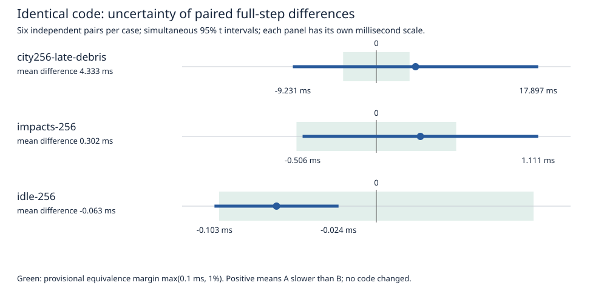

# Measured profiled experiment protocol

Published2026-09-13; same-day measurements. Source13b11af2e0aeabf4e0070931fbd8a060f383dfaf; no implementation change.

The GPU-exclusive nine-scenario pipeline finished in **284.088 seconds (4m44s)**, including GPU isolation, physical checks, Systems, focused counters, export and desktop restoration. Its timer starts at the shared lease. A separate three-repeat measurement of the preceding frozen-input/artifact preflight took **1.300–1.395 seconds**; practical turnaround is therefore approximately **4m45s**, below the300-second target. These separately measured times are not falsely presented as one external stopwatch observation. Build, queue and Python interpreter startup are separate. New runner revisions now record preflight in their total explicitly. This establishes turnaround; independent-pair precision calibration also completed, in416.486 seconds, and is reported below.

| Section | Measured seconds |
|---|---:|
| Seven restored scenarios,130 complete ticks and physical comparisons |152.260|
| Continuous idle/heavy,1440 complete ticks and work-history checks |74.979|
| Large-debris Systems trace, export and physical check |33.176|
| Two stress-kernel counter launches, export and physical check |22.929|
| Admission/restoration/remaining bookkeeping |0.743|
| Measured GPU-exclusive pipeline |284.088|

The Systems capture contains2307 CPU samples,26959 native scopes and884 GPU launches. The counter capture contains two componentStressSolve launches and all five requested metrics: duration, registers, achieved occupancy, issue activity and DRAM bytes. Full CPU/GPU timeline attribution is available for the selected tick; this is not new full52 hardware-counter coverage. Conditional-graph node counter limitations remain. Profiler durations are separate from unprofiled application latency.

Every restored process checks one full tick per restore and the original frozen force/material/motion gates; all130 repeatability ticks pass. Continuous four-process A/B/B/A per scenario passes1440 work-history/convergence checks with sleep enabled, ordinary APIs and at most one correction. Those counters alone do not prove full continuous pose/force/energy trajectory equivalence. Full52/numerical/memory/trajectory promotion gates remain mandatory for implementation finalists.

The first attempt failed before any simulation because desktop GPU handles were still closing after systemctl returned. Its evidence remains in out/destruction-baseline-20260913/representative-calibration/. The harness now waits for actual empty GPU ownership; the complete run is representative-calibration-v2/. No admission check was waived.

## Statistical decision procedure

A timing difference needs an explicit application resolution. We evaluate0.1ms,0.5ms,1ms,1% and2% rather than declaring a fixed sample count universally sufficient. A provisional routine resolution is max(0.1ms,1% of the frozen baseline mean), frozen before any candidate is evaluated. This is a performance decision margin, never a relaxation of numerical or physical quality.

Use differences between independently started, adjacent process means, with randomized balanced A/B versus B/A order and identical sample schedules. Every first-use tick remains in its process mean and is also reported separately. Individual consecutive ticks do not count as independent experiments. Six fixed pairs on large debris, continuous heavy and continuous idle are collected as a separate pilot to measure variance and seconds per pair. The count and order seed were fixed before collecting these data.

For a candidate, predeclare the primary outcomes, equivalence margins and fixed confirmation count from the pilot. Calculate intervals on paired process differences. Control the family error across declared outcomes; do not search52 cases and report an unadjusted lucky win. The initial implementation uses Student-t paired intervals with Bonferroni adjustment; it assumes independent, reasonably normal/stable pair effects. Inspect order/time drift and retain raw data. A six-pair pilot is not proof those assumptions hold on every future run.

With saved time defined as A minus B and marginδ:

- **Meaningfully faster:** the entire confidence interval is above+δ.
- **Meaningfully slower:** the entire interval is below−δ.
- **Equivalent withinδ:** the entire interval is inside[−δ,+δ]. This is positive equivalence evidence; a nonsignificant difference alone is not evidence of equivalence.
- **More measurement required:** the interval crosses a decision boundary. Do not promote. Run a separately planned confirmation or a predeclared sequential design with an error budget. Never rerun until a favorable p-value appears.

This prevents a false speedup claim and gives every uncertain screen an explicit next action. No finite noisy experiment can guarantee classifying an effect arbitrarily close to a chosen boundary. A fixed five-minute deadline cannot guarantee arbitrary sub-millisecond resolution. If a budget ends without enough evidence, the implementation remains unpromoted; that is an engineering decision, not proof of equivalence.

The paired method follows [NIST's paired-observation analysis](https://www.itl.nist.gov/div898/handbook/prc/section3/prc311.htm). The equivalence distinction follows [JMP's two-one-sided-test description](https://www.jmp.com/content/dam/jmp/documents/en/academic/learning-library/05-basic-inference-proportions-and-means/05-18-two-sample-equivalence-test-for-means.pdf). Our simultaneous95% intervals are deliberately stricter than ordinary unadjusted90% TOST intervals. Projected repeat counts use an80% planning probability at true zero and the pilot variance; they are estimates, not observed guarantees.

## Calibration finding and operational decision

The routine run's **4m44s** turnaround is measured and complete. The extra six-pair pilot took **6m56s**; together these two completed calibration pipelines took **11m40.6s** excluding preflight and their lock queue, not hours. They executed5938 unprofiled full ticks plus four physically checked profiler ticks. The first failed1.09-second admission attempt is preserved separately.

At the provisional max(0.1ms,1%) margin, none of the three pilot intervals establishes equivalence. Rounding the supported margins upward gives **0.125ms idle,1.25ms continuous heavy,20ms restored debris** as an illustrative coarser resolution supported by this cohort's intervals. These are performance-resolution choices for future review, not changed physics tolerances or a promise of future power. A five-minute screen must not promote a claimed1% debris win.

There is a particularly useful negative-control warning: identical-code idle labels differ by−0.0635ms and the nominal simultaneous interval excludes zero. That is a false signed implementation-effect signal. It may be chance, timing correlation or environmental/scheduling bias; this pilot does not identify the cause. Both randomized orders show a similar offset. The equivalence/noise-margin gate prevents calling it a meaningful optimization. The confidence calculation alone is not a validated universal noise model.

Debris first-use means differ by16.338ms between the arbitrary A/B labels, whereas their subsequent-tick means differ by0.331ms; all samples remain in the authoritative mean. Continuous heavy A/B stage means are54.521/54.232ms in PhysX plus integrated destruction,0.185/0.180ms commands and0.231/0.223ms completion. Idle's offset is almost entirely inside the integrated simulate/fetch phase. This is diagnostic localization, not proof of a CPU/GPU clock cause. The VM exposes19 virtual CPUs and no guest CPU-frequency governor; sampled GPU clocks vary. No clock lock or affinity change was made in these cohorts.

Use the9-case profiled run to screen broad behavior and verify the proposed mechanism. Then run a fixed, independently planned confirmation only on the primary outcome and any affected/regressing guards. Record its resolution before collecting candidate data. **Accept a runtime gain only when the confidence bound clears that margin, physical gates pass and tails/deadlines do not establish a regression. Accept neutral architecture only with equivalence evidence and its separate architectural justification.** A boundary-crossing interval triggers targeted confirmation; it never becomes an automatic win or equivalence claim. Full52 and trajectory/numerical/memory qualification remains the final promotion stage.

The tables below include variance-based projected repeat counts. These are not reliable promises in the presence of the observed idle offset or future drift. Before spending48 minutes chasing a1% restored-debris effect, investigate first-use/environment variation or target a larger application benefit; continuous heavy currently gives much more precise real-time feedback. No statistically honest procedure can guarantee an answer at arbitrary precision within a fixed five-minute cap.

## Reproduction

From the repository root; use a new output directory each time:

```bash
python3 tools/diagnostics/destruction-snapshot/run-representative-screen.py \
  out/destruction-baseline-20260913/representative-calibration-v2 \
  --baseline out/destruction-baseline-20260913/fast-baseline.json \
  --native-binary out/destruction-baseline-20260913/native/native_destruction_demo \
  --profile-binary out/destruction-baseline-20260913/profile/serialization-probe \
  --warm-args out/destruction-baseline-20260913/warm-args \
  --target-seconds 300 --watchdog-seconds 420 --manage-desktop

python3 tools/diagnostics/destruction-snapshot/run-paired-calibration.py \
  out/destruction-baseline-20260913/precision-calibration \
  --baseline out/destruction-baseline-20260913/fast-baseline.json \
  --native-binary out/destruction-baseline-20260913/native/native_destruction_demo \
  --warm-args out/destruction-baseline-20260913/warm-args \
  --scenario city256-late-debris --scenario impacts-256 --scenario idle-256 \
  --pairs 6 --seed 20260913 --watchdog-seconds 540 --manage-desktop
```

Regenerate the statistics from the archived measured analyzer and the report without using the GPU:

```bash
python3 reports/destruction-baseline-20260913/evidence/measured-protocol/analyze-paired-calibration.py \
  out/destruction-baseline-20260913/precision-calibration/calibration.json \
  out/destruction-baseline-20260913/precision-calibration/analysis.json
python3 reports/destruction-baseline-20260913/render-measured-protocol.py
```

The first command supports separate candidate probe/native/artifacts arguments; the profile binary must be built from the same candidate source. The second command ran identical builds. Its reusable runner now accepts candidate binaries/artifacts and requires predeclared --margin-ms SCENARIO=MS values for every candidate case; --family-size preserves multiple-outcome accounting across separate focused runs. The original measured runner version is archived. Both use the shared GPU/build lease, hash-verified frozen checker/runtime, sequential GPU execution and automatic desktop restoration. No simulation source/runtime changes were made. The harness, decision analysis and documentation are new.

<!-- GENERATED MEASUREMENTS -->

## All nine scenarios: identical-build timing

Authored scales (chunks / bonds): bridge768 /1524; chain256 /255; dense1728 /4752; tower2368 /4900; city25 impact11100 /22400. Both city256 snapshots and both continuous scenarios use113664 chunks /229376 bonds. Continuous heavy uses256 projectiles; continuous idle has none. Peak active-node/bond/island/contact counts are retained in each process record; authored chunks are not independent rigid bodies.

Milliseconds per complete tick. Each cell is one fresh process, in A0/B0/B1/A1 order; “—” is a slot absent from the predeclared schedule. All differences here are measurement variation. The independent unit is the process, not each tick. All first-use samples are included.

| Scenario | Ticks/process | Mean ms: A0 / B0 / B1 / A1 | Peak ms: A0 / B0 / B1 / A1 | 60Hz misses: A0 / B0 / B1 / A1 |
|---|---:|---|---|---|
|bridge64-cold|8|7.809 / 8.777 / — / 8.919|9.517 / 11.330 / — / 11.247|0 / 0 / — / 0|
|chain256-cold|8|7.469 / 7.502 / — / 7.564|9.862 / 9.929 / — / 10.530|0 / 0 / — / 0|
|dense12-cold|6|31.330 / 32.111 / — / 31.283|32.928 / 33.820 / — / 33.575|6 / 6 / — / 6|
|tower64-cold|4|108.430 / 108.427 / — / 109.337|111.246 / 109.992 / — / 111.286|4 / 4 / — / 4|
|city25-initial-impact|6|36.127 / 41.589 / 41.426 / 41.402|39.367 / 50.606 / 50.921 / 48.808|6 / 6 / 6 / 6|
|city256-intact-idle|4|63.360 / 65.396 / — / 75.579|72.280 / 74.169 / — / 90.824|4 / 4 / — / 4|
|city256-late-debris|4|361.515 / 372.581 / 382.628 / 370.458|411.621 / 395.489 / 418.510 / 415.918|4 / 4 / 4 / 4|
|idle-256|180|1.722 / 1.671 / 1.703 / 1.658|14.264 / 13.479 / 13.503 / 12.525|0 / 0 / 0 / 0|
|impacts-256|180|54.886 / 54.867 / 55.073 / 55.291|181.224 / 184.833 / 179.240 / 184.054|99 / 99 / 99 / 99|

[Every process: stages, first/later ticks, restore, initialization and spread](data/representative-processes.csv). [Complete source record with peak physical-work counts](evidence/measured-protocol/screen.json).

| Scenario / process | Command ms | PhysX + integrated destruction ms | Completion ms | First tick / later mean ms | Restore mean / initialization ms, excluded |
|---|---:|---:|---:|---|---|
|bridge64-cold A0|0.0001|7.6398|0.1692|9.517 / 7.565|35.881 / 424.332|
|bridge64-cold B0|0.0001|8.6103|0.1669|11.330 / 8.413|35.258 / 438.808|
|bridge64-cold A1|0.0001|8.7386|0.1799|11.247 / 8.586|36.134 / 427.440|
|chain256-cold A0|0.0001|7.2773|0.1919|9.862 / 7.128|32.636 / 428.429|
|chain256-cold B0|0.0001|7.3260|0.1761|9.929 / 7.155|30.259 / 425.503|
|chain256-cold A1|0.0001|7.3767|0.1870|10.530 / 7.140|31.916 / 440.219|
|dense12-cold A0|0.0001|31.1100|0.2202|32.928 / 31.011|57.548 / 436.586|
|dense12-cold B0|0.0001|31.9040|0.2065|33.820 / 31.769|55.757 / 425.333|
|dense12-cold A1|0.0001|31.0956|0.1873|33.575 / 30.825|55.172 / 460.341|
|tower64-cold A0|0.0001|108.2400|0.1901|111.246 / 107.491|80.180 / 490.923|
|tower64-cold B0|0.0002|108.2632|0.1640|109.992 / 107.906|72.947 / 432.786|
|tower64-cold A1|0.0002|109.1104|0.2264|111.286 / 108.687|77.723 / 432.112|
|city25-initial-impact A0|0.0001|35.9203|0.2062|39.367 / 35.478|99.734 / 571.759|
|city25-initial-impact B0|0.0001|41.4032|0.1852|50.606 / 39.785|101.262 / 585.237|
|city25-initial-impact B1|0.0002|41.2391|0.1869|50.921 / 39.527|95.739 / 567.698|
|city25-initial-impact A1|0.0002|41.2240|0.1779|48.808 / 39.921|105.894 / 614.552|
|city256-intact-idle A0|0.0002|63.1502|0.2099|72.280 / 60.387|722.878 / 1754.164|
|city256-intact-idle B0|0.0001|65.1930|0.2031|74.169 / 62.472|730.766 / 1736.332|
|city256-intact-idle A1|0.0001|75.3417|0.2368|90.824 / 70.497|738.668 / 1719.719|
|city256-late-debris A0|0.0001|361.2725|0.2428|411.621 / 344.813|789.862 / 1690.004|
|city256-late-debris B0|0.0002|372.3528|0.2284|395.489 / 364.945|795.218 / 1744.591|
|city256-late-debris B1|0.0002|382.3768|0.2514|398.820 / 377.231|781.924 / 1734.127|
|city256-late-debris A1|0.0002|370.0940|0.3643|415.918 / 355.305|810.558 / 1764.618|
|idle-256 A0|0.0002|1.5105|0.2117|14.264 / 1.652|n/a / 2176.881|
|idle-256 B0|0.0002|1.4666|0.2045|13.479 / 1.605|n/a / 2159.585|
|idle-256 B1|0.0003|1.4740|0.2282|13.503 / 1.637|n/a / 2187.632|
|idle-256 A1|0.0003|1.4411|0.2170|12.525 / 1.598|n/a / 2223.827|
|impacts-256 A0|0.1657|54.4970|0.2233|49.334 / 54.917|n/a / 2197.778|
|impacts-256 B0|0.1728|54.4495|0.2444|50.684 / 54.890|n/a / 2191.965|
|impacts-256 B1|0.1685|54.6732|0.2312|50.095 / 55.101|n/a / 2152.749|
|impacts-256 A1|0.1844|54.8678|0.2389|53.303 / 55.302|n/a / 2214.930|

PhysX and the tightly integrated stress solver share the simulate/fetch phase. The legacy stress_solve_ms zero field is not a measurement. Detailed disjoint CPU/GPU attribution is in the selected Systems capture. Nested scopes and concurrent kernel durations must not be summed into application wall time.

## Measured independent-pair precision

The additional fixed six-pair calibration completed in **416.486 seconds**. It reused the just-completed matching profiles. This is a separate calibration cohort, not an extended candidate result or a new speedup.

| Scenario | Pair mean difference ms | Simultaneous95% interval ms | Smallest supported equivalence margin ms | Proposed routine margin ms | Decision at routine margin | Seconds/pair |
|---|---:|---|---:|---:|---|---:|
|city256-late-debris|4.3331|[-9.2308, 17.8969]|±17.8969|±3.6753|more measurement required no promotion|31.53|
|impacts-256|0.3023|[-0.5059, 1.1105]|±1.1105|±0.5479|more measurement required no promotion|28.24|
|idle-256|-0.0635|[-0.1030, -0.0240]|±0.1030|±0.1000|more measurement required no promotion|8.88|

Intervals adjust for all three measured means. They describe uncertainty under the stated stable/normal paired-effect model; they do not establish a worst-case bound or full52 equivalence. A margin strictly larger than the interval’s largest absolute endpoint would pass this conservative equivalence criterion. Maxima/miss histories remain separate.

| Scenario | Target resolution | Estimated fresh pairs | Estimated focused seconds |
|---|---|---:|---:|
|city256-late-debris|0.1ms = 0.1000ms|119400|3765263.5|
|city256-late-debris|0.5ms = 0.5000ms|4780|150736.7|
|city256-late-debris|1ms = 1.0000ms|1198|37778.8|
|city256-late-debris|1percent = 3.6753ms|92|2901.2|
|city256-late-debris|2percent = 7.3506ms|26|819.9|
|impacts-256|0.1ms = 0.1000ms|428|12087.1|
|impacts-256|0.5ms = 0.5000ms|20|564.8|
|impacts-256|1ms = 1.0000ms|8|225.9|
|impacts-256|1percent = 0.5479ms|18|508.3|
|impacts-256|2percent = 1.0957ms|8|225.9|
|idle-256|0.1ms = 0.1000ms|4|35.5|
|idle-256|0.5ms = 0.5000ms|4|35.5|
|idle-256|1ms = 1.0000ms|4|35.5|
|idle-256|1percent = 0.0169ms|38|337.5|
|idle-256|2percent = 0.0339ms|12|106.6|

These counts are **pilot-based projections**, not measured turnaround guarantees. They target80% probability of an equivalence conclusion at true zero with stable variance. New candidate confirmations must use fresh data and a frozen count; do not pool these same-build pilot labels into a candidate comparison. Profiles cost roughly56 seconds in this measured protocol and can be reused when identities/mechanism match.

| Scenario / pair order | A mean / peak ms | B mean / peak ms | A / B 60Hz misses | A − B ms |
|---|---|---|---|---:|
|city256-late-debris 0 AB|379.252 / 437.118|371.629 / 392.314|4 / 4|7.6227|
|city256-late-debris 1 BA|367.688 / 414.092|346.478 / 392.532|4 / 4|21.2100|
|city256-late-debris 2 BA|357.240 / 417.689|359.860 / 401.782|4 / 4|-2.6195|
|city256-late-debris 3 AB|375.668 / 419.528|371.567 / 419.027|4 / 4|4.1006|
|city256-late-debris 4 BA|367.563 / 415.178|372.328 / 401.827|4 / 4|-4.7648|
|city256-late-debris 5 AB|370.779 / 410.090|370.329 / 408.188|4 / 4|0.4494|
|impacts-256 0 BA|54.714 / 154.660|55.003 / 182.810|99 / 99|-0.2887|
|impacts-256 1 AB|54.934 / 167.417|54.551 / 166.125|99 / 99|0.3824|
|impacts-256 2 AB|54.816 / 176.400|54.386 / 167.998|99 / 99|0.4297|
|impacts-256 3 AB|54.764 / 179.751|55.172 / 179.940|99 / 99|-0.4080|
|impacts-256 4 BA|55.028 / 180.215|54.396 / 180.935|99 / 99|0.6319|
|impacts-256 5 BA|55.365 / 196.019|54.299 / 178.056|99 / 99|1.0665|
|idle-256 0 BA|1.532 / 13.960|1.615 / 13.063|0 / 0|-0.0825|
|idle-256 1 AB|1.583 / 12.707|1.649 / 13.511|0 / 0|-0.0660|
|idle-256 2 AB|1.731 / 13.766|1.772 / 13.181|0 / 0|-0.0411|
|idle-256 3 BA|1.824 / 13.856|1.844 / 12.441|0 / 0|-0.0203|
|idle-256 4 AB|1.667 / 13.925|1.748 / 14.109|0 / 0|-0.0815|
|idle-256 5 BA|1.634 / 13.669|1.723 / 13.699|0 / 0|-0.0895|

[Complete precision analysis, order effects and planning assumptions](data/paired-precision.json). [Raw paired records with stages, peak work and receipt locations](evidence/measured-protocol/paired-calibration.json).




SVG source and numerical tables were checked; browser/raster rendering was not checked on this host. Large capture hashes are the collector-verified identities; captures were not redundantly rehashed during GPU work.
