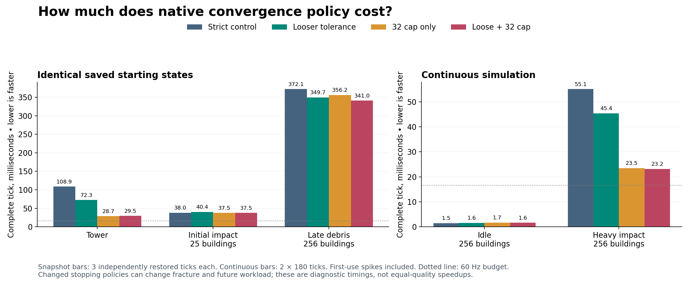

# Native convergence policy experiment — 2026-09-13

**The stopping policy explains a substantial part of the cost in some scenes.** On the same native implementation and RTX 5060 Ti, the continuous heavy scene fell from **55.10 ms to 45.43 ms** with looser tolerance, and to **23.16 ms** with looser tolerance plus a 32-iteration cap. The latter is a **58% reduction in mean tick time**, but it also produced **41% fewer broken bonds** and substantially different forces and fragmentation. This is a measured performance/behavior tradeoff, not a qualified equal-quality engine speedup.

The correction to the earlier explanation is important: **native already has an iteration cap**. This cohort normally permits 8,192 iterations, stopping sooner on convergence, and rejects an unconverged result. Vibe's deployed stopping policy permits 32 iterations and consumes an unconverged result. Neither implementation normally performs its maximum number of iterations unconditionally.

The requested experiment completed: **29 processes, 2,919 full ticks, 203.560 seconds of GPU collection including isolation and desktop restoration**. Build time, a long wait behind the separate 52-case qualification, and offline analysis are excluded from that collection time. The installed SDK and production settings are unchanged. No source or report commit was made.

The four modes use the same frozen native source, stress operator, preconditioner, arithmetic precision, materials, scene inputs, sleeping and contact/correction ordering. The original convergence flag remains truthful; all other error checks remain active.

| Mode | Tolerance | Iteration limit | Allow unconverged output? |
|---|---:|---:|---|
| Strict | 0.00001 | 8192 | No |
| Tolerance only | 0.001 | 8192 | No |
| 32 cap only | 0.00001 | 32 | Yes |
| Loose + 32 cap | 0.001 | 32 | Yes |

The tolerance becomes 100 times looser in the monitored norm, or 10,000 times in its squared threshold. This does **not** mean positions or forces become exactly 100 times less accurate. “Loose + 32 cap” matches the legacy stopping settings, not Vibe's different solver, preconditioner, precision, machine or game scene. All runtime edits are isolated under `out/destruction-convergence-policy-20260913/build/source/`. The policy overrides only the private solve parameters; the serialized starting states remain byte-identical. [Complete diagnostic patch](diagnostic.patch), [artifact identities](provenance.json).

**Continuous simulation is the relevant real-time comparison.** Each cell below combines two independent 180-tick processes. The mode order is strict/tolerance/cap/both, then reversed. Every timed tick is retained, including startup and impact peaks. The heavy scene contains 256 buildings, 113,664 chunks, 229,376 bonds and one wave of 256 aerial projectiles. Idle has the same city and no projectiles.

| Scene / mode | Mean ms | Range of two process means | Largest tick ms | Over 16.67 ms / 360 | Unconverged ticks / 360 | Broken bonds per run |
|---|---:|---:|---:|---:|---:|---:|
| Idle / Strict | 1.494 | 1.353–1.635 | 13.551 | 0 | 0 | 0 |
| Idle / Tolerance only | 1.551 | 1.445–1.656 | 11.095 | 0 | 0 | 0 |
| Idle / 32 cap only | 1.666 | 1.545–1.787 | 8.644 | 0 | 6 | 0 |
| Idle / Loose + 32 cap | 1.614 | 1.553–1.676 | 8.460 | 0 | 4 | 0 |
| Heavy / Strict | 55.101 | 55.086–55.115 | 188.800 | 198 | 0 | 56,077 |
| Heavy / Tolerance only | 45.430 | 45.166–45.695 | 177.369 | 198 | 0 | 58,723 |
| Heavy / 32 cap only | 23.475 | 23.275–23.675 | 184.454 | 194 | 202 | 33,213 |
| Heavy / Loose + 32 cap | 23.160 | 23.064–23.257 | 179.370 | 193 | 200 | 33,213 |

The heavy-scene timing differences repeat in both process orders. Tolerance alone saves 17.6%; adding the cap saves much more. Once capped at 32, changing tolerance adds little, because difficult solves usually reach the cap first. Idle remains around 1.4–1.8 ms, without a reliable steady-state benefit. The capped idle cases initially contain two or three unconverged ticks per run, subsequently converge, break no bonds, and finish with all bodies asleep.

The cap does not fix the impact stall: the largest heavy tick still takes about **179 ms**, and **193 of 360 ticks** still miss 60 Hz versus 198 for strict. All modes first fracture at step 82, also the peak step. As an additional descriptive view, the common steps 81–179 average 96.32 ms strict, 79.31 ms tolerance-only, 38.84 ms cap-only and 38.28 ms combined. This subwindow does not replace the all-tick results above. It illustrates why the 23 ms whole-run mean is not a claim of real-time behavior during active destruction.

**The physical work changes.** Both independent repeats produce identical work and iteration histories within each mode. Across modes, the heavy scene finishes with:

| Mode | Broken bonds | Final clusters | Final awake bodies |
|---|---:|---:|---:|
| Strict | 56,077 | 12,248 | 10,108 |
| Tolerance only | 58,723 | 13,230 | 10,947 |
| 32 cap only | 33,213 | 8,145 | 7,240 |
| Loose + 32 cap | 33,213 | 8,145 | 7,240 |

Tolerance-only breaks 4.7% more bonds than strict, despite its faster mean. The combined cap breaks 40.8% fewer and leaves fewer fragments to simulate. Therefore the continuous timing gain includes both cheaper solves and a different later workload. These measurements do not separate their individual contributions. A tick marked unconverged means at least one component/pass did not satisfy its requested convergence criterion, not that every component failed.

**The saved-state tests explain the scene dependence.** Each row starts from exactly the same serialized physical input, restored afresh for each of three full ticks. Restore time is excluded and reported separately. The snapshot process is not a sustained simulation: execution caches must be reconstructed. These timings must not be compared directly to the continuous idle result.

| Starting state / mode | Mean ms | Max ms | Max reported iterations | Unconverged / 3 | Bonds broken in tick | Resulting clusters | Mean restore ms |
|---|---:|---:|---:|---:|---:|---:|---:|
| Tower / Strict | 108.904 | 111.204 | 137 | 0 | 0 | 1 | 93.06 |
| Tower / Tolerance only | 72.323 | 73.687 | 89 | 0 | 0 | 1 | 104.50 |
| Tower / 32 cap only | 28.687 | 28.796 | 32 | 3 | 0 | 1 | 82.78 |
| Tower / Loose + 32 cap | 29.476 | 31.322 | 32 | 3 | 0 | 1 | 100.84 |
| City25 impact / Strict | 38.009 | 42.184 | 304 | 0 | 3,412 | 537 | 159.78 |
| City25 impact / Tolerance only | 40.350 | 45.937 | 232 | 0 | 3,412 | 537 | 158.02 |
| City25 impact / 32 cap only | 37.526 | 43.918 | 32 | 3 | 3,330 | 655 | 153.67 |
| City25 impact / Loose + 32 cap | 37.523 | 41.691 | 32 | 3 | 3,330 | 655 | 147.28 |
| City256 debris / Strict | 372.073 | 402.503 | 1084 | 0 | 11,051 | 16,135 | 906.05 |
| City256 debris / Tolerance only | 349.679 | 366.997 | 960 | 0 | 11,020 | 16,126 | 917.66 |
| City256 debris / 32 cap only | 356.201 | 401.452 | 32 | 3 | 9,970 | 16,087 | 920.89 |
| City256 debris / Loose + 32 cap | 340.959 | 358.754 | 32 | 3 | 9,970 | 16,087 | 935.34 |

Tower latency drops about 34% with tolerance alone and 73% with the combined cap. No bonds break in this particular tower tick and observed motion is unchanged, although forces differ. This establishes that a substantial timing effect can occur without fewer fragments in that tick.

City25 initial-impact time stays around 38–40 ms. The capped solve takes at most 32 reported iterations instead of 304, yet produces 655 clusters instead of 537. Reduced iteration cost is not sufficient to reduce the complete tick here. For late debris, the three-sample means shift much less than the tower, with large first-use variation; this short, fixed-order snapshot screen does not establish a small performance win. Existing selected-baseline CPU/GPU attribution is consistent with substantial remaining lifecycle/contact work, but **no new per-stage GPU profile was collected for these changed-policy arms**.

Iteration telemetry is the maximum across relevant components and the two possible passes, not a sum of iterations or GPU work. The continuous tolerance-only trajectory even reaches a larger maximum than strict (816 versus 788), because its later physical states differ; on the same tower input it decreases from 137 to 89.

**Output differences were measured, not waived.** The rebuilt strict mode passes the original frozen physical checker against a freshly run original binary/runtime on the city25 starting state. Every relaxed snapshot mode fails at least one original strict comparison. Selected differences are below. Force/torque discrepancies are relative L2 differences from the strict **end-of-tick outputs**, not errors against an independent exact solution. Once fracture differs, correction loads and the final equation can differ too.

| State / mode | Force discrepancy | Torque discrepancy | Bonds whose broken/intact identity differs | Same physical connectivity? |
|---|---:|---:|---:|---|
| Tower / Tolerance only | 0.0011% | 0.0210% | 0 | Yes |
| Tower / 32 cap only | 0.5750% | 5.5208% | 0 | Yes |
| Tower / Loose + 32 cap | 0.5750% | 5.5208% | 0 | Yes |
| City25 impact / Tolerance only | 0.0347% | 0.0124% | 0 | Yes |
| City25 impact / 32 cap only | 51.9333% | 35.0354% | 2,012 | No |
| City25 impact / Loose + 32 cap | 51.9333% | 35.0354% | 2,012 | No |
| City256 debris / Tolerance only | 8.8943% | 4.7950% | 83 | No |
| City256 debris / 32 cap only | 90.9977% | 102.6411% | 4,343 | No |
| City256 debris / Loose + 32 cap | 90.9980% | 102.6411% | 4,343 | No |

Tolerance-only preserves the broken-bond identities, connectivity and observed motion in the city25 tick, but changes health on 5,014 bonds, by at most 0.0000879. Those small differences can matter later: in the debris snapshot, even tolerance-only changes 83 broken/intact identities and connectivity. The capped city25 case changes 2,012 broken/intact identities despite a much smaller difference in the total break count. Aggregate counts alone would miss that change.

All 29 processes completed without reported native errors; the one-correction limit, stress/correction pass sequence, snapshot repeatability, finite snapshot observations and non-healing damage checks remained enforced. Full-step timers close across all 2,919 ticks to within 5.7e-14 ms. Within each continuous mode, the two processes have identical recorded work/convergence/iteration histories. Initialization takes roughly 2.16–2.24 seconds per continuous process, outside the tick timer. The original strict checker was not modified to accept any candidate. Continuous histories are counters, not a full pose/energy or long-duration physical validation. The selected model's existing independent-reference limitations remain unchanged.

**Decision:** retain this as a diagnostic experiment; do not promote either setting on this evidence. The data support the user's suspicion that the original comparison imposed materially different numerical work. They also show why that does not establish a universal native-versus-Vibe engine ranking. Tolerance-only is the more conservative setting to evaluate further: it retains convergence and improves this heavy-scene mean, although it changes later fracture behavior. A universal 32-iteration cap is a much larger physics tradeoff. The impact peaks and late-debris costs need attention independently of this solver budget.

The full data and failed build-preparation attempts remain local under `out/destruction-convergence-policy-20260913/`; they are not included by these report links in a fresh clone. [Structured results](results.json) and [provenance](provenance.json) identify the measurements. `screen/screen.json` contains the exact per-process commands, mode environment, mapped-module hashes, GPU admission and restoration receipt. `verification.json` contains timer checks and repeated-history comparisons. One early lock admission and two build-harness preparation errors occurred before GPU testing and are preserved; no failed physics capture was discarded.

Build and capture entrypoints are `tools/diagnostics/destruction-convergence-policy/build.py` and `run.py`. They intentionally require fresh output destinations; choose new destinations in their constants for another independent campaign. `analyze.py` reads existing outputs, and `plot.py` regenerates the figures offline with NumPy/Matplotlib. No installed runtime or shared application source needs to change to reproduce the diagnostic.
