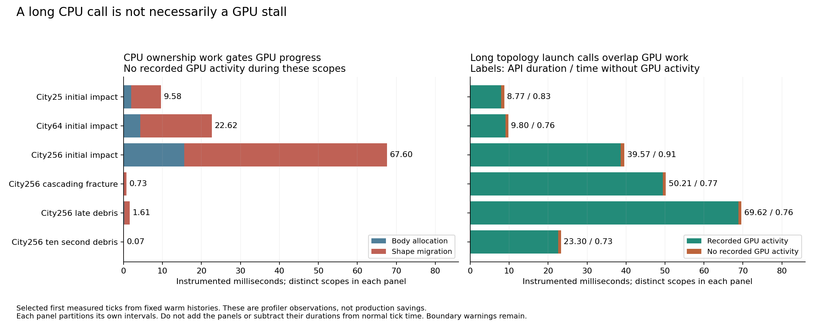
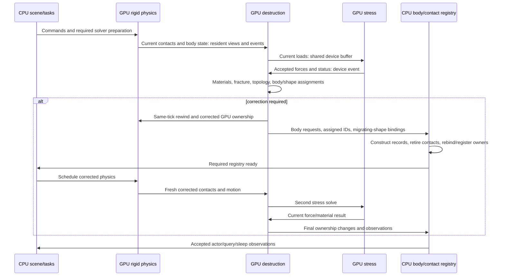
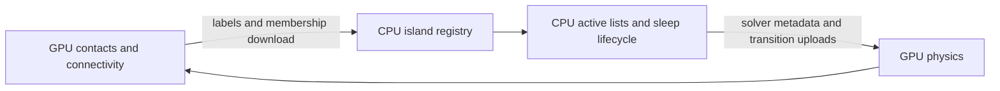
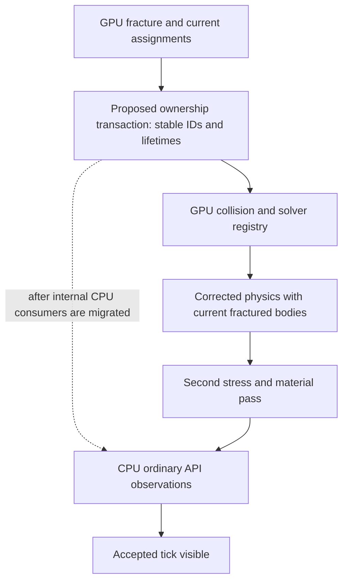
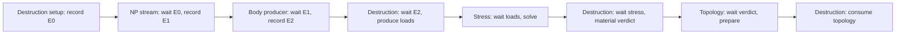

# CPU/GPU ownership and scheduling audit

Published 2026-09-14. Reuses all52 warm traces and frozen source `13b11af2`,
runtime `d5770a80`. Architecture audit only: no runtime changes, promotion or
new GPU collection.

**CPU ownership/registration before corrected physics is the strongest misplaced
dependency. A separate restriction keeps contact-island ownership on the CPU
when sleeping is enabled.** Stress/load/material math is already on the GPU.
Moving that math is not the missing change.

The completed traces show no deadlock. They do show GPU inactivity during CPU
registration. Conversely, the longest CUDA launch calls mostly overlap useful
stress execution; they are not equivalent GPU stalls.



Each panel partitions its own instrumented intervals. Left: CPU allocation and
migration intersected with absence of recorded GPU activity. Right: topology
graph-launch API duration split by recorded GPU activity. Do not add the panels
or treat them as production savings. Boundary warnings prevent an exhaustive
hardware-idleness claim.

## Scenario evidence

Normal complete-step timings include physics, stress/material, CPU work,
transfers, waits, at most one correction and publication. Restore and fixed
physical warmup are excluded. Means span two processes, each with two restored
trajectories and eight measured ticks; city256 idle measures sixteen.

| Warm window | Normal mean / peak, ms | Misses / ticks | Profiled selected tick, ms | No GPU activity during CPU allocation / migration, ms |
|---|---:|---:|---:|---:|
| City25 impact | 22.607–22.761 / 36.917 | 20/32 | 100.617 | 1.921 / 7.662 |
| City64 impact | 28.301–28.641 / 57.795 | 22/32 | 123.449 | 4.298 / 18.323 |
| City256 intact idle | 1.659–1.692 / 3.927 | 0/64 | 15.719 | 0 / 0 |
| City256 impact | 88.772–90.104 / 187.800 | 32/32 | 264.442 | 15.605 / 51.995 |
| City256 cascade | 77.277–77.409 / 99.809 | 32/32 | 136.783 | 0.057 / 0.671 |
| City256 late debris | 124.455–124.662 / 129.219 | 32/32 | 180.464 | 0.151 / 1.456 |
| City256 ten-second debris | 40.834–41.383 / 59.954 | 32/32 | 102.635 | 0.020 / 0.046 |

City25/64/256 contain 11,100/28,416/113,664 chunks and
22,400/57,344/229,376 original bonds. [All52 boundary measurements](all-scenarios.md)
include every structural and ordinary-body case. [Stages, preparation, physical
work and histories](../destruction-warm-full52-20260914/all-scenarios.md) remain
authoritative. Full52 cascade uses W47/M8, not the nine-window W55/M8 case.
Profiles select the first measured tick, not the window average.

The last column uses clock-aligned SQLite NVTX wall intervals. The earlier
report's native CSV thread-CPU clocks have slightly different boundaries. All
listed allocation/migration intervals lack recorded GPU execution throughout.
This supports the dependency diagnosis, not a promise of equal savings outside
the profiler.

## The split that already makes sense



Conceptual ordering, not duration. No-correction completion also joins device
work before publication. Second-pass ownership changes cannot cause a third
physics simulation.

Already on device: contact-load routing, gravity/inertial inputs, stress,
material health, fracture, connectivity kernels, cluster motion/mass fitting,
motion-slot allocation and body/shape installation. The integrated stress API
rejects a different input pointer: it consumes the runtime's shared allocation.
There is no CPU force-vector download between stress and materials.

Source: [runtime](../../out/warm-bottleneck-analysis-20260914/source/PxgDestructionRuntime.cu),
[stress API](../../out/cpu-gpu-boundaries-20260914/source/StressResidentAPI.inl),
[borrowed contact views](../../out/cpu-gpu-boundaries-20260914/source/PxgNarrowphaseCore.cpp).

## Contact islands: GPU computation, CPU ownership with sleeping

The [frozen eligibility predicate](../../out/cpu-gpu-boundaries-20260914/source/PxgContext.h)
requires `mPreSolveSleepingDisabled` for `deviceConnectivityOwnershipRequested()`.
The [constructor](../../out/cpu-gpu-boundaries-20260914/source/PxgContext.cpp)
sets it directly from `PxSceneFlag::eDISABLE_SLEEPING`. Sleeping-enabled scenes
therefore cannot enter this fully device-owned path, even when its other switches
and buffers are ready. This is an implementation restriction, not a GPU limitation.

GPU pre-solve connectivity separately permits ordinary API mode with sleeping.
Thus connectivity kernels run on GPU while CPU island ownership still supplies
active lists and sleep/deactivation consumers. `IslandSim::findRoute` uses
downloaded labels and sorted members to avoid CPU graph searches. It would be
wrong to claim every component is independently recomputed on both processors.
[CPU island consumers](../../out/cpu-gpu-boundaries-20260914/source/PxsIslandSim.cpp).



Arrows span successive ordered phases; this is not a circular wait in one queue.
Warm debris island repair downloads **1.573 MB** in **0.221 ms** summed copy time.
Four label/member groups cover 32,767 body-capacity entries each: two graph
variants across two passes, plus status. These are body/contact entries, not
113,664 authored chunks. The surrounding repair scope's 11.85 ms instrumented
exclusive CPU time also includes CUDA submission and collector work.

**Change the consumers first:** give supported contact-island membership,
activity and sleep/wake transitions authoritative device representations; migrate
internal consumers; return compact ordinary-API observations. Retain current
restrictions for joints/articulations and other unsupported correction state.
Deleting only the sleeping guard would skip unfinished host responsibilities.

An intermediate interface should version graph, active-list and sleep state
separately and identify each host consumer. Same-pass graph reuse already exists:
`buildDestructionContactGraph(true)` checks generation, retained-contact revision
and pair/removal counts. The later stress call is not automatically a duplicate
full rebuild. Late contact removal must continue to invalidate reuse.

## Fragment registration: the expensive CPU predecessor

GPU indices, motion and shape ownership exist before corresponding CPU `BodySim`
records are constructed. Corrected physics is nevertheless submitted only after
CPU construction and per-shape rebinding. This is the first-impact GPU inactivity
in the figure, scaling from 7.66 ms migration at city25 to 52.00 ms at city256.

`ShapeSimBase::rebindRigidOwner` refilters bounds, retires contacts, registers the
narrowphase owner and changes actor links. Shape identity and GPU geometry persist;
ordinary simulation registries remain CPU objects. [Ownership operation](../../out/cpu-gpu-boundaries-20260914/source/ScShapeSimBase.cpp),
[correction scheduling](../../out/cpu-gpu-boundaries-20260914/source/ScPipeline.cpp).

The target is a **private ownership transaction consumed by collision/solver
registration**, separating CPU observation from internal simulation requirements.
An intermediate batch can deduplicate affected interaction visits and reserve
CPU capacity once. C++ object construction cannot simply become a CUDA kernel:
the internal consumers and ownership representation must change.



This is a target design, not implemented behavior. CPU filtering, pair lifetimes
or metadata must remain before their consumers until those responsibilities
move. Final actor/query publication is already deferred. Valid geometric contact
records may persist, but new ownership/mass requires current constraints and
impulses; preserving stale response data would change the physics.

## Long CUDA calls versus GPU starvation

| Selected tick | Topology prepare launch API time, ms | Stress overlap, ms | No recorded GPU activity during calls, ms |
|---|---:|---:|---:|
| City25 impact | 8.771 | 7.860 | 0.828 |
| City64 impact | 9.797 | 8.894 | 0.763 |
| City256 impact | 39.572 | 38.216 | 0.913 |
| City256 cascade | 50.214 | 49.001 | 0.767 |
| City256 late debris | 69.616 | 68.379 | 0.757 |
| City256 ten-second debris | 23.296 | 22.156 | 0.726 |

API intervals also overlap non-stress GPU work, so the final two columns do not
sum to the first. Topology requires the fracture verdict produced after current
stress/material execution. It cannot execute before that verdict exists.

The [transaction](../../out/cpu-gpu-boundaries-20260914/source/PxgDestructionTransaction.cuh)
uses a nonblocking stream, event dependencies and graphs uploaded at setup.
`prepare()` has no explicit host wait; the long interval is inside
`cudaGraphLaunch`. Its internal cause is unproven. CUDA permits calls to block
for internal resources, and profiling can perturb them. [NVIDIA synchronization
behavior](https://docs.nvidia.com/cuda/cuda-runtime-api/api-sync-behavior.html).

A bounded plain-versus-traced API check would distinguish production behavior
before redesigning submission. The trace does not establish 69.6 ms of avoidable
scheduling loss. Asynchronous submission could free a worker or reduce short
submission gaps; it cannot remove required stress. Main-thread `fetchResults`
waits likewise coexist with useful GPU/worker execution.

## Keep, replace or coalesce each boundary

| Boundary | Current purpose | Disposition before tuning |
|---|---|---|
| Physics → loads → stress → materials | Current device views and stream events | Keep data dependencies; no stale-input overlap. |
| Fracture → CPU ownership | Requests/IDs/bindings feed registries before corrected physics | Replace internal consumers; batch compatibility work as an intermediate step. |
| Contact graph → host island members | CPU activity/sleep lifecycle consumes GPU results | Migrate lifecycle consumers, then delete unnecessary downloads. |
| Correction acceptance → host status → second stress | Host validates status and accepts reservations before setup | Candidate for device error propagation and later observation, after migrating host status consumers. The GPU dependency remains. |
| New-body requests, then migrating-owner metadata | Separate readbacks/joins into ordinary `std::vector` buffers | One reusable pinned transaction packet; join once at its first necessary CPU consumer. |
| Sleep transitions | Sparse IDs; generic setters for velocity/force/torque and optional rollback pose | Dedicated ordered device transition can remove setters/joins; small current exposure. |
| Capacity exhaustion | Host grants memory/IDs and retries allocation/preparation | Retain recovery; reserve justified headroom/reuse storage. Never rerun stress/material after growth. |
| Final actor/query publication | Ordinary accepted observations, already deferred | Keep at public completion; distinguish it from internal registration. |

City256 impact downloads only **0.119 MB** of compatibility requests and
**0.213 MB** in `applyBindings`, taking **0.019/0.030 ms** summed copy time.
Late debris's respective packets are **1,320/3,352 bytes**. The large first-impact
cost comes after arrival; faster copies cannot eliminate its CPU registration.

Late debris sleep commit contains fourteen host stream-synchronize calls totalling
**0.070 ms** API time and 472 bytes of attributed uploads. Its whole scope has
other CPU work. A dedicated transition operation improves the design, but these
waits do not establish a large saving. Null-stream setup operations exist here;
the entire application does not exclusively use nonblocking streams.

Ordinary PhysX bulk data is larger: warm debris host↔device traffic totals
61.117 MB and 8.690 ms summed copy time. Its identified producers/consumers are
in the [earlier transfer audit](../destruction-warm-bottlenecks-20260914/README.md#transfers-reduce-the-dependency-not-just-the-byte-count).
Delete a payload only after removing or moving its actual consumer. No evidence
supports deleting all rigid-body transfers or switching to Direct GPU API mode.

## Deadlock and event-lifetime check

All52 selected ticks complete. No explicit `cudaDeviceSynchronize` or
`cuCtxSynchronize` call is recorded in their normalized inventories. Host
event/stream waits, synchronous/default-stream copies and growth paths still
exist: this is not proof of zero implicit serialization.

Reused event handles can look circular if their successive recordings are
collapsed into one node. Source order is acyclic when recordings are separated:



E0/E1/E2 are conceptual record instances, not new events added to the code. CUDA
waits capture event state when submitted; later recordings do not retroactively
change an earlier wait. [CUDA event semantics](https://docs.nvidia.com/cuda/cuda-runtime-api/cuda_runtime_api/group__CUDART__EVENT.html).
Explicit producer-ready events and lifetime contracts would make a refactor
easier to reason about without inventing additional host joins.

The reviewed context-locked joins wait for work already enqueued. I found no
required host callback in that path that must acquire the same lock to allow the
queued work to finish. This is review of the supported path, not proof over all
commands/error paths/concurrent clients. Externally supplied consumer events
remain an API lifetime obligation and cannot simply be deleted.

A small transitive redundancy exists at the integration call: runtime setup
waits for the prior consumer before producing current loads, then the stress API
waits for both that consumer and load readiness. A proven call-site dependency
contract can omit the duplicate without weakening the standalone API. That is
minor cleanup, not the main performance opportunity.

The exports contain **2,298 selected event recordings**, recovered by joining
their correlation IDs to event-record API calls. Their device timestamps are all
zero; filtering those timestamps would incorrectly discard valid records. CUPTI
documents optional device timestamp collection and a distinct synchronization ID
for each recording of a reused event. [CUPTI event-record fields](https://docs.nvidia.com/cupti/13.4.0/api/structCUpti__ActivityCudaEvent2.html).

Of **2,086 observed stream waits**, 1,841 match one exact recording: 1,799 inside
the selected tick and 42 before it. Every matched producer API completes before
the wait API begins. The other 245 waits, in 41 scenarios, carry the sentinel
`eventSyncId=4294967295` and lack a matching record. This does not establish
incorrect application ordering; those dependencies cannot be reconstructed from
these exports. Late debris has all 101 waits matched, including seven preceding
recordings.

All52 reconstructed record/stream-wait subgraphs are acyclic. One overlapping
same-stream API pair in city25 fragmented-loaded has no asserted submission-order
edge. Graph-internal dependencies, missing boundary records, implicit/default
stream synchronization and host locks are outside this graph. Thus the source
review and observed completion support **no deadlock found**, not an exhaustive
deadlock proof. Historical CUPTI teardown faults are separate.

## Fix-first order and acceptance

1. **Body/interaction ownership transaction.** Inventory the internal consumers,
   remove repeated owner/interaction work, and migrate consumers of device-produced
   identities. First-impact exposure makes this the first CPU-dependency target.
   Low-confidence target: 0–30 ms on expensive impact ticks; high cost. Support
   requires fewer actual visits/rebuilds and lower normal peaks. Refute if
   mandatory registration remains or removing visits does not reduce exposure.
2. **GPU-owned contact-island activity with sleeping.** Implement missing lifetime,
   activity and sleep consumers before lifting eligibility restrictions. Count
   removed observations, sorted nodes and CPU registry visits. Low-confidence
   initial target: 0–5 ms active ticks plus enabled architecture; high cost.
   Wake/lost-touch/kinematic/correction mismatches refute correctness.
3. **One transaction observation and precise events.** Coalesce metadata, use
   reusable pinned storage, migrate intermediate host status gates and replace
   generic sleep setters. Low-confidence initial target: 0–1 ms; medium cost.
   Neutral architecture requires a named removed dependency/follow-up and no
   physical regression. Do not advertise fewer wait calls as a timing win.
4. **Optimize remaining necessary work.** Structural/numerical reuse remains
   essential during sustained destruction. Residency tuning must not substitute
   for fixing ownership. Investigate submission changes only where they can
   expose useful overlap; running GPU work inside a long API cannot be deleted.

Ranges overlap and are not additive predictions. Required order remains current
physics → current stress/material → optional corrected physics → second stress
→ accepted publication. The normal full-step screen and uninterrupted physical
trajectory qualification determine application benefit. No tolerance, sleep or
correction rule changed in this audit.

## Reproduction and remaining evidence limits

```bash
python3 reports/destruction-cpu-gpu-boundaries-20260914/audit.py
PYTHONPATH=/tmp/destruction-comparison-python \
MPLCONFIGDIR=/tmp/destruction-boundary-plots \
python3 reports/destruction-cpu-gpu-boundaries-20260914/plot.py
```

[Audit source](audit.py), [plot source](plot.py), [structured audit](data/audit.json),
[all52 table](all-scenarios.md). The audit hashes 54 JSON inputs plus frozen source
copies and uses read-only SQLite. Original report hashes remain in the baseline
audit; raw captures are not rehashed here. Python3 and the existing
Matplotlib3.10.9 environment suffice. Raw evidence/source copies remain ignored
and local; readable Markdown and figures accompany the report. No commits.

CPU PMU counters, complete event/dependency coverage and unprofiled per-API timing remain
gaps. They do not prevent identifying the ownership restriction and observed
critical-path exposure, but they prevent attributing all CPU scope time to useful
work or all launch blocking to production driver behavior.

Reusable lesson: move the **consumer and ownership contract** before deleting a
transfer or wait. GPU-computed data can still have a CPU-owned lifecycle; a long
CPU wait can coexist with a busy GPU.
