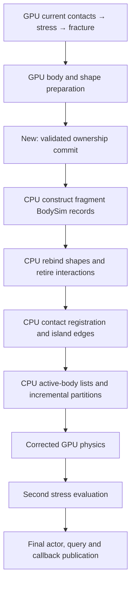

# Native ownership transaction: implementation and remaining dependency

2026-09-15. **Foundation implemented; complete GPU ownership migration remains
unfinished.** No performance win or SDK promotion. This work does not satisfy the
contract's 10 ms target. The selected source/runtime remain unchanged; no E1–E3
prototype is composed into this candidate. Source patches, build tools and this report are saved in the user-authorized
WIP branch checkpoint. Raw evidence remains local and ignored. See the
[handoff](../../docs/destruction/HANDOFF-20260915-ownership-wip.md) for reconstruction
and the distinction between the mixed main source and tested candidate.

## Implemented

The isolated runtime exposes a resident transaction containing current prepared
body inputs, shape assignments, native node records, counts, checkpoint and
topology generations, and a readiness event. No new physical algorithm or load
history is introduced.

`PxgSimulationController::advanceDestruction` now submits one
`commitPreparedOwnership` operation instead of independently restoring the rigid
checkpoint, installing fragment body inputs, then installing shape owners.
The operation validates storage before the first write, preserves that execution
order, and records one completion boundary after all writes. It rejects stale
checkpoint generations, duplicate commits and shape/remap domains that differ
from those used during preparation. Existing correction timing markers remain.

The private module factory advances from V20 to V21 so the new controller cannot
silently load an older runtime lacking its appended virtual methods. Existing
public APIs and prior virtual slots remain unchanged.

This removes intermediate transaction event bookkeeping and makes admission
coherent. **It does not remove the CPU allocation, binding or registration work.**
No performance measurements are justified by those bookkeeping changes alone.

## Ownership and lifetime contract

- The runtime owns all resident preparation arrays. Consumers borrow them for the
  current correction only, and enqueue waits on the supplied readiness event.
- Preparation observation validates the producer verdict. A rejected or
  incomplete preparation exposes an empty transaction.
- Checkpoint generation distinguishes correction inputs, including the fresh
  end-of-tick checkpoint used for a possible second fracture. At most one commit
  is admitted for each checkpoint generation.
- Native node lifetime remains the existing per-slot generation. The transaction
  does not replace it with a topology generation or assume a reused ID is the
  same physical body.
- Body, previous-velocity and acceleration storage must satisfy the checkpoint's
  extent and enabled buffers. Shape and remap storage must match the prepared
  domains, preventing a late device fault after earlier body writes.
- Successful submission records completion after body and shape writes. The
  checkpoint reuse event is recorded at the same boundary. This is asynchronous
  submission, not a promise that device execution cannot subsequently fail.
- Clear, reconfiguration and the next preparation invalidate borrowed views.
  The readiness event is reusable; consumers must enqueue their dependency before
  the producer advances to another preparation. Existing teardown drains work.
- CUDA submission failures invalidate the checkpoint and fail the runtime.
  This is not rollback of partially executed device work.

## Why the main dependency still exists

All arrows above remain dependencies. The new commit replaces the previous
three submission calls at C; it does not bypass D–G.

| Consumer in isolated PhysX source | Needed data / effect | Classification and required replacement |
|---|---|---|
| `gpudestruction/src/PxgDestructionRuntime.cu`, `prepareBodyCompatibility` | Creates CPU records at GPU-selected body IDs | Host representation is required eventually; its simulation prerequisite must be replaced |
| `physx/src/NpDestructionBodyAllocator.h`, `applyBindings` | Activates current owners, updates readiness and rebinds shapes | Mixed physical state and representation; cannot defer as one opaque operation |
| `simulationcontroller/src/ScShapeSimBase.cpp`, `rebindRigidOwner` | Refiltering, lost-touch retirement, narrowphase owner and actor links | Physical eligibility/lifetime changes are mandatory; per-shape reconstruction is the removal target |
| `simulationcontroller/src/ScShapeInteraction.cpp`, `createManager` | Current body/core pointers, contact flags and node identities | Contact registration still assumes CPU bodies exist; replace these inputs, not only the lookup |
| `simulationcontroller/src/ScPipeline.cpp`, overlap creation / island insertion | Interaction allocation and CPU edges before solving | Pair lifetimes and current response remain necessary; device registration needs a corresponding consumer |
| `gpusolver/src/PxgContext.cpp`, `update` | Counts and active nodes from the CPU accurate island simulation; solver index layout | Shared with ordinary bodies; GPU fragment ownership alone does not supply the solver's work list |
| `gpusolver/src/PxgConstraintPartition.cpp`, `updateIncrementalIslands` | Contact partitions derived from CPU islands, body manager and contact records | Shared solver prerequisite; needs a device registration/partition path before CPU records can be deferred |
| `gpusolver/src/PxgContext.cpp`, `updatePostPartitioning` | Node liveness, lifetimes and retained edges | Must consume current generations and preserve ordinary-body interactions |
| `lowlevel/software/src/PxsIslandSim.cpp`, lost edges / deactivation | Connected membership, active lists, readiness and sleep/wake | Required physical behavior; existing sleeping restriction cannot simply be removed |
| `simulationcontroller/src/ScPipeline.cpp`, correction finalization | Report repair, activity restore and correction scheduling | Must see current ownership and preserve one-correction ordering |

This audit identifies a shared implementation boundary, not proof that a device
implementation is impossible. It also does not prove every transitive consumer
has been enumerated. Completing the main hypothesis requires replacing the
contact-registration and solver-partition inputs together for affected contact
islands, including their ordinary-body participants. Moving CPU construction
after the current solver submission would leave these inputs invalid.

## Validation and evidence

Initial V1 native checks passed in both selected control and candidate. These
are correctness invocations, not representative performance samples:

| Native fixture | Control | Candidate V1 | Scope |
|---|---|---|---|
| Native node births | Pass | Pass | GPU preparation before CPU construction; growth then no-growth fracture |
| Contact response | Pass | Pass | Current contact response after ownership changes |
| Retained registry | Pass | Pass | Retained contact registration |
| Correction bodies | Pass | Pass | Momentum, mass/inertia, commands, invalid inputs, TGS/PGS and enabled buffers |
| Checkpoint | Pass | Pass | Rigid checkpoint and rejection behavior |

The ten-invocation wrapper took **55.461 s**, including launching/checking each
process and desktop handling. This is not simulation tick time. No new scenario
mean, peak or deadline-miss statistic is available, and historical performance
numbers must not be treated as this candidate's control measurements.

Added V3 tests intercept the real native correction before and after ownership
commit. They reject stale generations, null/undersized/mismatched storage, and
duplicate commits, and compare the body, previous-velocity, acceleration, shape
and remap buffers byte-for-byte after rejection. They also check clear invalidates
the borrowed transaction. **All four V3 invocations pass:** ordinary-API and
preparation fixtures, focused memcheck, and focused synccheck. Total wrapper time
is 13.432 s; each fixture exercises two consecutive fracture ticks. These tests
are not full physical trajectories or timing measurements.

V3 artifact hashes:

| Artifact | SHA256 |
|---|---|
| Runtime | `f60093d477b13a4f8ac292009aa733e5648c6eadc5e677b506609057e2b2fa40` |
| GPU module | `425403041926897f4aff24de8ef593268d2e3a525574e1801c2ad8aee50a1d08` |
| Transaction fixture | `9c357b11d860b71e2eb1a617b24a8b5d1a9592a0f5d513f0a9fcb0d7b6b517bc` |

All 143 reused GPU link objects/libraries match the earlier selected-module
relink attestation. The build receipt records every source dependency, shared
input and output hash. The host test fixture is rebuilt from matching frozen
source; the SDK is not replaced.

Local ignored evidence:

- `out/ownership-migration-20260915/transaction-build-v1/build.json`: initial
  build, module hashes and inputs.
- `out/ownership-migration-20260915/native-v1/campaign.json`: ten passing native
  invocations, per-process receipts and loaded module identities.
- `out/ownership-migration-20260915/transaction-build-v2/build.json`: preserved
  test-link failure. The old fixture scene object had a different constructor
  signature; no GPU physics failure occurred in this attempt.
- `out/ownership-migration-20260915/transaction-build-v3/build.json`: matching
  frozen fixture scene source, native modules and updated rejection test.
- `out/ownership-migration-20260915/native-v3/campaign.json`: rejection and
  focused memory/synchronization checks.
- `out/ownership-migration-20260915/transaction-v2.patch`: isolated native/test
  changes against source13b11af2.

The known baseline initialization failures are unresolved. Passing focused
memory/synchronization checks would not establish clean initialization or final
qualification. Nine-case performance, full52 and independent confirmation have
not been run for this foundation. They are gates for a completed mechanism, not
a substitute for implementing the missing consumers.

## Final focused regression checkpoint

The final V3 module also passes all seven additional native invocations: contact
response, retained registry, initialization rejection, slot lifetime exhaustion,
accepted properties, correction bodies and checkpoints. Wrapper duration: 31.903 s.
Receipt: `out/ownership-migration-20260915/native-v3-regression/campaign.json`.
Across V1 and V3 there are 21 passing native invocations (5 selected control,
16 candidate), including one focused memcheck and one focused synccheck. These
counts include different fixture modes and repeats, not 21 representative
performance scenarios. V3 itself accounts for 11 candidate invocations.

Decision: retain the isolated transaction foundation, unpromoted. The main
contact/solver ownership hypothesis is still untested. No full52, nine-case
performance screen, initialization qualification or end-to-end gain is claimed.
Next implementation must replace contact registration and solver work-list/
partition inputs for affected contact islands, with ordinary-body and sleep/wake
consumers, before CPU fragment records can become publication-only work.
