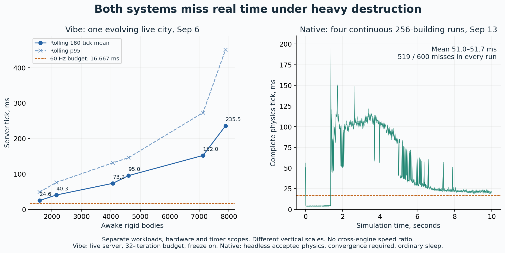
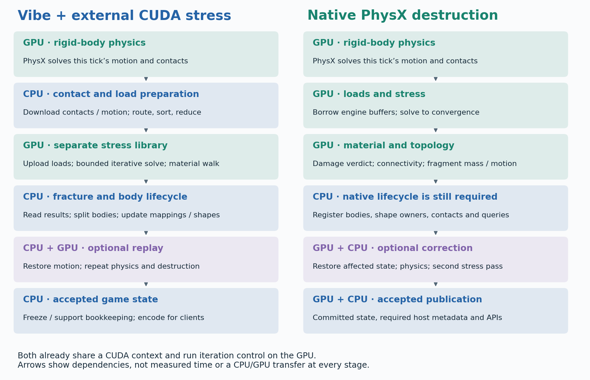
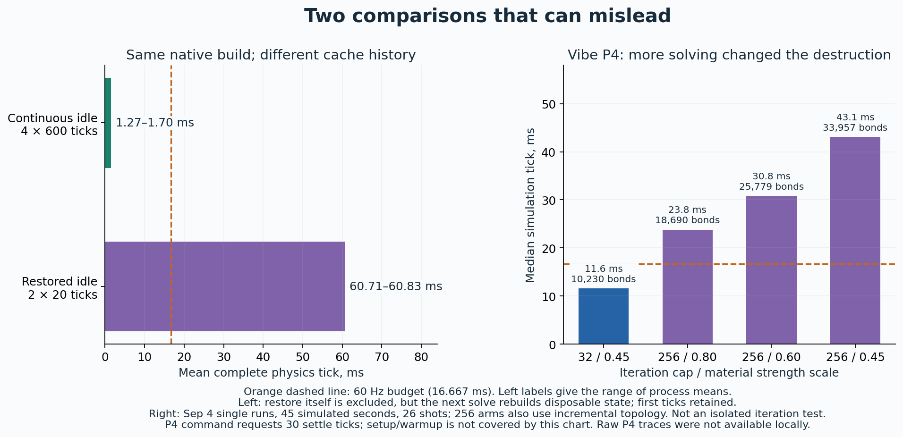
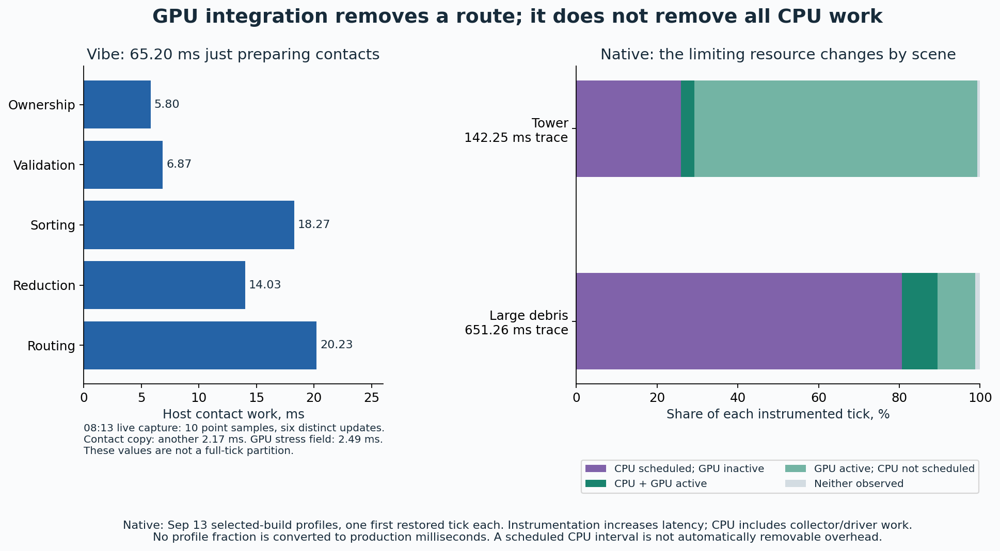

# Vibe and native PhysX destruction: what is actually different?

Subsequent measured experiment: [native convergence policy test](../destruction-convergence-policy-20260913/README.md) isolates tolerance and a 32-iteration cap on the same native build. Heavy mean falls 55.10→45.43→23.16 ms, with changed fracture behavior; this qualifies the numerical-policy discussion below without establishing an equal-quality cross-engine ranking.

Published September 13, 2026. Analysis of existing source and measurements; no new physics run, optimization, deployment or commit.

**Vibe can feel better in particular scenes, but the evidence does not establish that its physics implementation is generally faster. Native integration removes a substantial CPU contact-processing route. It still has expensive CPU fragment bookkeeping and a more demanding stress-solve contract. Both systems have measured heavy-destruction failures against the 16.667 ms budget for 60 Hz.**

The most useful distinction is between **where the work runs**, **how much physics it computes**, and **what the measurement includes**. Moving the destruction system inside PhysX changes the first; it does not automatically make the other two equal.

[Open the interactive comparison](comparison.html). It includes an explorer for all 52 native restored scenarios and every tick of the eight continuous control runs. [Source identities and verification](provenance.json) distinguish current working files from the measured executables.

## What the existing performance evidence says

These are **separate cohorts, not a head-to-head benchmark**:

| Evidence | Workload and scope | Observed performance | What it establishes |
|---|---|---|---|
| Vibe P4, September 4 | One downtown scene, grid 1; 26 shots over 45 simulated seconds; 32 iterations, strength scale 0.45, whole topology reset | Simulation p50 **11.6 ms**, p95 **41.6 ms** | Ordinary moments can look responsive; the run does not sustain every-tick 60 Hz. Single trial; command requests 30 settle ticks. |
| Vibe submitted reports, September 6, 04:46–04:47 | One evolving grid-2 downtown; Direct GPU, CUDA stress, 32 iterations, freeze on; full server rolling windows | Mean **24.57 → 235.51 ms** as awake bodies rise **1,579 → 7,887**; final p95 **450.28 ms** | Vibe itself becomes extremely slow under accumulated destruction. Six overlapping 180-tick summaries, not six independent experiments. |
| Vibe live observation, September 6, 08:13 | Same live release; roughly 8,900 awake and 24,450 frozen bodies; 600 unique historical ticks recovered from ten samples | Mean **130.126 ms**, p95 **141.108 ms**, observed max **534.507 ms**; **600/600** above 60 Hz | The later rubble state is also far from real time. Ring includes history before the 45-second observation. |
| Native selected control, September 13 | 256 repeated buildings, 113,664 chunks, 229,376 bonds, one wave of 256 physical projectiles; four continuous 600-tick runs | Mean **51.028–51.676 ms**, observed maxima **175.622–194.571 ms**; **519/600** misses in every run | Native heavy destruction remains roughly three times the mean real-time budget. It is not evidence of a threefold win over Vibe. |
| Same native control, intact idle | Same scale, no projectiles; four continuous 600-tick runs | Mean **1.271–1.704 ms**, maxima **12.038–13.508 ms**; **0/2,400** misses | Native does capitalize on continuous settled-state reuse. It is not intrinsically expensive merely because a large intact city exists. |

Native initialization is separate: approximately **2.14–2.26 seconds** in this continuous cohort. Every timed first tick remains in the statistics. Native's benchmark excludes rendering, networking, output export and independent snapshot restoration; Vibe's full live server tick includes game-side work. The historical Vibe environment was an **RTX 4090 / CUDA 12.8 / PhysX 5.10**; the current native campaign is **RTX 5060 Ti / CUDA 13.4**. No hardware scaling factor is applied.

The native 180-tick calibration has heavy means 54.867–55.291 ms and idle means 1.658–1.722 ms. That shorter three-second history is kept separate from the ten-second 600-tick cohort above. Likewise, the older N20 profile report is not silently pooled with the newer selected N13+N20 composition.

Sources: [Vibe P4](../../../vibe-land-4/docs/p4-iteration-budget-videos-2026-09-04.md), [submitted reports](../../../vibe-land-4/docs/city-player-reports-2026-09-06-live.md), [later live analysis](../../../vibe-land-4/docs/city-live-analysis-2026-09-06-0813.md), [native continuous controls](../destruction-baseline-20260913/continuous-controls.md), [shorter calibration](../destruction-optimization-summary-20260913/README.md).

## The two pipelines

This is a dependency diagram, not a measured timeline. Steps have unequal costs. Correction is conditional. The final Vibe game-output stage is outside the native physics benchmark's scope.

Both systems start from the same broad model: chunks connected by bonds, rigid bodies for groups of chunks, contact impulses from PhysX, a numerical stress solve, material damage, and new rigid groups after fracture. **A chunk is not necessarily a rigid body.** A bonded building can have hundreds of stress nodes but only one rigid-body owner. Contact islands, stress components and groups that move together are also different partitions.

**Vibe's live route:** PhysX GPU finishes the first pass; the bridge obtains contacts and mirrors motion to the CPU. CPU code validates shape ownership, orders and reduces contacts, routes them to structures, and constructs loads. The external CUDA solver receives those host-built loads. Its GPU bond-stress walk avoids much older whole-bond CPU work, and lazy impulse readback avoids downloading every bond force unconditionally. CPU adapter code still owns fracture application, actors, shape maps and replay coordination. Splits can trigger a same-tick restore and another physics/destruction pass before game output.

**Native's route:** the engine borrows its current solved contact buffers, resolves loads on-device, then runs stress, material and connectivity work with resident device state. It prepares fragment mass, motion and binding changes on the GPU. CPU code still reserves/registers native bodies and maintains shapes, interactions, sleeping and ordinary API/query state. The engine can restore affected state and run one internal correction with a second stress pass, then publish accepted state.

The native design therefore **does remove the external GPU → CPU contact/load assembly → GPU route**. It does **not** remove all CPU participation in a fracture, all transfers in PhysX, or the dependency between current contacts and current stress. A large CPU wait can contain necessary GPU execution; asynchronously launching stress using stale contacts would change the simulation.

There is no inherent two-CUDA-context penalty to remove: Vibe's solver already borrows the PhysX CUDA context and uses a private stream. It already uses CUDA graphs and device-side iteration termination. Both already support per-component retirement and reuse of unchanged converged solutions. These are not benefits that exist only in the native design.

The external library also contains a tested `solveDevice` / device-contact primitive. Its [pipeline report](../../../blast-stress-solver-2/demos/blast-stress-demo/GPU_PIPELINE.md) explicitly says that primitive was **not the deployed city load route**. Similarly, newer physical-graph and multilevel experiments in that repository must not be mistaken for the solver measured in the live game.

## The numerical algorithms are no longer equivalent

| Aspect | Vibe live-era external solver | Native selected solver | Performance consequence |
|---|---|---|---|
| Iterative method | Node-space CGLS by default, derived from the bond-space least-squares problem; per-component reductions and convergence flags | Preconditioned node-space CG with rigid-mode handling, accurate residual checks and final bond-output verification | Iteration counts are not comparable units of work. |
| Scheduling | Several sparse kernels per iteration inside a conditional CUDA graph; host wrapper per solver submission | Up to 1,024 dynamic nodes per component: one GPU thread block owns its iterations and dynamically claims more components; larger components use a cooperative multi-block solve | Native removes inter-kernel iteration traffic for small components; a single large problem has a different synchronization and parallelism problem. |
| Preconditioning / arithmetic | Primarily FP32 iteration state; optional block Jacobi is off by default in inspected source | FP32 state combined with FP64 operator/residual/preconditioner work; local inverse/polynomial path for small components, multilevel cooperative path for large ones | More accurate or stronger steps can be more expensive. Neither precision nor iteration count alone predicts runtime. |
| Acceptance | Live cap **32** per solve; tolerance **1e−3**. A successful API return can contain an unconverged result, retained for later refinement | Example driver tolerance **1e−5**; convergence is required for an accepted integrated step. Iteration cap is a failure bound, not permission to accept a partial solve | Native may do much more numerical work during the tick. The tolerance numbers alone are not physical-error guarantees. |
| Warm state | Per-component unchanged-input/converged skipping; live configuration forces whole-reset-on-topology | GPU-owned certificates include topology, inputs and solve settings; verify stored output; material damage still advances | Both exploit quiet scenes, but invalidate and preserve different work. |
| Fracture response | Host-owned split and replay; current live settings request one replay | GPU-owned topology with native lifecycle joins; at most one internal correction and second stress pass | Replay is already present in Vibe; it is not a new cost unique to native. |

In plain terms, the solver repeatedly asks: **“How must forces pass through these bonds to account for the current load?”** An iteration improves that answer; it does not mean one more physics tick. A connected structure with a long or poorly conditioned load path can need much more work than thousands of already-settled fragments. Preconditioning supplies a better correction direction but costs work of its own.

The external API's `solveInputs()` records unconverged status and still returns successful execution. Its adapter reads the status and retains the result. Native's `requireNativeConvergence()` marks the step erroneous if convergence failed. Thus, a smooth legacy frame can involve a partial numerical answer where native refuses to complete on that basis.

This does **not** justify saying “Vibe is fast because its physics is wrong.” The contribution depends on the scene, and both systems have unresolved physical-model issues. The held Vibe contact-wrench correction exposed a **0.9970 physical force residual at 32 iterations** on one 5,936-node anchored building. That is a diagnostic of the corrected candidate, **not a 99.7% error measurement of every live Vibe scene**. The native regression report separately retains a failing unequal-mass column: **27.746870 N versus the physical 29.430000 N**, consistent with the inherited mass equalization. Stricter convergence certifies solving the implemented equations, not the correctness of every modeling assumption.

Sources: [external numerical implementation](../../../blast-stress-solver-2/blast/source/sdk/extensions/stressgpu/NvBlastExtStressGpu.cu), [external adapter](../../../blast-stress-solver-2/blast/source/sdk/extensions/stress/NvBlastExtStressSolver.cpp), [native small-component solve](../../blast/source/sdk/extensions/stressgpu/detail/StressComponentIteration.cuh), [native preconditioner](../../blast/source/sdk/extensions/stressgpu/detail/StressNativePreconditioner.cuh), [native convergence boundary](../../physx/source/gpudestruction/src/PxgDestructionRuntime.cu), [held physical correction](../../../vibe-land-4/docs/contact-wrench-fidelity-2026-09-05.md), [native model limitation](../destruction-regression-suite/README.md).

## Why the measurements can look contradictory

**Continuous and restored are different workloads.** The same selected native build measures 1.27–1.70 ms for continuous intact idle, versus 60.71–60.83 ms mean for restored intact idle in the 52-case cohort. The independent restore is outside the timer, but caches and execution state still need rebuilding during the next solve. Snapshot labels such as “warm” describe the saved physical history; they do not promise that numerical caches survived restoration. The restored debris mean of 334–351 ms is a valid stress test, not the average cost of running the game continuously.

**CPU time is not elapsed tick time.** The older August Vibe suite highlights `cpu_ms`. The recorder computes it from process CPU consumption; the separate `sim_ms` brackets elapsed simulation time. A 0.84 ms CPU result can coexist with a GPU wait. Likewise, a native `physics_step_ms` includes integrated stress and host work; its legacy `stress_solve_ms = 0` is a placeholder, not proof of free stress. Use the complete relevant wall-clock bracket before comparing.

**The amount of destruction changes the future workload.** In P4, the same strength scale 0.45 gives 10,230 broken bonds with the 32-iteration/whole-reset configuration and 33,957 with 256 iterations/incremental topology. Peak awake bodies rise 2,305 → 7,454; median simulation tick rises 11.6 → 43.1 ms. Both the numerical budget and topology policy changed, and these are single runs. This demonstrates a workload confound, not a clean speed penalty attributable to iterations alone. A 256 cap also does not prove convergence.

**Sleep, freeze and material calibration differ.** Vibe's live freeze system makes eligible debris kinematic and uses support/wake bookkeeping to release it. Native's selected benchmark uses ordinary PhysX sleeping and preserves ordinary APIs. The legacy material strength scale is 0.45 in these game reports; the old direct comparison attempted scale 1 with freeze off. Fragment count, contact density and solver conditioning depend on those choices. Neither chunks nor shots alone define equal work.

**The browser is not the physics clock.** Vibe's client maintains a continuous render clock following the measured server rate and interpolates/extrapolates debris. In the last submitted report, the client frame point sample is about **23.59 ms** while the server's rolling tick mean is **235.51 ms**. Those are asynchronous samples with different scopes, so they are not an exact rate ratio; they illustrate why visual smoothness cannot establish simulation throughput. The later server observation advances only five simulated seconds in 45 wall seconds.

**A report in a Vibe consumer is not necessarily an external-backend result.** Several `physx-2/qualification/vibe-*` reports measure the newer native engine inside a Vibe consumer. For example, the 54.5 → 44.3–47.7 ms improvement from committed topology deltas compares native revisions. It does not compare original Vibe against native.

The previous explicit external-versus-native downtown attempt also failed comparability: under the copied native driver settings, the external idle scene spontaneously breaks **15,034 bonds**, whereas native remains intact. It changed the historical external iteration budget to 8,192 and retained different tolerances. That experiment cannot rank equal-quality performance. [Preserved failed comparison](../../qualification/vibe-coarse-assembly-20260908/external-reference/README.md).

## Where time actually goes

**Vibe, live heavy rubble:** ten 08:13 point samples average **65.20 ms** of first-pass host contact work: ownership 5.80, validation 6.87, sorting 18.27, reduction 14.03, routing 20.23 ms. Contact observation/copy adds 2.17 ms. The GPU stress field averages 2.49 ms, while the surrounding stress phase averages 21.74 ms. The process uses about 1.33 CPU cores and sampled GPU duty is only 10.3%. These overlapping or repeated samples are not a whole-tick partition or SM occupancy measurement. They strongly support expensive CPU preparation around relatively short GPU work.

**Native, a large connected tower:** the fresh selected-build trace spends **103.908 ms** in the persistent stress kernel, with **104.416 ms** GPU activity during a **142.246 ms instrumented tick**. Unprofiled restored means are 107.885–108.169 ms. Only 1,288 bytes cross GPU → CPU in that trace. Faster contact readback is not the relevant solution to this case.

**Native, large fragmented debris:** the fresh selected-build instrumented tick lasts **651.257 ms**, with **117.977 ms** GPU activity and **67.083 ms** summed component-solve launches. The disjoint trace partition is 525.456 ms CPU scheduled/GPU inactive, 57.111 ms both active, 60.866 ms GPU active/CPU not scheduled, and 7.823 ms neither observed. Expensive exclusive CPU scopes include shape migration **93.956 ms**, contact-manager preparation **35.907 ms**, and dynamics update **16.209 ms**. These are diagnostic thread times; they must not be added to overlapping wall spans or projected proportionally onto the unprofiled **334–351 ms** tick.

That debris trace has **884 kernels and 347 copies**:

| Direction | Payload | Active copy-time union within direction |
|---|---:|---:|
| CPU → GPU | 42.359 MB | 6.211 ms |
| GPU → CPU | 43.208 MB | 6.075 ms |
| GPU → GPU | 50.701 MB | 0.221 ms |

MB means decimal megabytes. Directions can overlap other work; this is not an additive latency budget. The numbers include the engine's whole tick, not just the destruction load handoff. A short transfer may still force a costly dependency, but **copy bandwidth by itself does not explain hundreds of milliseconds**. Moving ownership and removing repeated CPU lifecycle operations is a different proposition from making those copies faster.

All three new profile extracts use the September 13 selected-build CPU archive, pass the recorded physical comparison, and retain profiler sampling-loss/throttling warnings. They supersede the need to use the earlier N20 profile for this report. No profile is treated as production timing.

## What to pursue, and what remains unproven

| Target regime | Supported direction | Why | Remaining proof |
|---|---|---|---|
| Intact/settled native city | Preserve existing exact reuse; improve invalidation only where work remains | Continuous idle is already roughly 1–2 ms | Changed contacts, removed loads, fracture and ongoing damage must invalidate the correct products |
| Large connected structures | Reduce total time to convergence, including preconditioner setup/application | Tower and dense cases expose long persistent solves with tiny readback | Independent load/bond/material correctness plus full-step timing; fewer iterations alone is insufficient |
| Large fracture/debris | Remove repeated shape/contact/body lifecycle work at producer boundaries | GPU numerical integration still leaves substantial CPU registration and migration | Same-tick contacts, shape identity, ordinary APIs, sleep and correction semantics must survive |
| Repeated intact/early-impact assets | Share asset-level operator preparation where exact dependencies permit | Existing operator/duplicate-work census exposes shared structure | Include initialization, memory and fracture invalidation; fresh per-tick factor setup already erased library-only benefits |
| Overall comparison | Common hardware, matched authored scene and input tape, explicit numerical/model policy; compare full physics and full game separately | Existing evidence changes too many variables at once | Intact idle, localized impact, mass impact, late rubble and reactivation; compare actual contacts, bodies, damage and equilibrium |

These are directions supported by the evidence, not implemented gains. Existing N29/N29b exact-solve matching did not produce a qualified broad win; late debris has almost no exact duplicate loads. N30 wider component dispatch failed numerical convergence. Earlier local/multilevel candidates also failed performance or quality gates. Their failures prevent simply assuming that a cache, larger block threshold or multilevel algorithm solves the current bottleneck.

My assessment is therefore: **native has a useful ownership advantage and already performs well in continuous idle; Vibe has demonstrated responsive lighter moments and an effective presentation layer. Neither has demonstrated broad real-time heavy destruction, and no collected matched comparison proves either engine generally faster.** The major native opportunities depend on the regime: numerical work for connected structures, native CPU lifecycle work for fragmented cities. Completing those changes and reconciling physical contracts is more consequential than integration alone.

## Audit and reproduction

The report builder recomputes **4,800 native continuous ticks, 2,080 native restored ticks and 600 deduplicated Vibe ticks**. It checks means, maxima, standard deviations and exact 60 Hz miss counts, checks the Vibe sample hashes, verifies native stage sums, and verifies the disjoint profile partitions. The six submitted-report summaries are read directly from their saved structured extraction. P4 values are parsed from its dated Markdown; original P4 recordings/CSVs were not found locally, so their percentiles were not independently recomputed.

Native source identity is `13b11af2e0aeabf4e0070931fbd8a060f383dfaf`, runtime `d5770a80…`. The live Vibe executable is `7c5d0426…`, game `a4685b3`, solver `bd71ce1b`. Current checkout HEADs and relevant working-file SHA-256 values are recorded in [provenance.json](provenance.json). They differ from historical binaries. The native solver/preconditioner, acceptance boundary and controller code were checked against the selected revision; additional response-history WIP in the current small-component file is not credited to the measured build.

Rebuild with Python 3.10+ and Matplotlib 3.10.9: `python3 build-report.py`, followed by `python3 build-interactive.py`. The latter generates a self-contained HTML artifact with embedded figures/data; no CDN or server is required. [Verification receipt](verification.json) records the final offline and browser checks. Companion SVG and PNG plots are portable. [Local extracted data](data/observations.json) and source captures remain ignored/local and are not promised in a fresh Git clone. See the original [all-52 table](../destruction-baseline-20260913/all-scenarios.md) for every restored scenario, both arms, physical counts and source observations.
