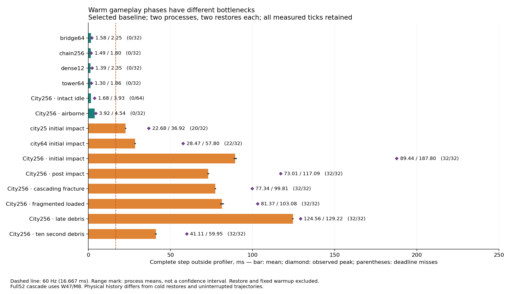
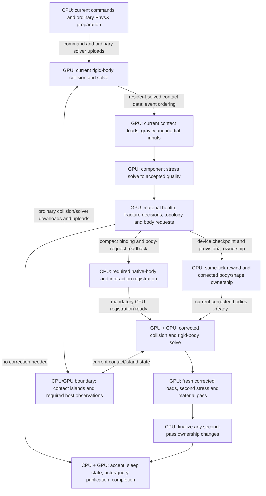
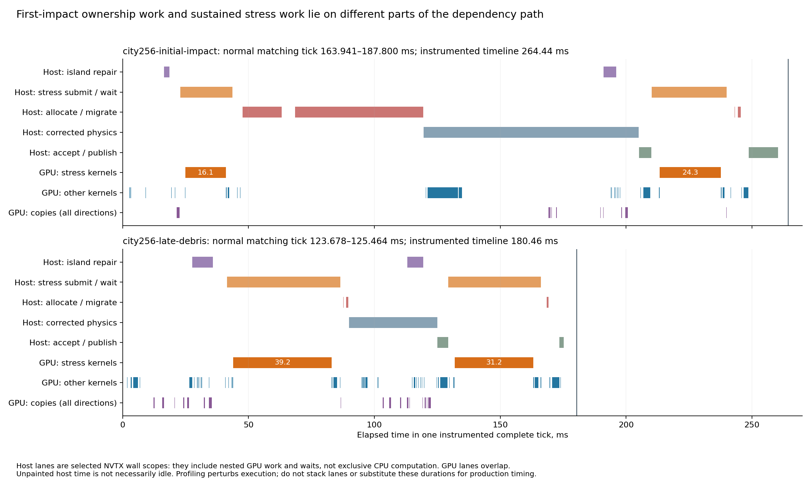

# Warm destruction bottlenecks: repeated solves and fracture ownership

Published 2026-09-14. Offline analysis of the 2026-09-14 full52 warm baseline,
with separately labeled older continuous and numerical experiments. Selected
source `13b11af2`, runtime `d5770a80`; no runtime changes or new GPU collection.

Follow-up: [CPU/GPU ownership and scheduling audit](../destruction-cpu-gpu-boundaries-20260914/README.md)
checks the sleeping eligibility restriction, CPU registration gaps, long launch
overlap and recorded event instances, with current/proposed data-flow diagrams.

**Sustained destruction is dominated by repeated stress solving; the largest
first-impact stall also contains substantial CPU fragment registration.** The
ranking changes with physical history. Warm late debris has only 1.46 ms of
instrumented shape-migration CPU time, versus 52.00 ms at first impact. Applying
the old cold-restored debris migration diagnosis to sustained gameplay would
prioritize the wrong work.

The numerical kernel has low instruction issue activity and a concrete register
and launch limit. The evidence does **not** establish a DRAM-bandwidth bottleneck.
Stress inputs and force/material evaluation already reside on the GPU. The
remaining expensive communication includes ordinary PhysX collision/solver data
and destruction-specific ownership/connectivity coordination.



All 52 windows remain in [the comparison table](all-scenarios.md). The original
[full tables](../destruction-warm-full52-20260914/all-scenarios.md) retain means,
observed peaks, misses, stages, preparation costs and physical work. These are
baseline observations, not improvements produced by an implementation change.

## Real-time cost and physical scale

Mean ranges below span independently started processes. All measured ticks are
retained; each case has two processes and two restored trajectories per process.
Most windows measure eight consecutive ticks after their fixed physical warmup;
city256 idle measures sixteen. Restore, warmup and validation are excluded.

| Warm scenario | Chunks / original bonds | Full-step mean range, ms | Observed peak, ms | 60 Hz misses / ticks |
|---|---:|---:|---:|---:|
| Bridge | 768 / 1,524 | 1.462–1.691 | 2.251 | 0/32 |
| Long chain | 256 / 255 | 1.392–1.579 | 1.799 | 0/32 |
| Dense structure | 1,728 / 4,752 | 1.272–1.515 | 2.351 | 0/32 |
| Tall tower | 2,368 / 4,900 | 1.145–1.447 | 1.861 | 0/32 |
| City25 initial impact | 11,100 / 22,400 | 22.607–22.761 | 36.917 | 20/32 |
| City64 initial impact | 28,416 / 57,344 | 28.301–28.641 | 57.795 | 22/32 |
| City256 intact idle | 113,664 / 229,376 | 1.659–1.692 | 3.927 | 0/64 |
| City256 airborne | 113,664 / 229,376 | 3.784–4.063 | 4.544 | 0/32 |
| City256 initial impact | 113,664 / 229,376 | 88.772–90.104 | 187.800 | 32/32 |
| City256 post-impact | 113,664 / 229,376 | 72.831–73.196 | 117.094 | 32/32 |
| City256 cascading fracture | 113,664 / 229,376 | 77.277–77.409 | 99.809 | 32/32 |
| City256 fragmented loaded | 113,664 / 229,376 | 80.534–82.198 | 103.085 | 32/32 |
| City256 late debris | 113,664 / 229,376 | 124.455–124.662 | 129.219 | 32/32 |
| City256 ten-second debris | 113,664 / 229,376 | 40.834–41.383 | 59.954 | 32/32 |

The late-debris mean requires about **7.47×** lower complete-step latency to
reach 16.667 ms; the observed initial-impact peak requires **11.27×**. These are
required reductions, not predicted achievable speedups. Seventeen of 52 window
means exceed the deadline. The suite's 453/1,696 misses are not a gameplay rate:
it deliberately oversamples difficult, sometimes overlapping physical windows.

The warm bridge/dense/tower fixtures largely exercise equilibrium reuse. They
remain useful idle/architecture guards, but cannot alone qualify an algorithm
for newly loaded structures. Preserve cold initial solves as companions. Full52
cascade uses snapshot40 + W47/M8; the fast nine-window screen uses W55/M8, a
different event window. Late debris uses snapshot179 + W8/M8 and is a qualified
post-restore continuation, not proof of equivalence to uninterrupted history.

For a separate gameplay reference, the saved 180-tick uninterrupted cohort has
idle means **1.658–1.722 ms**, peak **14.264 ms**, **0/720** misses; heavy means
**54.867–55.291 ms**, peak **184.833 ms**, **396/720** misses. It includes quiet
pre-impact ticks, so its mean must not replace the active-destruction windows.
[Continuous measurement contract](../destruction-baseline-20260913/measured-experiment-protocol.md).

## Data ownership and the required dependency path

This is a conceptual dependency diagram. CPU and GPU operations overlap where
their dependencies allow; arrows show data readiness, not measured duration.



The precise correction installation interleaves device work and host completion;
the diagram does not require CPU allocation before device installation. Source
installs GPU body/shape ownership before constructing required CPU `BodySim`
records, then joins both before corrected physics. At most one correction is
allowed; the second stress pass does not initiate another physics resimulation.

**Already in place:** contact-to-stress routing, load construction, stress
outputs, material evaluation and topology decisions execute on device. There is
no full force-vector CPU round trip between stress and materials. Persistent
shape identities and a shape lookup index exist. Final actor/query publication
is already deferred. Component work uses a dynamic queue and accepted unchanged
components skip iteration.

**Necessary joins:** fracture decisions must precede corrected body ownership;
CPU registration and GPU installation must finish before corrected collision;
second stress consumes that corrected collision's fresh inputs. Moving stress
beside the physics operation that produces its loads would use stale data. The
internal same-tick checkpoint/rewind is real simulation work, unlike benchmark
restore, and remains inside complete-step timing.

Source review used the frozen cohort, not mixed working-tree experiments:
[runtime](../../out/warm-bottleneck-analysis-20260914/source/PxgDestructionRuntime.cu),
[controller](../../out/warm-bottleneck-analysis-20260914/source/PxgSimulationController.cpp),
[allocator](../../out/warm-bottleneck-analysis-20260914/source/NpDestructionBodyAllocator.h),
[shape ownership API](../../out/warm-bottleneck-analysis-20260914/source/NpShapeManager.cpp).
These source copies are local ignored evidence.

## Where the observed time goes



Host bars are selected wall scopes, including nested work and waits. GPU bars
show recorded execution. Empty host lanes are not necessarily idle CPU time.
The first impact has a long ownership interval before corrected physics; late
debris has two long stress kernels separated by corrected physics and its joins.

The profiler selects the **first measured tick**, not an average of the eight
ticks. Compare it to the matching first-tick range below before considering
collector overhead. Scope CPU time is exclusive of instrumented same-thread
children, but can overlap other threads and GPU work. None of these columns can
be added to normal step time or rescaled into a production stage budget.

| Scenario | Normal matching tick range, ms | Profiled tick, ms | GPU activity union, ms | Stress kernels summed, ms | Shape migration exclusive thread CPU, ms | Island repair exclusive thread CPU, ms |
|---|---:|---:|---:|---:|---:|---:|
| City25 impact | 33.052–36.917 | 100.617 | 13.893 | 10.336 | 7.669 | 6.864 |
| City64 impact | 47.520–57.795 | 123.449 | 17.487 | 11.394 | 18.330 | 4.124 |
| City256 impact | 163.941–187.800 | 264.442 | 68.256 | 40.431 | 52.000 | 5.899 |
| City256 cascade | 80.333–82.990 | 136.783 | 66.866 | 50.999 | 0.676 | 10.578 |
| City256 fragmented | 98.055–101.654 | 157.414 | 83.203 | 63.822 | 0.316 | 10.479 |
| City256 late debris | 123.678–125.464 | 180.464 | 100.092 | 70.419 | 1.464 | 11.851 |
| City256 ten-second debris | 48.308–49.892 | 102.635 | 38.123 | 24.230 | 0.049 | 9.467 |

**Surviving structures explain the numerical concentration.** In the earlier
continuous work census, anchored components account for 99.999% of iterative node
updates at city256 impact and 99.429% at tick179. All 256 intact components skip
iteration before impact. That census is a different trajectory, not a measured
99.429% share of this warm debris tick; it supports the source-level diagnosis.
Tiny fragments dominate body/contact counts, not the recorded iterative node work.
[Census and counting definitions](../../qualification/optimization-next20-20260910/end-to-end-attribution-20260912/removal-work-census.md).

The warm profile itself records 28,596 newly broken bonds and 5,204 output
clusters at initial impact. Late debris records only 193 newly broken bonds but
17,374 output clusters, 300,472 normal contacts and a maximum reported stress
iteration count of 812. That iteration field is a maximum, not total solver work.
It explains why a tick can have little new ownership migration yet remain slow.

**Ownership work explains much of the first-impact CPU exposure.** The selected
impact has 52.00 ms migration, 15.62 ms native-body allocation, 10.47 ms corrected
contact-manager preparation, 9.76 ms interaction registration and 9.13 ms scene
interaction registration in instrumented exclusive thread clocks. The migration
API still rebinds each shape's simulation owner. Body/contact identities, filtering
and constraints really change after fracture; the opportunity is to avoid repeated
traversal and unnecessary retirement/recreation around that mandatory change.
Existing pointer lookup and deferred final publication do not remove it.

The corrected GPU broadphase also costs 11.82 ms in the impact trace; it is
ordinary physics work induced by the changed bodies. Late debris instead exposes
4.80 ms of `constructMotionModes`, 2.11 ms of cluster-mass accumulation and
2.07 ms of incremental broadphase, alongside 70.42 ms of stress. These are
secondary to the principal numerical target, but show why removing stress alone
does not establish a complete 60 Hz solution.

## Hardware counters: a specific occupancy limit, an unresolved stall mix

Two focused warm-debris `componentStressSolve` captures provide individual-kernel
metrics; broad full52 captures also include graphs dominated by this kernel.

| Individual stress launch metric | First pass | Second pass |
|---|---:|---:|
| Threads per block / grid blocks | 256 / 72 | 256 / 72 |
| SMs | 36 | 36 |
| Registers used / allocated per thread | 109 / 112 | 109 / 112 |
| Register-limited resident blocks per SM | 2 | 2 |
| Achieved occupancy | 32.21% | 32.05% |
| Issue activity | 10.65% | 10.69% |
| DRAM throughput | 1.756 GB/s | 2.102 GB/s |
| NCU replay kernel duration | 39.299 ms | 31.200 ms |

The launch's warp limit permits six 256-thread blocks per SM, but registers
permit only two. Two blocks contain sixteen warps, one third of the possible
forty-eight. The observed ~32% occupancy is close to that ceiling, not evidence
that the whole GPU is accidentally unused. Source also explicitly launches at
most `sms*2` blocks. Increasing grid size alone cannot remove the register limit;
reducing registers alone cannot increase average resident blocks without enough
grid work. [Frozen dispatch](../../out/warm-bottleneck-analysis-20260914/source/StressIterationDispatch.inl).

Each block advances one component's entire iterative solve before claiming the
next. The [kernel](../../out/warm-bottleneck-analysis-20260914/source/StressComponentIteration.cuh)
contains dependent sparse products, block reductions, barriers, preconditioning
and true-residual verification. **Inference:** the low issue rate is consistent
with insufficient latency hiding and serial dependencies within these solves.
Current metrics cannot separate memory dependency, barrier, instruction dependency,
register spills and final-component tails. Core DRAM throughput alone neither
proves bandwidth saturation nor rules out memory latency or cache bottlenecks.
NVIDIA distinguishes these causes and recommends scheduler/source/memory metrics
to resolve them. [Nsight Compute profiling guide](https://docs.nvidia.com/nsight-compute/ProfilingGuide/index.html#sections-and-rules).

Warm impact stress-dominated graphs show 32.3–33.0% occupancy and 13.5–13.8% issue;
warm debris graphs show 32.3% and 10.6%. Stress occupies 98.5–99.4% of summed node
duration in those graphs. These are graph aggregates, not individual-node
hardware counters. A graph's reported register field must not be substituted for
the individual kernel's 109 registers.

NCU uses kernel replay, `cache-control all` and `clock-control none`. Its traffic
and durations are not normal warm-L2 timing. Systems and unprofiled tick results
remain the application evidence. A register/lifetime experiment should measure
spills, eligible warps, issue activity and actual complete solve/tick costs; forcing
a register cap can create extra memory traffic. No speedup follows automatically
from increasing occupancy. [Counter collection and cache policy](https://docs.nvidia.com/nsight-compute/ProfilingGuide/index.html#replay).

**CPU evidence is less specific:** we have sampled stacks, scheduling, API
correlation and instrumented thread CPU clocks, not CPU PMU instruction, IPC,
cache-miss or branch-miss counters. Therefore no claim that native registration
is CPU-cache-bound is supported. Some samples are unresolved; `submit` also
contains GPU waits and profiler callbacks. Its wall time is not avoidable CPU
computation. Production CPU stage savings need a bounded lower-overhead check.

## Transfers: reduce the dependency, not just the byte count

These are decimal MB and **summed copy durations in a selected profiled tick**.
Copies overlap other work. They are neither measured PCIe wire utilization nor
an additive complete-step budget.

| Scenario | CPU→GPU MB / ms | GPU→CPU MB / ms | GPU→GPU MB / ms |
|---|---:|---:|---:|
| City256 intact idle | 0.001920 / 0.001504 | 0.001288 / 0.001760 | 0.065536 / 0.000992 |
| City256 initial impact | 5.714 / 0.840 | 24.516 / 3.426 | 10.581 / 0.058 |
| City256 cascade | 6.240 / 0.920 | 26.103 / 3.651 | 12.882 / 0.098 |
| City256 fragmented | 11.315 / 1.676 | 37.047 / 5.199 | 22.979 / 0.117 |
| City256 late debris | 16.736 / 2.459 | 44.381 / 6.231 | 37.572 / 0.197 |
| City256 ten-second debris | 2.078 / 0.328 | 20.342 / 2.853 | 19.077 / 0.107 |

Late debris transfers 98.689 MB in total, but only **61.117 MB crosses the host
boundary**, taking 8.690 ms of summed copy duration. Calling all 98.689 MB a PCIe
round trip would be wrong. Correlated API stacks identify these large payload
producers across the two physics passes:

| Identified late-debris caller | Direction | MB | Summed copy ms |
|---|---|---:|---:|
| `gpuMemDMAUp` | CPU→GPU | 10.408 | 1.519 |
| `gpuMemDMAUpContactData` | CPU→GPU | 4.962 | 0.729 |
| `fetchNarrowPhaseResults` | GPU→CPU | 11.504 | 1.612 |
| `gpuMemDMAbackSolverData` | GPU→CPU | 6.478 | 0.909 |
| `gpuMemDMAbackSolverBodies` | GPU→CPU | 2.230 | 0.310 |
| Unresolved engine caller | GPU→CPU | 21.452 | 3.004 |

The identified large host transfers are ordinary rigid-body pipeline data, not
stress force downloads. Other smaller callers remain in the dataset. Merely
making stress transfers faster cannot remove these dependencies. The current
GPU checkpoint and rewind together account for about 18.012 MB of **device-local**
copies and 0.075 ms summed copy duration here; deleting the required correction
checkpoint would sacrifice fidelity to chase a small measured copy budget.

The destruction-specific opportunity is the **island/ownership boundary**.
`prepareGpuDestructionIslandRepair` builds the contact graph before deciding
whether host component observations are needed. When requested,
`observeContactComponents` waits for the graph, sorts membership, copies labels
and membership (12 bytes per node per requested graph), then synchronizes. Buffers
grow on demand and are already reused. Observation is conditional, not an
unconditional full download every idle tick.

That repair scope costs 10.58–11.85 ms of instrumented CPU time in the cascade,
fragmented and late-debris selections. Determine how much is graph building,
host observation, launch interception and actual host processing before assigning
production savings. The next architecture should keep an authoritative device
representation, version each consumer's needs, and deliver only required changed
membership to host consumers. **Do not simply move the early return:** the graph
also has device consumers, and sleep/wake/contact removal can invalidate it.

## Ranked opportunities and decisive experiments

The planning ranges below are deliberately low-confidence **application-ms
hypotheses**, not measured gains, bounds or rescaled profiler fractions. They can
overlap and must not be added. All experiments preserve fresh same-tick inputs,
ordinary APIs, sleeping, material behavior and the one-correction limit unless a
separate quality experiment explicitly declares its changed acceptance budget.

| Rank | Hypothesis and mechanism | Primary scenarios | Application saving hypothesis | Confidence / cost | Supporting or refuting measurements |
|---|---|---|---|---|---|
| 1 | Retain structural preparation by exact operator/boundary identity; solve fresh loads; rebuild only changed operators. Use a factor or stronger admissible preconditioner to remove repeated sparse iterations. | Active city25/64/256, anchored loaded remnants; cold loaded tower as companion | 0–30 ms per active large-city tick initially | High confidence in target; low in gain. High implementation cost | Count operator changes/reuse, preparation ms/bytes, all operator and factor applications, current forces/material/trajectory quality. Support requires lower complete solve and tick cost including rebuild/fallback. Refute if reuse is rare, setup dominates or physics differs. |
| 2 | Apply shape ownership as one validated interaction transaction; reserve capacity once, deduplicate affected interaction visits, preserve only records whose dependencies survive. | First impact and major new fractures at all city scales | 0–30 ms on expensive impact ticks; 0–5 ms on a longer heavy mean | High confidence in phase exposure; low savings confidence. High cost | Count migrated shapes, unique interactions, repeated visits, destroyed/recreated records and allocations. Support requires removing actual visits/rebuilds and lower normal first-impact peaks. Refute if all visits are mandatory or registration still dominates. |
| 3 | Make contact/island observations consumer- and change-driven; retain device ownership and return only required deltas. | Cascade, fragmented, late debris, sleep/wake and mixed ordinary bodies | 0–5 ms per active tick | Medium diagnosis, low savings confidence. Medium–high cost | Count graph generations/builds, host observations, sorted nodes, copied bytes and joins separately. Support requires fewer real operations and unchanged sleeping/contacts. Refute if the cost is collector overhead or all consumers truly require a full rebuild. |
| 4 | Reduce stress-kernel live state and dependent sparse work, then increase useful resident component work beyond the two-block limit. | Warm active components; dense/tower cold solves | 0–15 ms per active tick | Register limit measured; latency benefit unproven. Medium–high cost | Keep the numerical method/work fixed for this experiment. Measure registers, spills, eligible warps/stall mix, issue activity, per-component tails and complete ticks. Refute if extra spills/barriers/traffic cancel improved occupancy. Grid-only or arbitrary block-size sweeps do not test this hypothesis. |
| 5 | Localize topology and operator-neighbor maintenance to affected old components; preserve valid material/load/equilibrium certificates separately. | Sparse damage amid intact assets; settled post-fracture worlds | 0–3 ms active; 0–0.2 ms idle, plus enabled factor reuse | Medium architecture confidence; low direct gain. Medium cost | Count nodes/bonds actually rebuilt and unchanged components invalidated. Include contact removal, support changes, gravity/orientation/rates and both passes. Refute if existing gates already omit the work or maintenance exceeds savings. |

Rank 1 is an architectural/numerical family, not approval to repeat failed
preconditioners. The current-operator batch prototype solves reused systems in
about 5.54 ms, but rebuilding every factor costs about 48 ms. Selective masked
factor reuse failed 1,402/3,102 output checks. A valid next design must retain
unchanged factors explicitly and establish correct factor lifetime before native
integration. The dense-parent prototype passed residual checks but failed **all
300** unchanged native force-compatibility checks; its correction replay still
cost 12.47–12.91 ms. FP32 factors plus ten FP64 corrections cost about 81 ms.
None is a qualified application improvement. Earlier local-connectivity,
adjacency and producer-load candidates also failed to establish a substantial
retained full-step gain. [Experiments and failure mechanisms](../destruction-removal-implementation-20260913/README.md).

For PCG, symmetry and definiteness requirements apply to both the system and
preconditioner; a useful cached matrix is not automatically an admissible fixed
preconditioner for a fractured system. Preserve free-component treatment and
test the exact operator being solved. [PETSc CG requirements](https://petsc.org/release/manualpages/KSP/KSPCG/).

A separate **quality-budget opportunity** exists, but is not an equal-fidelity
win. The convergence diagnostic reduced continuous heavy mean from 55.10 to
45.43 ms with looser tolerance, while changing broken bonds by +4.7%. A 32-step
cap reduced mean to 23.16 ms with loose tolerance but produced 40.8% fewer broken
bonds; its peak remained 179.37 ms. Later work therefore became different. This
supports investigating a physically justified stopping/error budget, not simply
lowering the cap. Equilibrium, force error, damage integration and fracture
threshold sensitivity must all be qualified. Preserve the separate unequal-mass
model failure. [All diagnostic scenarios and physical differences](../destruction-convergence-policy-20260913/README.md).

An enabling change can be retained as architectural progress with neutral
timing when it simplifies ownership or enables measured preparation reuse. Name
that follow-up and qualify regressions; do not label neutral architecture a speedup.
An unchanged load/equilibrium certificate does not by itself permit skipping
material evaluation: constant stress may still accumulate damage. Initially omit
that work only with a proven zero increment and complete material-input validity.

## What the existing evidence settles, and what still needs discrimination

We can choose targets now without another exhaustive collection: warm expensive
phases, principal kernel family, first-impact ownership exposure, register limit,
host/device copy directions and existing skip/reuse paths are identified.

The smallest useful follow-ups, when implementation resumes, are a component
operator-change/reuse census, lower-overhead CPU phase/interaction counts at
warm first impact, and one targeted stress-kernel scheduler/cache/spill capture.
If CPU phase measurements justify it, CPU PMU sampling can distinguish pointer
chasing/cache stalls from other registration costs. None requires re-profiling
all 52 cases before a coherent experiment. Follow the
[fast measurement reference](../../.agents/skills/physx-destruction-performance/references/fast-warm-measurement.md):
work/quality checks for intermediate edits, matched nine-window full-step
screen for completed mechanisms, then full52 and uninterrupted trajectories for
finalists. The measured 205.85-second warm calibration is A0/A1, not a measured
A0/B/A1 candidate turnaround guarantee.

Repeated settled-state detection, generic copy tuning, tiny-fragment solver
tuning and a compiler/Tile rewrite do not address the largest current exposure.
The required substantial gain is fewer necessary serial solves and less ownership
bookkeeping on the same-tick correction path. No saved experiment proves a single
change will deliver the required 7–11× improvement.

## Provenance and reproduction

The analysis recomputes all 1,696 measured ticks' mean, peak and deadline counts
from saved native outputs; checks graph inventory/NCU ordinal correspondence;
splits every transfer by CUDA direction; correlates available API stacks; and
draws timelines using SQLite's common clock. No CPU/GPU scope totals are added
to production timing. Missing CPU clocks remain null, not zero.

[Structured analysis and 209 input hashes](data/analysis.json) retain all52 rows,
core graph metrics, focused kernel resources, detailed CPU scopes, copy callers,
profile work, preparation and source hashes. [Derivation/plot source](analyze.py)
requires the ignored local raw dataset; these large captures are not committed
or supplied by a fresh clone. The compact Markdown and PNG/SVG plots are readable
without it. Source/runtime hashes are preserved in the dataset; historical
experiment evidence remains in its original linked reports.

```bash
PYTHONPATH=/tmp/destruction-comparison-python \
MPLCONFIGDIR=/tmp/destruction-warm-analysis-mpl \
python3 reports/destruction-warm-bottlenecks-20260914/analyze.py
```

Rendering uses Python3, Matplotlib3.10.9 and its NumPy dependency already available
in that local environment. The script launches no simulation or profiler. Its
checks pass for all52 scenarios and all1,696 measured ticks; both exported PNGs
were visually inspected. The prior baseline audit holds native report/binary
hashes; this analysis hashes the 209 source datasets it reads, not every raw
binary profiler artifact again.

Coverage remains 52/52 timing/physical endpoint-work gates, CPU/GPU traces and
core-counter inventories: 1,799 CPU samples, 34,243 native scopes, 13,377 timeline
kernels, 408 graph invocations and 4,480 ordinary representatives. At least
99.0004% of observed kernel duration is represented by the selection policy;
this is not all metrics or all conditional-node counters. NVTX/OS/CUDA boundary
warnings remain in 50/42/41 captures. Endpoint/work checks are not complete
physical-array comparisons at every timed tick. The stack is RTX5060Ti16GB,
CUDA13.4, driver615.71.09, Systems2026.3.2 and pinned Compute2025.3.1.

Reusable lesson: compare the same **physical phase and cache history** before
ranking targets. Preserve warm, cold and uninterrupted cohorts separately; a
large cold lifecycle scope is not evidence of a large sustained warm cost.
Runtime optimization remains stopped; this report changes the diagnosis only.
