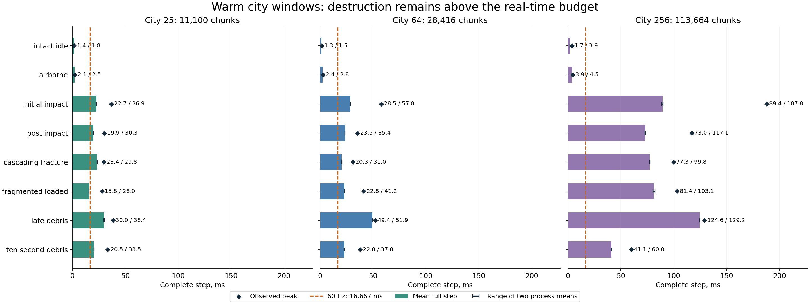
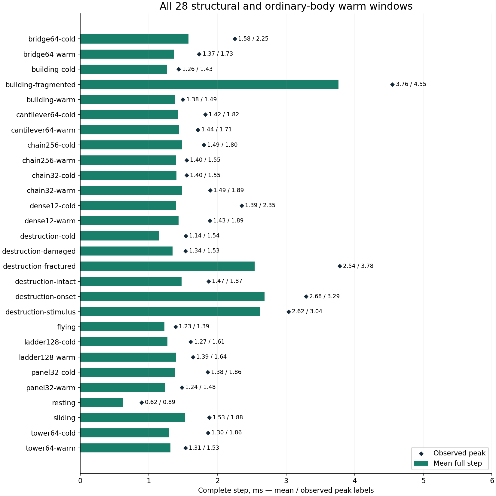

# Current warm measurements and debugging data for all52 scenarios

Measurement date2026-09-14. Selected runtime remains `d5770a80`, source `13b11af2`.
Collection only; no optimization or physical-quality change.

**Complete: all52 scenarios have repeated warm full-step timings, passing
work-history/endpoint physical checks, CPU/GPU traces and core hardware counters.**
The final audit verifies binary/module/input identities, saved report hashes and
launch inventories. [Coverage audit](data/coverage.json),
[finalization receipt](../../out/warm-full52-20260914/finalization.json).

The scope is all52 original physical fixtures, with fixed warmup/measurement
histories. The17 window means above16.667ms are all city destruction cases;
18 windows have at least one deadline miss, with453 misses among1,696 measured
ticks. Those counts describe this deliberately mixed suite, not a gameplay miss
rate. Large-city impact averages88.77–90.10ms and late debris124.45–124.66ms;
its intact idle window averages1.66–1.69ms. No runtime optimization produced
these differences: the new measurement history reconstructs and then warms caches.

Exact raw inputs, binaries, commands,
observations, phase tables, traces and exports remain in ignored local
`out/warm-full52-20260914/`. This report links that data rather than committing it.

- [Frozen histories and input hashes](../../out/warm-full52-20260914/manifest.json).
- [New timing processes](../../out/warm-full52-20260914/timings/campaign.json).
- [Eight matching timing pairs reused](../../out/warm-full52-20260914/reused-timings.json).
- [Full-process CPU/GPU pilot](../../out/warm-full52-20260914/cpu-pilot/campaign.json).

The existing [nine-case warm workflow](../destruction-warm-window-benchmarks-20260914/README.md)
remains the fast iteration screen. This one-time coverage expansion is larger and
must not become the default per-edit workload. [Cold52](../destruction-baseline-20260913/all-scenarios.md)
and uninterrupted trajectories remain separate companions.

## Warm full-step timings



Labels are mean / observed peak in milliseconds, outside the profiler. Bars show
pooled means; whiskers span the two independently started process means, not a
confidence interval. Each window has32 measured ticks (64 for city256 idle).
The common axis makes scale costs comparable. Restore, warmup and validation are
excluded here and reported separately below; every measured tick is retained.
The8-tick impact/post-impact/cascade windows overlap in physical time and must not
be added or treated as independent experimental repetitions.



All these windows use8 real warmup ticks followed by8 measured ticks, repeated
across two processes and two restores each. The maximum axis is6ms; all observed
ticks are below the16.667ms deadline. Source labels such as `cold` and `warm`
describe the original fixture, not the cache state of this measured continuation.
These figures do not compare a runtime optimization against a control.

[All52 timings, stages, preparation and work counts](all-scenarios.md) and
[CPU/GPU overlap, launch/counter coverage and warnings](attribution.md) retain
the complete tabular results.

## Current saved timing coverage

**52/52** warm timing cases pass the physical comparison audit:1,696 measured
ticks and2,992 separately stored warmup ticks. The new88 processes took414.53s;
eight earlier qualified pairs are reused. [Every scenario, mean, peak, deadline
miss, stage and preparation cost](all-scenarios.md); [versioned timing audit](../../out/warm-full52-20260914/timing-audit.json).

The52 timelines contain1,799 CPU samples,34,243 native phase scopes and13,377
recorded kernel launches. Hardware captures contain408 graph invocations and4,480
ordinary launch representatives at2,639 configurations. Every case covers at
least99.0004% of **observed timeline kernel duration** under the selection policy,
with all requested core metrics finite and no out-of-range percentage ratios.
These are diagnostic coverage counts, not application speed measurements.

The successful CPU continuation took553.50s (9m14s), reusing eight earlier
captures. The full core-counter pass took1,434.94s (23m55s); normalization and
the final saved-data audit took20.47s. Earlier attempts remain separate: the
full-process pilot53.93s, interrupted CPU expansion76.35s, initial counter
inventory attempt6.42s, and detailed-counter pilot160.40s. Reused cases and phases
must not be counted as fresh collection. This full refresh is a baseline/coverage
operation; the qualified nine-window iteration screen remains204.34s plus1.51s
of exports, with a much smaller selected profile scope.

The full-process Systems pilot succeeded, but broader collection encountered the
known CUPTI-worker GSP fault (Xid120/154) at chain256-cold teardown. That capture
is quarantined. A PCI function reset recovered the GPU in9.02s; desktop, persistence
service and the preexisting demo server were restored using their exact private
configuration. [Recovery receipt](../../out/warm-full52-20260914/recovery/receipt.json)
contains no exported server configuration. Completed captures are reused; pending
CPU captures use the narrower full-tick range. Generic boundary warnings remain
explicit, with selected-tick/native-phase inventories checked.

The first graph inventory also exposed duplicate versioned CUDA API records.
For example, bridge has12 API records for6 physical graph launches. Deduplication
requires identical correlation, thread, node inventory and nested intervals;
ambiguous records are rejected. Raw records are preserved. Normalized attribution
sidecars prevent these aliases from inflating physical API call counts.

The detailed counter pilot required3 replay passes and host-memory state backups.
It was stopped when measured overhead would exceed the budget. The broad pass uses
core hardware metrics across the selected graph/configuration coverage; detailed
cache/stall/eligible-warp/FP64 metrics remain targeted follow-ups. This is explicit
core-counter coverage, not a claim that every supported metric has been collected.

## Fixed history policy

Structural and small physical fixtures restore their existing input, warm8 real
ticks, and measure8 consecutive ticks. Labels such as `cold`/`warm` refer to the
original source fixture; the new measured window is explicitly after warmup.
The original cold measurements are retained separately to cover startup solving.

City initial impact, post-impact and cascading cases restore the earlier intact
snapshot40 and warm42,43 or47 ticks, respectively. Their first measured tick
retains nominal event time82,83 or87. This avoids warming away first impact.
Other city fixtures continue8 real ticks from their saved state, then measure8.
City256 intact idle reuses the qualified16-warm/16-measured schedule.
Already-fractured continuations are reproducible benchmark inputs only when their
physical gates pass; they are not claimed to equal the uninterrupted trajectory.

Each timing case uses two independently started processes, two restores per
process. Tick times include all physics, destruction/stress/material work,
transfers, required CPU work/synchronization and at most one correction plus
second stress. Restore/validation are excluded and reported separately. Warmup
costs remain recorded. Adjacent ticks are correlated; the process/trajectory is
the replication unit. This is descriptive baseline data, not proof of a tiny gain.

The cross-process physical gate compares the first trajectory's complete warmup
and measured work history, then its final exported state: bond membership, health,
material state, forces, body identity, poses and velocities. Exact fields remain
exact; existing force/motion tolerances are unchanged. The 1,696 timed ticks are
not 1,696 independent full-array physical comparisons. Full uninterrupted
trajectory qualification remains a separate requirement for runtime changes.

## Checker correction

The first broad warm pass exposed a v1 admission error on flying, resting and
sliding. The C++ simulation and physical repeats completed successfully, but the
checker expected a destruction frame counter to increment in ordinary scenes
with no configured destruction stage. V2 accepts that inactive counter only when
all destruction work fields are zero. It still requires consecutive tick offsets,
complete sample selection, valid timing partitions, and unchanged motion/material/
force/work comparison gates. Original failed parser receipts are retained;
versioned re-audits qualify the saved native outputs without rerunning them.

## Attribution policy

Systems records CUDA/NVTX/OS events with CPU stack/scheduling samples at2,000,000
reference cycles. Analysis selects exactly the first measured complete tick.
Eight completed full-process recordings are reused; remaining recordings use the
selected full-tick range after the teardown fault described above. Sampling,
unresolved symbols and all boundary warnings stay visible. The selected-tick and
native-scope checks do not establish exhaustive event completeness. Profiled
durations never replace unprofiled full-step timings.

Warnings remain in50 traces for NVTX boundaries,42 for OS runtime boundaries and
41 for CUDA boundaries; no sampling-throttle warning is present in this cohort.
Verified nested CUDA API aliases are normalized in sidecars, removing15,901
duplicate records from physical API counts without changing the raw traces.

Counter selection reuses the existing graph and ordinary configuration planners:
all nonempty graph invocations, and first/slowest representatives of significant
ordinary launch configurations covering at least99% of the timeline kernel time
together with graphs, plus every ordinary family costing0.1ms or more. Thresholds
are coverage policies, not bottleneck diagnoses. Every recorded kernel remains in
the timeline. Conditional graph node/source counters remain unavailable where the
pinned collector does not support them; graph aggregates do not imply node detail.

The capture stack is RTX5060Ti16GB, driver615.71.09, CUDA13.4, Systems2026.3.2
and pinned Compute2025.3.1. Compute uses kernel replay, `cache-control all` and
`clock-control none`. Replay counter durations and DRAM traffic are therefore not
production warm-cache latency measurements. Match cache policy explicitly for a
future cache-reuse hypothesis; use the unprofiled complete steps for performance.

The broad core metric set includes duration, achieved occupancy, issue activity,
DRAM bandwidth and registers/shared memory where applicable. The optional detailed
tier adds eligible warps, FP64 activity, L1/L2 hit rates, local-memory traffic and
long-scoreboard/barrier stall ratios; it is not qualified across the full suite. Invocation
and configuration inventories must match the timeline, and each profile's physical
outputs must pass against its plain reference. Unsupported metrics and anomalous
ratios are recorded, not filled with zeros or interpreted as measured speedups.

## Reproduction and local evidence

Run from `/root/workspace/physx-2`. The manifest fixes executable paths, artifact
paths, input hashes and histories. Each capture receipt retains its exact native
and profiler command. Use a new output directory for a new campaign; never
overwrite these baseline inputs or receipts. Captures take the shared GPU lease
and restore the temporarily stopped desktop. They must not overlap other GPU
work or builds.

The new timing plan contains the44 pairs not reused from the earlier calibration.
The original run used v1 and its three ordinary-scene admission failures were
re-audited with v2. Future replay uses the explicit corrected checker:

```bash
python3 tools/diagnostics/destruction-snapshot/run-warm-suite.py \
  out/warm-full52-20260914/timing-plan.json out/NEW-warm52-timings \
  --manage-desktop --budget-seconds 900 --contract-version 2
```

The accepted CPU continuation and broad counter commands were:

```bash
python3 tools/diagnostics/destruction-snapshot/collect-warm-full.py \
  out/warm-full52-20260914/manifest.json out/warm-full52-20260914/cpu-v2 \
  --timings out/warm-full52-20260914/timings \
  --reuse out/warm-full52-20260914/reused-timings.json \
  --tier cpu --cpu out/warm-full52-20260914/cpu \
  --nsys-range first-tick --budget-seconds 1800

python3 tools/diagnostics/destruction-snapshot/collect-warm-full.py \
  out/warm-full52-20260914/manifest.json out/warm-full52-20260914/counters \
  --timings out/warm-full52-20260914/timings \
  --reuse out/warm-full52-20260914/reused-timings.json \
  --tier counters --cpu out/warm-full52-20260914/cpu-v2 \
  --metric-tier core --budget-seconds 1800
```

These destinations already exist; substitute new destinations when rerunning.
Both tools resolve missing or changed physical inputs as failures. For a candidate,
use a separately frozen manifest and matched current timing references, not the
baseline's binaries with renamed output directories.

Regenerate readable tables and figures offline after collection:

```bash
python3 reports/destruction-warm-full52-20260914/summarize.py
python3 tools/diagnostics/destruction-snapshot/audit-warm-full.py \
  out/warm-full52-20260914 reports/destruction-warm-full52-20260914
PYTHONPATH=/tmp/destruction-comparison-python \
  MPLCONFIGDIR=/tmp/physx-warm52-matplotlib \
  python3 reports/destruction-warm-full52-20260914/plot.py
```

Per-capture `attribution-normalized.json` is derived by
`normalize-warm-attribution.py CAPTURE_DIRECTORY`; the original attribution and
SQLite remain unchanged. The finalizer creates those sidecars before the audit.
All raw-data links require this machine's ignored local evidence; a fresh clone
does not include the captures. Source, tools and this report remain uncommitted
under the user's current save policy. No runtime implementation was changed.
Plots reuse the existing local Matplotlib/NumPy installation; no packages were
installed or host Python settings changed. A first render without that dependency
path failed before plotting; it is retained in the validation receipt. Both
figures were subsequently rendered and visually inspected.
The final [machine receipt](../../out/warm-full52-20260914/stopped.json) verifies
all owned jobs have exited, the shared lease is free, no compute clients remain,
and desktop/persistence services are active.
